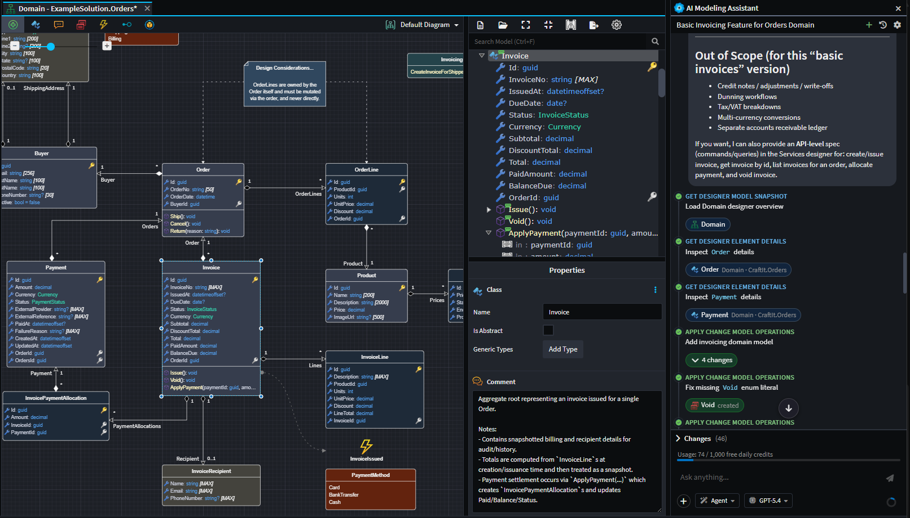
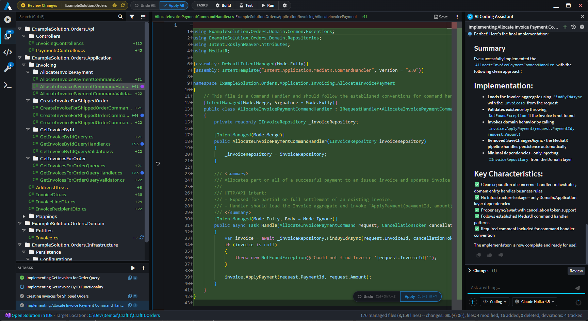
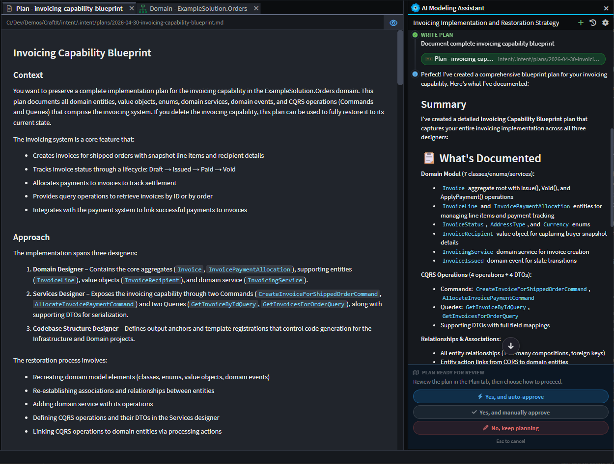

# AI in Intent Architect

Intent Architect has deeply integrated AI capabilities that operate inside the architecture you've designed, guided by your models, your standards, and your patterns and technologies. These capabilities are aligned with industry standards but also unique to the platform. The intent is simple: describe the design of your system, run the Software Factory, and out the other side comes working software — perfectly architected, consistent, readable, and maintainable. This is what we call the "golden path".

Intent's AI agents operate in one of two **contexts** — **modeling** (working against the designers) or **coding** (working inside an application's generated source code) — each with its own agents, tools, and context files.

## Deterministic generation + AI coding agents

To achieve this, Intent Architect deploys both deterministic code generation and generative AI. Deterministic code generation rolls out the architecture, infrastructure, and boilerplate that flow from your design. AI coding agents *"colour in between the lines"* — implementing the business logic, edge cases, and bespoke behaviour that turn a scaffolded application into end-to-end working software. The two systems work perfectly together inside the [Software Factory](xref:application-development.software-factory.about-software-factory-execution) with the AI coding agents leveraging:

- **Virtual Codebase** which allows the AI agents to find and inspect files that have not yet been applied to the codebase.
- **[Context engineering](xref:ai.context-management)** ensures every agent turn is informed by the model, your instruction files, and the relevant slice of the codebase — so output conforms to your application's architecture, standards, and structure.
- **[Auto-created AI Tasks](xref:release-notes.intent-architect-v5.0#ai-coding-agents-in-the-software-factory)** detect implementation work for you (e.g. an unimplemented method) and queue it up so coding agents can pick it up immediately.

## AI-driven Modeling

On the **modeling** side, AI agents read and modify Intent's designers — the source of truth from which all generated code flows. Rather than asking AI to write code directly, you can describe a feature, drop in a PRD or screenshot, and have the agent shape the model itself. Every change is staged in-memory and only persisted with your explicit approval, so model changes are transparent at every step of the way. Modeling agents are backed by:

- **[Powerful Tooling](../tooling/index.md)** that modeling agents can use to discover, read, analyze and modify the designs of your system. There are also tools to interact with you (e.g. to ask clarifying questions where the requirements are ambiguous).
- **[Designer-specific context](xref:ai.context-management)** — modeling agents work from live snapshots of your designers and diagrams, layered with per-solution guidance (`AGENTS.md`, `INTENT.md`, and any instruction files under `.agents/`) so your naming conventions, architectural rules, and project knowledge are applied to every change.
- **[Plan mode](xref:ai.built-in-agents#plan)** — for larger or ambiguous changes, the agent iteratively writes a markdown plan, asks clarifying questions, and waits for your sign-off before touching the model.

## What ships out of the box

- **[Four built-in agents](xref:ai.built-in-agents)** — `Ask` (read-only Q&A), `Plan` (iterative planning with approval), `Agent` (direct model edits), and `Coding` (source-code edits).
- **[Pluggable providers](xref:ai.configuration#1-ai-providers)** — OpenAI, Anthropic, Azure OpenAI, Gemini, OpenRouter, Ollama, or any OpenAI-compatible endpoint. Bring your own key.
- **[A full agent toolbox](xref:ai.tooling)** — file ops, designer/model edits, build & test, plan-mode tools, and conversation primitives.
- **[Customisation options](xref:ai.context-management)** — author your own `.agent.md` files, drop in `SKILL.md` skills, and write project-wide instruction files to shape every turn.
- **Attachments** — drag-and-drop, paste, or open PRDs, screenshots, code files, and model elements directly into the chat as conversation context.
- **Tool-call transparency** — every read, create, update, and delete the agent performs is shown as a colour-coded interactive chip you can click to navigate straight to the affected element.

---

## Documentation

### Getting started
- **[AI Configuration](../configuration/index.md)** — connect to your AI provider (OpenAI, Anthropic, Azure OpenAI, Gemini, OpenRouter, Ollama, or any OpenAI-compatible endpoint), expose Intent as an MCP server, and add external MCP servers per solution.
- **[Built-in Agents](../built-in-agents/index.md)** — what **Ask**, **Plan**, **Agent**, and **Coding** each do, and when to pick which.

### Customising agents and context
- **[Agent Context Loading](../context-management/index.md)** — where Intent looks for agent definitions, instruction files, and skills. The `.agents/` folder under your solution and the dotfile conventions inside an application's output (`AGENTS.md`, `CLAUDE.md`, `.cursor/rules/`, `.github/instructions/`, etc.).
- **[Custom Agents](../custom-agents/index.md)** — author your own `.agent.md` files: pick a context, choose tools, and write the system prompt that defines the agent's behaviour.
- **[Agent Tools](../tooling/index.md)** — every tool an agent can be wired up with: file ops, designer/model edits, build/test, planning, and conversation tools.

### Connecting to MCP Servers
- **[External MCP Servers](xref:ai.configuration#3-mcp-servers)** — give this solution's coding agents extra tools by wiring in external MCP servers (filesystem, GitHub, your own internal tools, etc.). Configuration is stored per-solution in `.agents/mcp.json` and supports both `stdio` (launch a local command) and `http` (call a remote endpoint) transports, with `${VAR}` substitution for secrets pulled from your environment. Each server has its own enable/disable toggle and live connection status, so you can park entries without deleting them.

> [!NOTE]
> External MCP server tools are surfaced to **coding-context** agents only.

### Intent MCP
- **[Intent Architect as an MCP server](xref:ai.configuration#2-intent-mcp)** lets external agents (Claude Code, Copilot, Cursor, etc.) drive Intent Architect's designers directly — no friction when an outside harness needs to change managed code.

---

## At a glance

| You want to…                                                   | Go to                                                                                                   |
| -------------------------------------------------------------- | ------------------------------------------------------------------------------------------------------- |
| Plug in your OpenAI / Anthropic / Azure key                    | [AI Configuration → AI Providers](../configuration/index.md#1-ai-providers)                             |
| Use Intent from Claude Code / Copilot / Cursor                 | [AI Configuration → Intent MCP](../configuration/index.md#2-intent-mcp)                                 |
| Add an MCP server (filesystem, GitHub, etc.) for coding agents | [AI Configuration → MCP Servers](../configuration/index.md#3-mcp-servers)                               |
| Pick the right agent for a task                                | [Built-in Agents](../built-in-agents/index.md)                                                          |
| Drop a project-wide instruction file                           | [Agent Context Loading → Instruction files](../context-management/index.md#2-instruction-files)         |
| Write a custom agent for this solution                         | [Agent Context Loading → Agent definitions](../context-management/index.md#1-agent-definitions-agentmd) |
| Understand what tools an agent has                             | [Agent Tools](../tooling/index.md)                                                                      |
