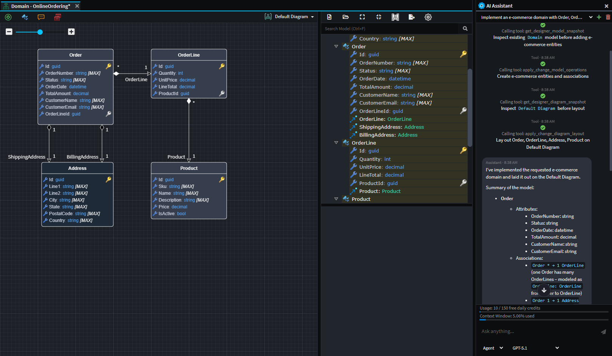
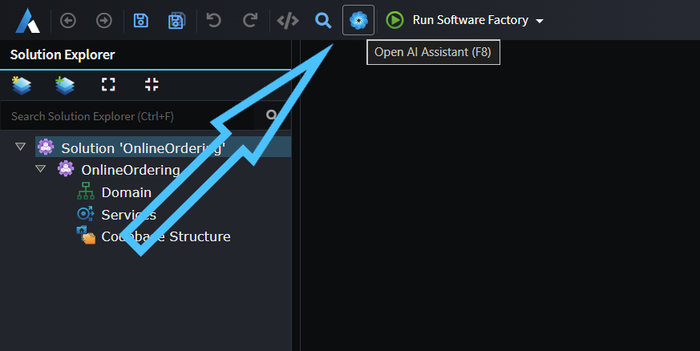
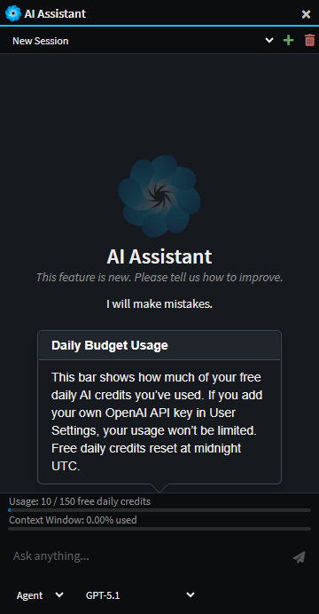

# AI Assistant

Intent Architect's integrated AI Assistant can be used to answer questions about the current workspace, explain how existing elements fit together, and propose design changes to meet new requirements. The assistant can also inspect models and diagrams to summarize structure, highlight dependencies, and identify gaps or inconsistencies.

_Example use of the AI assistant to create a simple e-commerce domain. The agent was able to design the domain from a simple natural language prompt._

## Overview Video

Our Version 4.6 release video has a great overview of using the AI Assistant, the below embedded video is set to start at the exact point of the overview of the AI Assistant:

> [!Video https://www.youtube.com/embed/HRnq-xn7Y38?si=SG1Fm08GHVz4ycz5&amp;start=227]

## Opening the AI Assistant

If you've previously hidden the AI Assistant pane on the right, you can use the icon in the toolbar or the F8 shortcut key to bring it back:

## Modes

The Integrated IA Assistant has 3 different modes:

- **Ask** - For analyzing and answering questions with read-only access to the designers.
- **Agent** - For instructing the LLM to read and make simple modifications to the designers.
- **Plan** - For larger tasks, Plan mode offers the user a way to design a step-by-step implementation plan with the LLM and then to convert this into a structured execution plan.

## Multiple Provider Integration

The Integrated AI Assistant can also be connected to the most popular AI providers (e.g. Open AI, Azure Open AI, Anthropic, Gemini, etc.). This can be done simply by specifying an API Key for the relevant provider in the [User Settings](https://docs.intentarchitect.com/articles/modules-common/intent-common-ai/intent-common-ai.html#user-settings).

_Example showing both Open AI and Anthropic models available when both are configured._

## Daily Budget

So that all new users of Intent Architect are able to get a sense of what the AI Assistant is capable of, by default they have access to 150 completely free daily credits. This free limit resets daily at midnight UTC.

No API Key is required to access these free credits, however adding your own Open AI API Key in the User Settings will remove the limit completely and no longer access Open AI through the Intent Architect organization's account. We also understand that some organizations would want this option disabled, which can be done by emailing this request to <support@intentarchitect.com>.

