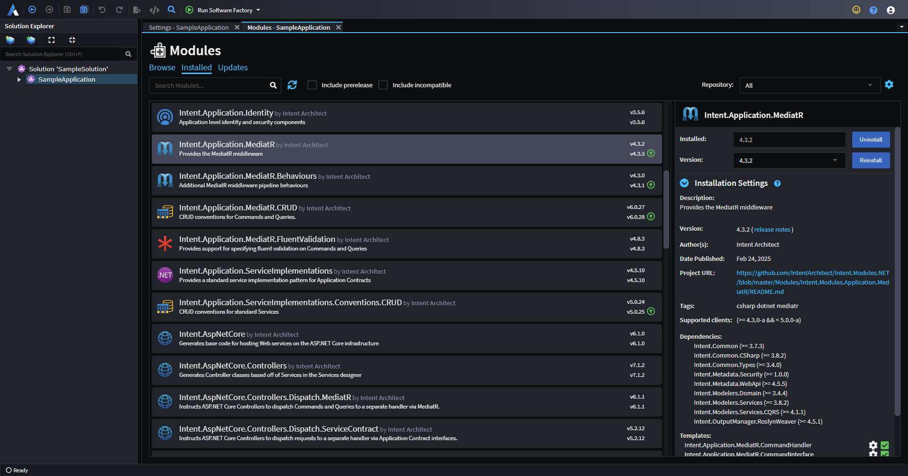
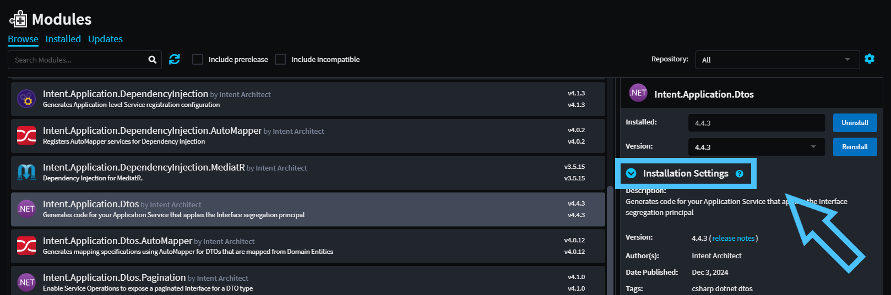
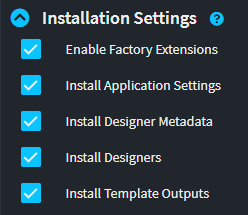

# About Modules

## What is a Module

Modules are the _building blocks_ and artifacts of pattern reuse in Intent Architect.

Typically, the purpose of a Module is to generate and manage a set of code files in a codebase, usually around a particular architectural pattern. This could for example be the entities in a domain, simple bootstrapping files, ORM mappings, controllers in an Api, etc.

Modules have similarities with package systems such as NuGet, NPM, and Maven. However, where the primary objective of these system is to make code-reuse easier, the primary objective of Modules is _pattern-reuse_.

Modules have versions and dependencies, and don't directly introduce any runtime dependencies. They can, however, be configured to introduce package dependencies if the designer of the Module so chooses.

_An example showing the list of Installed Modules in a sample application. The `Intent.Application.MediatR` module has been selected, with its details displayed in the pane on the right._

> [!NOTE]
> When you select an installed Module, Intent Architect gives a view into the internals of that module (i.e. the Templates, Decorators, and Factory Extensions it is made up of).

## Options

When (re)installing a module you can expand the "Options" drop down.

### Install metadata only

This option is generally only applicable when [building modules](xref:module-building.module-installation).

When selected, none of the module's Intent Architect extensibility will be enabled, this includes designers or software factory extensions (such as templates) will not be enabled or run during the software factory. However, the metadata from the module (i.e. modeled data such as elements or stereotypes) can be used from designers which are referencing them. Any dependent module that gets installed will also install their metadata **only**.
