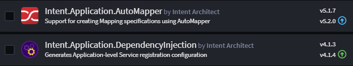

# About Modules

## What is a Module

Modules are the _building blocks_ and artifacts of pattern reuse in Intent Architect.

Typically, the purpose of a Module is to generate and manage a set of code files in a codebase, usually centered around a particular architectural pattern. This could include domain entities, bootstrapping files, ORM mappings, API controllers, etc.

Modules share similarities with package systems such as NuGet, NPM, and Maven. However, while those systems primarily focus on code reuse, the primary objective of Modules is _pattern reuse_.

Modules have versions and dependencies and do not directly introduce any runtime dependencies. However, they can be configured to introduce package dependencies if the Module designer chooses to do so.

  
_An example showing the list of installed Modules in a sample application. The `Intent.Application.MediatR` module is selected, with its details displayed in the pane on the right._

> [!NOTE]
> When you select an installed Module, Intent Architect provides a view into its internals (i.e., the Templates, Decorators, and Factory Extensions that comprise it).

## Module Management

Modules can be managed at either the **Solution** level (affecting all applications) or the **Application** level. To access the **Module Management** screen:

1. Right-click on your application or solution in the **Solution Explorer**.
2. Select `Manage Modules...`.

The Module Management screen includes three tabs:

- **Browse** – Discover and install new modules from this tab.
- **Installed** – View the list of currently installed modules.
- **Updates** – See installed modules with updates available.

> [!NOTE]
> By default, this screen only displays official releases. To access pre-releases or betas, enable the `Include Prereleases` option.

Documentation for modules is available on our [website](https://docs.intentarchitect.com/articles/getting-started/welcome/welcome.html) in the respective module sections.

### Updating Modules

It is recommended to be on a clean checkout when updating modules. The nature of the update is indicated by the color of the update indicator icon and aligns with [semantic versioning](https://semver.org/):

- **Green** – Patch update. Should be seamless; typically includes bug fixes or small enhancements.
- **Blue** – Minor update. Should be seamless; may impact unmanaged code (e.g., upgrading a NuGet package to a new major version).
- **Yellow** – Major update. Check the module's release notes for important information about the changes.

The module pane includes **release notes** containing a complete list of changes in each version, along with any upgrade notes (e.g., for major releases).

## Installation Settings

When (re)installing a module, you can expand the **Installation Settings** dropdown.

  

These settings are generally only relevant to those [building modules](xref:module-building.module-installation) who may want modules installed with selective capabilities enabled:

- **Enable Factory Extensions** – Controls whether the Software Factory will load any kind of extensions (templates, factory extensions, etc.) from the module.
- **Install Application Settings** – Controls whether settings from the module should be added to the  screen.
- **Install Designer Metadata** – Controls whether [designer metadata embedded in the module](xref:module-building.application-templates.metadata-installation) is installed into designers during initial installation.
- **Install Designers** – Controls whether [designers](xref:application-development.modelling.about-designers) are installed into the application.
- **Install Template Outputs** – Controls whether [template outputs](xref:application-development.code-weaving-and-generation.about-template-output-targeting) are installed.