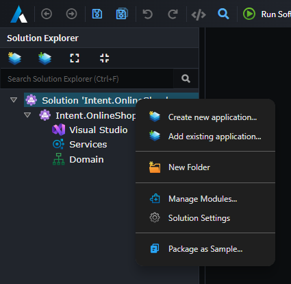
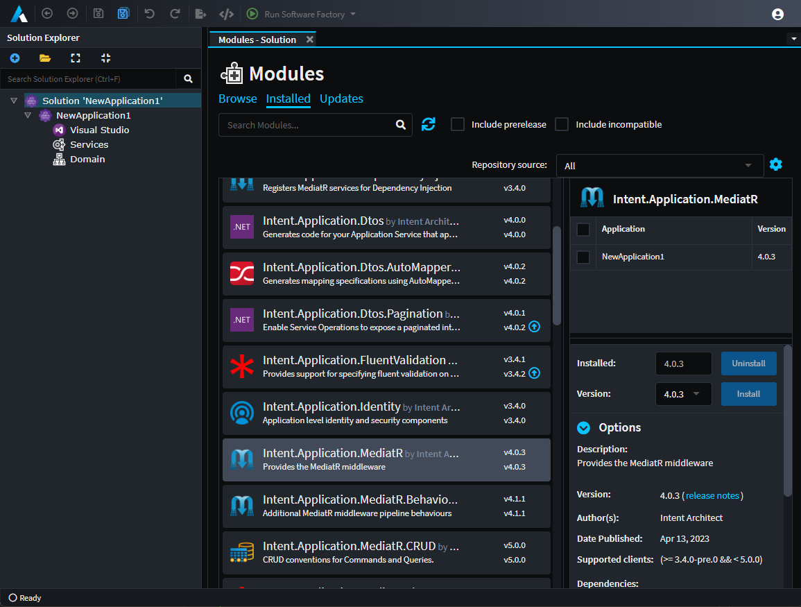

# About Solutions

Solutions in Intent Architect serve as a collection of one or more [Applications](xref:application-development.applications-and-solutions.about-applications).

They are represented by an `.isln` (Intent Solution) file on the disk-drive. With Intent Architect you can only open Solution files and not Application files; so if you want to open an Intent Architect Application, you have to do that through the context of a Solution.

## Solution Explorer 

The Solution Explorer is visible on the left side of Intent Architect.

_Applications are shown as children on the solution in the tree view._

## Managing Applications

At the top of the Solution Explorer, or the context menu, you will find these commands that can be performed: 

### Create New Application

Create a new Application such as in the .

### Add Existing Application

Browse for an existing Application located outside your current Intent Architect solution and add it to this Solution.

> [!NOTE]
> It will not import the content into this Solution but will merely make a reference to that location.

### Copy Existing Application

Like its `Add Existing Application` counterpart, this command will not only add the Application to this Solution but also attempt to import all its content as well. This is especially useful for working on Template Applications such as Intent Architect Modules.

## Managing Modules at a Solution level

Through the context menu on the solution, the `Manage Modules...` option can be used to see a solution wide view of all installed modules. This view can be useful for updating modules across all applications.

_Modules view at a solution level._
