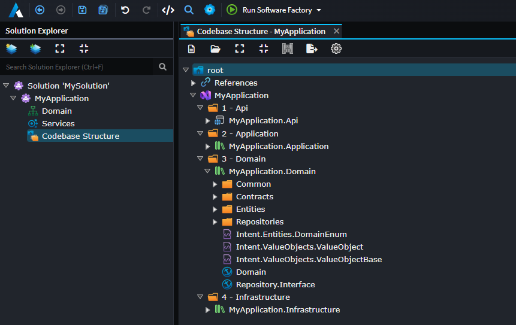

# About the Codebase Structure Designer

The `Intent.Modelers.CodebaseStructure` [Module](xref:application-development.applications-and-solutions.about-modules) provides a [Designer](xref:application-development.modelling.about-designers) for modelling your codebase layout and controlling the output location of the different [Templates](xref:module-building.templates-csharp.about-csharp-templates) in your Application.

The elements available in this designer depend on the programming language and architecture pattern selected. In a typical Clean Architecture pattern, you can determine where your Visual Studio solutions and projects (introduced by the `Intent.VisualStudio.Projects` module) are located, as well as which Templates are assigned to each project (which determines where generated content goes).

_Screenshot of a Visual Studio Solution inside the Codebase Structure Designer for an example Application._
## Why the Codebase Structure Designer matters

When the [Software Factory](xref:application-development.applications-and-solutions.about-applications) runs, it needs to know _where_ on disk to write each generated file. The Codebase Structure Designer is the place where that mapping is defined. By modelling which solutions, projects, and folders exist in your codebase, and assigning Templates to them, you control exactly which project (and therefore which folder) each generated file ends up in.

This is also why moving a Template output node from one project to another in this designer will cause the Software Factory to move the corresponding generated files the next time it runs.

## How to access it

The designer is installed as part of a Codebase Structure module. Once installed, it appears as a designer tab — labelled **Codebase Structure** in the left-hand navigation panel of your [Application](xref:application-development.applications-and-solutions.about-applications).

## Common element types

The specific elements available depend on the installed module, but in a typical .NET application you will find:

| Element | Description |
|---|---|
| **Visual Studio Solution** | The top-level package representing a `.sln` file. Created via `CREATE NEW PACKAGE`. |
| **C# Project** | Represents an individual `.csproj` within the solution. |
| **Folder** | A folder node within a project, used to organise generated files. |
| **Template Output** | Assigns a specific Template to a project or folder, determining where that Template's generated file(s) are written. |

> [!NOTE]
> For non-.NET application templates, the equivalent designer may use folder-based elements rather than solution/project elements, but the same principles apply.

## Relationship to the output root

The Codebase Structure Designer controls the _structure within_ the output root. The output root itself (the top-level folder on disk where all generated files are written) is configured separately in the Application's Settings. See [How to change the output root](xref:application-development.applications-and-solutions.how-to-change-the-output-root) for details.

## See also

- 
- 
- 
