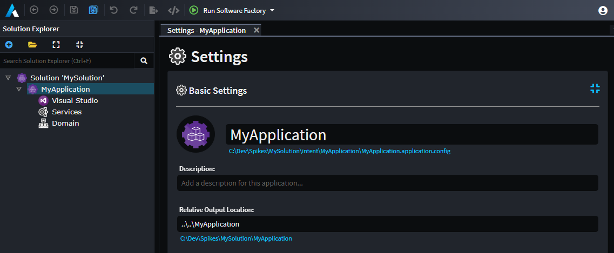

# How to change the output root

Applications in Intent Architect have a _Root Output Location_ which is stored as a relative path to the location of the Application's `.application.config` file. To change this location, open the Application's `Settings`.

In the image above we can see that the path of the `TestApp.application.config` file is in the `C:\Dev\Spikes\MySolution\intent\MyApplication` directory. The `Relative Output Location` is `..\..\MyApplication`. Therefore the _Root Output Location_ of this Application is `C:\Dev\Spikes\MySolution\MyApplication`.
>
> [!NOTE]
> In an attempt to make Intent Architect OS agnostic, it will automatically convert backslashes to forward slashes. However, we still recommend setting the `Relative Output Location` using forward slashes to avoid confusion.
