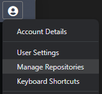
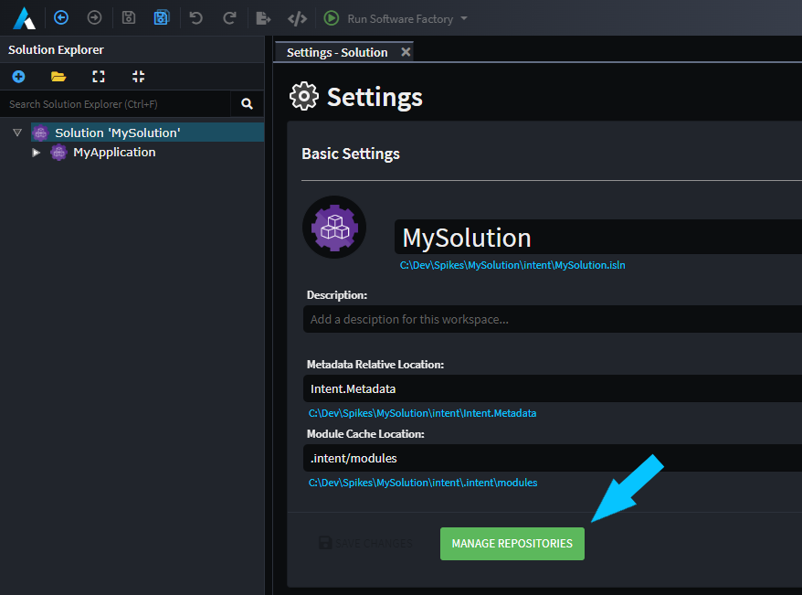
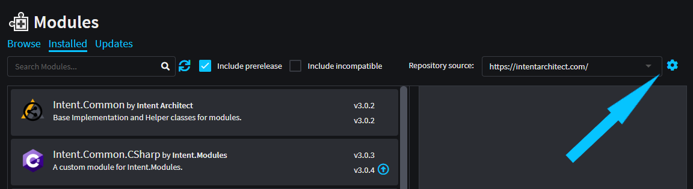

# How to manage Repositories

Asset Repositories manages the repository locations that are searched when discovering Modules and Application Templates. The official Intent Architect server `https://intentarchitect.com/` is available as a repository hosting all the official (and largely Open Source) Modules for use. Additional sources can be added too which can point to a physical drive, remote/network locations or the URL of a [self-hosted module server](https://docs.intentarchitect.com/articles/tools/module-server/module-server.html).

## Locate the Manage Repositories dialog

There are a few ways to locate the Repository Management dialog.

### Profile Menu

From any screen within Intent Architect, click on the top right Profile menu and select `Repository Management`.

### Solution Settings

Within the Intent Architect solution settings locate the `Manage Repositories` button like below.

### Modules

Within any Modules view, locate the gear icon at the top right of the screen.

## Repository Management layout

At the very least you will always see the Intent Architect repository listed here, it's built-in and cannot be modified or removed on this screen.

A new Repository can be added by clicking on the `Add New` button, and one can browse to the desired location by clicking on the Browse button in order to set the Repository location. This location can be any valid path for your operating system, including relative (for solution level repositories) paths, fully qualified paths, UNC paths or the URL for a [self-hosted module servers](https://docs.intentarchitect.com/articles/tools/module-server/module-server.html).

The `Context` dropdown has the following options:

| Name | Description |
|-|-|
| Global | Intent Architect will search this Repository from any Intent Architect Solution. |
| Current Solution | Intent Architect will search this Repository only in the current Solution across all its Applications. |

The arrow buttons allow you to adjust the order in which Intent Architect searches in each Repository. The top most Repository will be visited first and the bottom most Repository will be visited last.

Each Repository has a hyperlink (clicking on it opens up your File explorer on that location) and a counter badge next to it (indicating how many modules it detected at that location).
