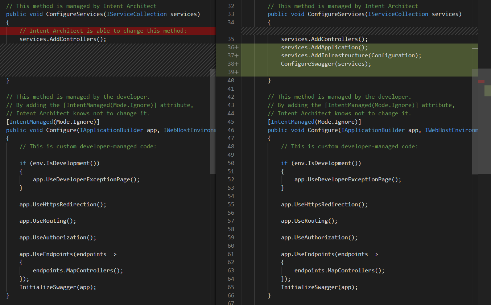

# About Code-Management

Simply put, code-management is a system that allows us to tell Intent Architect which parts of the codebase are managed by Intent Architect and which parts are managed by the developers, at a very granular level of control. It's the system that ensures practicality, and that we never need to convolute or distort our codebase in order accommodate this code-automation tool.

In this sense, code-management is a unique approach to code-automation that completely avoids the typical compromises. It utilizes abstract syntax tree parsing and intelligent algorithms to merge user-written code with automatically generated code. Code-management allows developers to control the automation systems of Intent Architect from a high-level all the way to the granular level of the members within each managed code file (e.g. classes, fields, functions, methods, etc.).

As a simple example, a developer may configure a C#, Java, Kotlin or TypeScript file such that they are managing the implementation of one method within a class, while Intent Architect will manage the remaining methods. They may then choose to change this configuration, perhaps deciding to take over management of the entire class or just one of the other methods. The configuration of each file is completely controlled by the developer, ensuring that the automation system never gets in the way.

_An example of how Intent Architect would change a C# `Startup.cs` file that is partially managed by the developer and partially by Intent Architect. Changes are staged before being accepted by the developer, allowing them to diff the changes before accepting or rejecting them._
