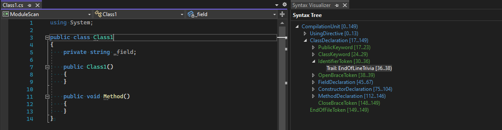
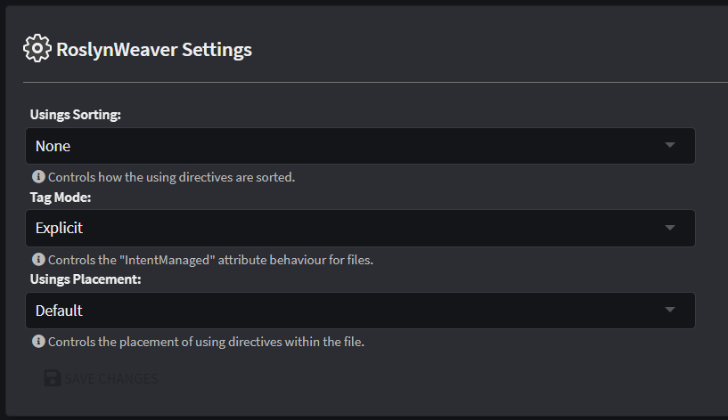

# C# Code Management

This article explains how to control [Code Management](xref:application-development.code-management.about-code-management) (Code Weaving) behaviour for C# files when "RoslynWeaver" (the C# code management extension of the `Intent.OutputManager.RoslynWeaver` Module) is used.

## Overview of how it works

The RoslynWeaver parses C# files into an [abstract syntax tree](https://en.wikipedia.org/wiki/Abstract_syntax_tree) and applies code management logic on a node-by-node basis. An individual node on the _abstract syntax tree_ is referred to as a _syntax node_. _Syntax nodes_ may have one or more children which are also _syntax nodes_.



_Example of an abstract syntax tree of a C# file._

The RoslynWeaver compares the generated content from the template with the existing file (if there is one) on a node-by-node basis. Instructions in the form of C# attributes are used by the RoslynWeaver for it to determine for a particular _syntax node_ what content it should ignore, replace with content generated by the template or perhaps remove entirely.

## Code management instructions

Instructing the RoslynWeaver on how to treat particular _syntax nodes_ is done using code management instructions in your source code, such as e.g. `[IntentManaged(Mode.Ignore)]`, `[IntentIgnore]`.

### Management modes

Both the `[IntentManaged]` and `[DefaultIntentManaged]` attributes have a mandatory parameter which accepts a `Mode` enum value of one of the following:

| Enum Value | Description                                                                                                                                                                    |
|------------|--------------------------------------------------------------------------------------------------------------------------------------------------------------------------------|
| `Fully`    | Intent has **full** control over the particular _syntax node_, any deviations in the existing file's _syntax node_ are overwritten with the content generated by the template. |
| `Merge`    | Intent may make additions to _the syntax node_ but is not allowed to remove any existing content from it.                                                                      |
| `Ignore`   | Intent must **ignore** this _syntax node_ and not remove or overwrite it with content generated by the template.                                                               |

### The `[DefaultIntentManaged]` attribute

One or more `[DefaultIntentManaged]` assembly attributes may be declared at the top of the file to set the "default" (or "fallback") management mode for _syntax nodes_, for example:

```csharp
[assembly: DefaultIntentManaged(Mode.Fully)]
```

When a _syntax node_ does not otherwise have its own `[IntentManaged]` attribute, the RoslynWeaver "falls back" to the default management mode as defined by these `[DefaultIntentManagement]` attributes.

### The `[IntentManaged]` attribute

_Syntax node_ types such as type definitions (classes, enums, interfaces, etc) and type members (such as fields, methods, properties, etc) can have an `[IntentManaged]` attribute applied to them to control their code management behaviour.

For example, to control code management behaviour for a method, you could add an `[IntentManaged]` attribute to it like so:

```csharp
[IntentManaged(Mode.Ignore)]
public void ChangeCountry(string country)
{
    throw new NotImplementedException();
}
```

When the RoslynWeaver sees this, it will know not to modify (or remove) this method in any way during code merging.

### Code management attribute properties

The `[IntentManaged]` and `[DefaultIntentManagement]` attributes have additional properties which can provide finer grained control of code management for a particular _syntax node_. By default each of these properties has the same `Mode` as the default parameter of the attribute, so:

```csharp
[IntentManaged(Mode.Fully, Body = Mode.Fully, Signature = Mode.Fully, Comments = Mode.Fully, Attributes = Mode.Fully)]
```

is equivalent to:

```csharp
[IntentManaged(Mode.Fully)]
```

The following table documents the available attribute properties and how the RoslynWeaver interprets them when applied to different _syntax node_ types:

| _Syntax node_ type  | Attribute property | Description                                                                                                                                                              |
|---------------------|--------------------|--------------------------------------------------------------------------------------------------------------------------------------------------------------------------|
| (All)               | Attributes         | By default the `Signature` parameter determines this parameter's setting but this parameter instructs the RoslynWeaver to treat the _syntax node_'s Attribute differently. |
| (All)               | Comments           | By default the `Signature` parameter determines this parameter's setting but this parameter instructs the RoslynWeaver to treat the _syntax node_'s Comments differently.  |
| Class               | Signature          | Instructs the RoslynWeaver to treat the definition of a Class (class name, inheritance, etc.) differently to the default parameter setting.                              |
| Class               | Body               | Instructs the RoslynWeaver to treat the members of a Class (methods, properties, etc.) differently to the default parameter setting.                                     |
| Constructor, Method | Signature          | Instructs the RoslynWeaver to treat the definition of a Method (method name, parameters, return type, etc.) differently to the default parameter setting.                |
| Constructor, Method | Body               | Instructs the RoslynWeaver to treat the implementation part of a method (where the code goes) differently to the default parameter setting.                              |
| Field, Property     | Signature          | Instructs the RoslynWeaver to treat the definition of a Field (field name, type, etc.) differently to the default parameter setting.                                     |
| Field, Property     | Body               | Instructs the RoslynWeaver to treat the value differently to the default parameter setting.                                                                              |

### Shorthand attributes

> [!NOTE]
> Shorthand attributes were introduced in version `4.2.0` of the `Intent.RoslynWeaver` module, ensure you have at least this version of the module installed for them to be able to work.

In situations where you are using a simple `[IntentManaged(Mode.<mode>)]` attribute, you can use any of the following attributes:

- `[IntentFully]` (equivalent to `[IntentManaged(Mode.Fully)]`)
- `[IntentIgnore]` (equivalent to `[IntentManaged(Mode.Ignore)]`)
- `[IntentMerge]` (equivalent to `[IntentManaged(Mode.Merge)]`)

Additionally, the following attributes can be used to override particular [code management properties](#code-management-attribute-properties):

- `[IntentFullyAttributes]`
- `[IntentFullyBody]`
- `[IntentFullyComments]`
- `[IntentFullySignature]`
- `[IntentIgnoreAttributes]`
- `[IntentIgnoreBody]`
- `[IntentIgnoreComments]`
- `[IntentIgnoreSignature]`
- `[IntentMergeAttributes]`
- `[IntentMergeBody]`
- `[IntentMergeComments]`
- `[IntentMergeSignature]`

These attributes can also be combined, for example to have a method have its signature fully managed, but the rest of it ignored, you can combine them as follows:

```csharp
[IntentIgnore]
[IntentFullySignature]
public void ChangeCountry(string country)
{
    throw new NotImplementedException();
}
```

You can also combine the attributes into a single list, the following code is functionally identical to the previous example:

```csharp
[IntentIgnore, IntentFullySignature]
public void ChangeCountry(string country)
{
    throw new NotImplementedException();
}
```

### "Tag Mode" attributes

> [!NOTE]
> File level "Tag Mode" attributes were introduced in version `4.2.0` of the `Intent.RoslynWeaver` module, ensure you have at least this version of the module installed for them to be able to work.

These attributes manage the "Tag Mode" for the current file.

#### Explicit Tag Mode

- `[assembly: IntentTagMode(TagMode.Explicit)]`

  or

- `[assembly: IntentTagModeExplicit]`

The RoslynWeaver will only look at the existing file for code management attributes except in the case where the generated template output will add new _syntax nodes_ to the existing file.

#### Implicit Tag Mode

- `[assembly: IntentTagMode(TagMode.Implicit)]`

  or

- `[assembly: IntentTagModeImplicit]`

When a _syntax node_ has no code management attribute of its own, the RoslynWeaver will attempt to find the corresponding _syntax_ node in the template generated content and use its code management attribute instructions. If the RoslynWeaver sees that the existing file's _syntax node's_ code management attribute instructions are identical to that of the _syntax node_ in the generated template output, it will remove it from existing file. This mode is useful if you want to keep the amount of code management attributes in your files to an absolute minimum.

> [!TIP]
> If you would like make to make "implicit tag mode" the default for all files, this can be done with the [tag mode application setting](#tag-mode).

### Block statement code management behaviour

Statements within code block _syntax nodes_ (e.g. method body, constructor body, delegate body, etc) can also support certain code management capabilities.

> [!NOTE]
> Support for management of statements was added in version `4.0.0` of the `Intent.RoslynWeaver` module, ensure you have at least this version of the module installed for them to be able to work.

#### Fully mode

You can add your own statements to a code block by adding a comment above with a code management instruction, for example:

```csharp
// Template generated content:
[IntentManaged(Mode.Fully)]
public void Method()
{
    var variable1 = "variable1";
}

// Content in your file, added after initial generation:
[IntentManaged(Mode.Fully)]
public void Method()
{
    var variable1 = "variable1";
    // IntentIgnore
    var myVariable = "myVariable";
}
```

With the above, even though the body of the method is "fully" managed, the `var myVariable = "myVariable";` will not be removed due to having `// IntentIgnore` above it.

This also works for statements which have statement blocks, with the above example you could have alternatively added an `if` statement:

```csharp
[IntentManaged(Mode.Fully)]
public void Method()
{
    var variable1 = "variable1";
    // IntentIgnore
    if (SomeCondition)
    {
        var myStatement1 = "myStatement1";
        var myStatement2 = "myStatement2";
    }
}
```

#### Merge mode

Inline with merge behaviour of other _syntax nodes_, the RoslynWeaver will only ever add statements from the template to your code if they are missing, it will never remove statements. For example:

```csharp
// Template generated content:
[IntentManaged(Mode.Fully)]
public void Method()
{
    var variable1 = "variable1";
}

// Content in your file, added after initial generation:
[IntentManaged(Mode.Fully)]
public void Method()
{
    var variable1 = "variable1";
    var myVariable = "myVariable";
}
```

If at a later time, the template content changes to have an additional statement, then it will get added without removing your code:

```csharp
// Template generated content:
[IntentManaged(Mode.Fully)]
public void Method()
{
    var variable1 = "variable1";
    var variable2 = "variable2";
}

// Content in your file before running the software factory:
[IntentManaged(Mode.Fully)]
public void Method()
{
    var variable1 = "variable1";
    var myVariable = "myVariable";
}

// Content in your file after running the software factory:
[IntentManaged(Mode.Fully)]
public void Method()
{
    var variable1 = "variable1";
    var myVariable = "myVariable";
    var variable2 = "variable2";
}
```

Block statement merge mode also allows you to update variable values:

```csharp
// Template generated content:
[IntentManaged(Mode.Fully)]
public void Method()
{
    var variable1 = "variable1";
}

// Content in your file (will not be updated by the software factory):
[IntentManaged(Mode.Fully)]
public void Method()
{
    var variable1 = "my alternative value";
}
```

> [!NOTE]
> At this time it is only possible to override individual statements which are _variable declarations_, for all other statements (e.g. a method call), RoslynWeaver will assume it's a different statement and re-add the template's statement because it thinks it's missing.

As with [fully mode](#fully-mode), if your statement was an if statement with a block statement, that would be retained too.

> [!NOTE]
> Because merge mode will never remove statements, if a template's output changes such that a statement is no longer being generated, the statement will not be removed from your file.

## Module Settings



The `Intent.OutputManager.RoslynWeaver` Module has the following settings which will instruct Intent Architect to behave in certain ways:

### Usings Sorting

This will instruct Intent Architect to order the `using directives` located above or within a `namespace` scope within a C# file.

| Option                                        | Description                                                                                                               |
|-----------------------------------------------|---------------------------------------------------------------------------------------------------------------------------|
| None                                          | The order of the using directives will remain unchanged.                                                                  |
| Alphabetical                                  | The using directives will be sorted alphabetically in ascending order.                                                    |
| Alphabetical, place 'System' directives first | The using directives will be sorted alphabetically except it will give first priority to `System` based using directives. |

### Tag Mode

_Tag Mode_ can be used to control inclusion of `[IntentManaged]` and `[DefaultIntentManaged]` attributes in the output file.

| Option        | Description |
|---------------|-------------|
| Explicit      | The RoslynWeaver will only look at the existing file for `[IntentManaged]` attributes except in the case where the generated template output will add new _syntax nodes_ to the existing file. |
| Implicit      | When a _syntax node_ has no `[IntentManaged]` attribute of its own, the RoslynWeaver will attempt to find the corresponding _syntax_ node in the template generated content and use its `[IntentManaged]` attribute instructions. If the RoslynWeaver sees that the existing file's _syntax node's_ `[IntentManaged]` is identical to that of the _syntax node_ in the generated template output, it will remove it from existing file. This mode is useful if you want to keep the amount of `[IntentManaged]` attributes in your files to an absolute minimum. |
| Template Only | Like with _Implicit_ mode, when a _syntax node_ has no `[IntentManaged]` attribute of its own, the RoslynWeaver will attempt to find the corresponding _syntax_ node in the template generated content and use its `[IntentManaged]` attribute instructions. After running the code management logic, **RoslynWeaver will remove all `[IntentManaged]` and `[DefaultIntentManaged]` attributes from the file**. This mode is useful if you want absolutely no `[IntentManaged]` or `[IntentDefaultManaged]` attributes in your code base. **WARNING: This mode removes all code management instructions from your code files, ensure you have a backup of your files (or have a commit in your source control management) in case you wish to rollback this change.** |

### Usings Placement

This will instruct Intent Architect where to place the `using` directives within a C# file.

| Option                   | Description                                                            |
|--------------------------|------------------------------------------------------------------------|
| Default                  | All using directives will be placed at the top of the C# file.         |
| Move to inside namespace | All using directives will be placed within the scope of a `namespace`. |

## Frequently asked questions

### How can I disable the RoslynWeaver from formatting my C# files?

By default the RoslynWeaver will automatically format files under [code management](xref:application-development.code-management.about-code-management). If this is undesired you can disable this behaviour by using the `.WithAutoFormatting(...)` extension method with the first parameter set to `false` in the `DefineFileConfig` method of your template:

```csharp
protected override CSharpFileConfig DefineFileConfig()
{
    return new CSharpFileConfig(
        className: "MyClass",
        @namespace: OutputTarget.GetNamespace())
        .WithAutoFormatting(false);
}
```

### Why isn't the RoslynWeaver removing extraneous `using directives`?

By default RoslynWeaver uses `Merge` as the management mode for `using directives`, where it will only ever add new ones and never remove existing ones. This can be overridden by adding an `[assembly: DefaultIntentManaged(Mode.Fully, Targets = Targets.Usings)]` in your file, typically just beneath the existing `[DefaultIntentManaged]` attribute, for example:

```csharp
[assembly: DefaultIntentManaged(Mode.Fully)]
[assembly: DefaultIntentManaged(Mode.Fully, Targets = Targets.Usings)]
```

### Why are are class members (such methods, properties, fields, etc) being overwritten by Intent even though the class has [IntentManaged(Mode.Merge)] on it?

`IntentManaged` attributes are not hierarchical, they only apply to the code element they are applied to. Each member of the class will have it's own `Mode`.
On a type definition (e.g. `class`, `interface`, `enum`, `record`, etc) `Body` mode refers its members (i.e. methods, fields, properties, etc). This is what Intent Architect will do under the following `Body` modes.

- **Fully:** Intent Architect will add and remove members as required.
- **Merge:** Intent Architect will only add new members and never remove members.
- **Ignore:** Intent Architect will not add or remove any members.
