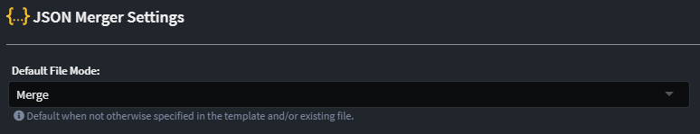

# JSON Code Management

This article explains how to control [Code Management / Merging](xref:application-development.code-management.about-code-management) behaviour for `.json` files when using the `Intent.Code.Weaving.Json` module.

## Overview of how it works

The merger parses `.json` files into a graph of nodes and recursively applies code management logic on a node-by-node basis.

The merger compares the generated content from the template with the existing file (if there is one) on a node-by-node basis. Instructions are used by the merger for it to determine for a particular node what content it should ignore, replace with content generated by the template or perhaps remove entirely.

## Code management instructions

Instructing the merger on how to treat particular nodes is done using code management instructions in your source code, within JSON, these are instructions like `// IntentIgnore` above nodes.

## Management modes

- **`// IntentFully`** - Intent has full control over the particular node, any deviations in the existing file's node are overwritten with the content generated by the template. Descendant nodes can be opted-out of being fully managed having an `// Intent<Mode>` instruction applied to them.
- **`// IntentMerge`** - Intent will add and remove Intent generated nodes for the node but will never remove nodes which were manually added.
- **`// IntentIgnore`** - Intent must ignore this node and not remove or overwrite it with content generated by the template. Code management instructions on descendant nodes are likewise ignored, i.e. it is not possible to opt-out of being ignored as a descendant.

## Default code management behaviour

By default, templates are in `Merge` mode. This default can be changed in the [settings](xref:module-building.application-settings) for your application:



## Node matching

The merger correlates nodes between existing and generated files by their field names on objects and for array items by their order or scalar value content.

### Matching scalar values in arrays

For cases where you want to replace a particular value in an array, you can add `(Match = "<starts with value>")` to the above instructions, e.g. `// IntentIgnore(Match = "SomeValue")`.

For example, the following is normally generated by a template:

```json
{
  "names": [
    "Alice",
    "Bob",
    "Charles"
  ]
}
```

If you wanted to replace `Bob` with a value, you can do the following:

```json
{
  "names": [
    "Alice",
    // IntentIgnore(Match = "Bo")
    "John",
    "Charles"
  ]
}
```

As `Bob` in the generated value starts with the string of `Bo` the items correlate.

### Matching objects in arrays by field value

For cases where you have an array of objects, you may want to match objects based on field names, this can be done by adding the following instruction above the array:

```json
// IntentMatchBy("<fieldName1>"[, "<fieldName2>"[, ...]])
```

Where `<fieldName1>`, `<fieldName2>`, etc are names of fields you the merger to match on.

Which instructs the merger that it should match objects when all the specified field names have matching values.

For example consider the following generated file:

```json
{
  "customers": [
    {
      "customerNumber": "00001",
      "name": "Generated Name 1"
    },
    {
      "customerNumber": "00002",
      "name": "Generated Name 2"
    }
  ]
}
```

And you want to override just the generated name to have a different value, so you ignore the field:

```json
{
  "customers": [
    {
      "customerNumber": "00001",
      // IntentIgnore
      "name": "Modified name"
    },
    {
      "customerNumber": "00002",
      "name": "Generated Name 2"
    }
  ]
}
```

The above won't work reliably as the merger also needs to be instructed that it should match items by the `customerNumber` field, which can be done as follows:

```json
{
  // IntentMatchBy("customerNumber")
  "customers": [
    {
      "customerNumber": "00001",
      // IntentIgnore
      "name": "Modified name"
    },
    {
      "customerNumber": "00002",
      "name": "Generated Name 2"
    }
  ]
}
```

As stated above, you can match on multiple fields, in the example below both `regionCode` and `customerNumber` fields must be the same for the objects to be considered a match.

```json
{
  // IntentMatchBy("regionCode", "customerNumber")
  "customers": [
    {
      "regionCode": "01",
      "customerNumber": "00001",
      // IntentIgnore
      "name": "Modified name"
    },
    {
      "regionCode": "02",
      "customerNumber": "00001",
      "name": "Generated name for customer in region code 2"
    }
  ]
}
```

If a template generates an `// IntentMatchBy` instruction it is not included in the output file but the merger will still respect it. This allows for keeping generated JSON looking clean while still allowing objects to be correlated predictably in arrays.
