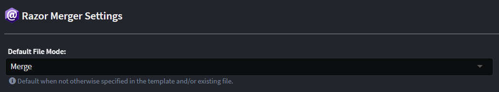

# Razor Code Management

This article explains how to control [Code Management / Merging](xref:application-development.code-management.about-code-management) behaviour for `.razor` files when using the `Intent.Code.Weaving.Razor` module.

## Overview of how it works

The Razor Merger parses `.razor` files into an [abstract syntax tree](https://en.wikipedia.org/wiki/Abstract_syntax_tree) and applies code management logic on a node-by-node basis. An individual node on the _abstract syntax tree_ is referred to as a _syntax node_. _Syntax nodes_ may have one or more children which are also _syntax nodes_.

The Razor Merger compares the generated content from the template with the existing file (if there is one) on a node-by-node basis. Instructions are used by the Razor Merger for it to determine for a particular syntax node what content it should ignore, replace with content generated by the template or perhaps remove entirely.

## Code management instructions

Instructing the Razor Merger on how to treat particular syntax nodes is done using code management instructions in your source code.

Within Razor syntax these are instructions like adding `intent-ignore` attributes in elements or `@Intent.Ignore` directives above syntax nodes.

Within `@codeblock` directives, the Razor Merger is delegating to the RoslynWeaver, please refer to its [article](xref:application-development.code-weaving-and-generation.about-code-management-csharp) for information on controlling C# Code management behaviour.

## Management modes

The following management modes can be used on Razor syntax nodes (Components, Directives, HTML Elements, etc):

- **`Fully`** - Intent has full control over the particular syntax node, any deviations in the existing file's syntax node are overwritten with the content generated by the template. Descendant syntax nodes can be opted-out of being fully managed having a `Merge` or `Ignore` instruction applied to them.
- **`Merge`** - Intent will add and remove Intent generated code for the the syntax node but will never remove code which was manually added.
- **`Ignore`** - Intent must ignore this syntax node and not remove or overwrite it with content generated by the template. Code management instructions on descendant syntax nodes are likewise ignored, i.e. it is not possible to opt-out of being ignored as a descendant.

It is also possible to specify that an instruction is only applicable to a particular aspect of a Razor syntax node:

- **`Body`** - Override only the body mode behaviour of the syntax node, generally body refers to inner syntax nodes or the content of a syntax node.
- **`Signature`** - Override only the signature mode behaviour of the syntax node, generally this refers to aspects like HTML element / component attributes of a syntax node.

There are two ways of applying management modes:

### Attribute syntax

You add an attribute in the format of `intent-<mode>[-(Body|Signature)]`, for example:

```html
<div intent-ignore class="content-block">
    content
</div>
```

Complete list:

- `intent-fully`
- `intent-fully-body`
- `intent-fully-signature`
- `intent-ignore`
- `intent-ignore-body`
- `intent-ignore-signature`
- `intent-merge`
- `intent-merge-body`
- `intent-merge-signature`

### Expression syntax

In some cases you may get a compilation or runtime error in your Razor file when applying unknown attributes to a Razor Component, in such cases you can apply an `@Intent.<Body>[Body|Signature]` expression above the syntax, for example:

```html
@Intent.Fully
<div class="content-block">
    content
</div>
```

Complete list:

- `@Intent.Fully`
- `@Intent.FullyBody`
- `@Intent.FullySignature`
- `@Intent.Ignore`
- `@Intent.IgnoreBody`
- `@Intent.IgnoreSignature`
- `@Intent.Merge`
- `@Intent.MergeBody`
- `@Intent.MergeSignature`

### Applying multiple instructions

Instructions can also be combined, for example you can say a syntax node is fully managed with its body ignored:

#### Multiple instructions (attribute syntax)

```html
<div intent-fully intent-ignore-body class="content-block">
    content
</div>
```

#### Multiple instructions (expression syntax)

```html
@Intent.Fully
@Intent.IgnoreBody
<div class="content-block">
    content
</div>
```

In the above, the `<div>` will be "Fully" controlled, while its body mode is overridden to be ignored, i.e. the Razor Merger should always update the attributes to match that generated by the template, but it should never update its body ("content" in this case).

## Default code management behaviour

By default, templates are in `Merge` mode. This default can be changed in the [settings](xref:module-building.application-settings) for your application:



## Syntax node matching

The Razor Merger applies a heuristic to try "match" syntax nodes in your "existing" file with a corresponding syntax node generated by the template it is merging with.

There are many cases where syntax nodes can't be easily differentiated and the Merger's default match may not be correct, this is particularly common with HTML Elements and Directives which appear numerous times within the same parent syntax node or root of the document. In such cases, an "identity" can be assigned to the syntax node which will force the Razor Merger to correlate the Syntax Node only with syntax nodes with a matching identity.

An "identity" can be assigned to a syntax node using any of the following ways:

- **An `id="<identity>"` HTML element attribute** - As this is a default attribute for HTML element it can be a "natural" identifier to use on elements if it's present.
- **An `intent-id="<identity>"` HTML element attribute** - This takes precedence over the `id` HTML element attribute and is useful for scenarios an HTML element's `id` is not "stable", i.e. if it's expected that the template output's `id` may change based on other factors.
- **An `@Intent.Id("<identity>")` instruction above the syntax node** - This takes precedence over both of HTML element attributes and was created with Razor Components in mind as trying to apply unknown attributes to them may cause a compilation error.
