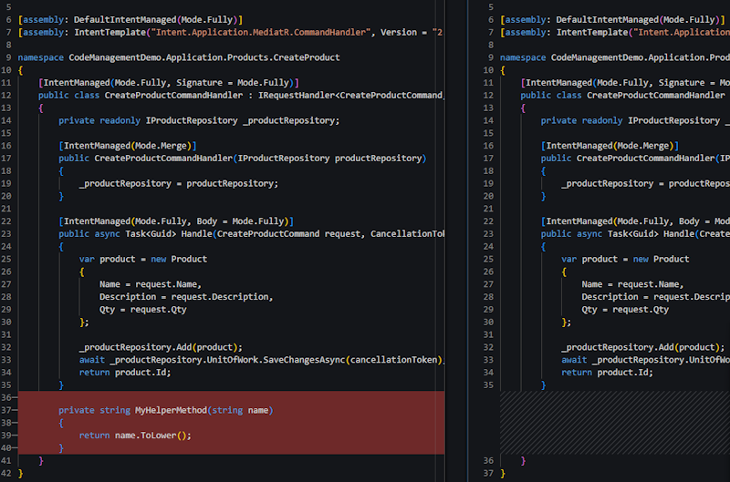
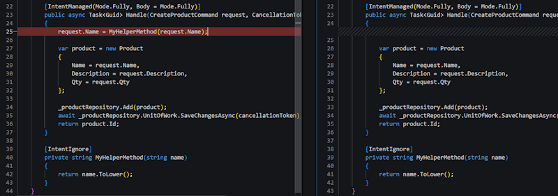
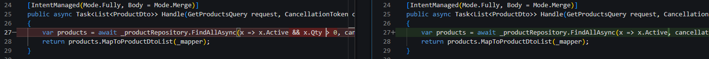
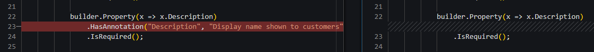
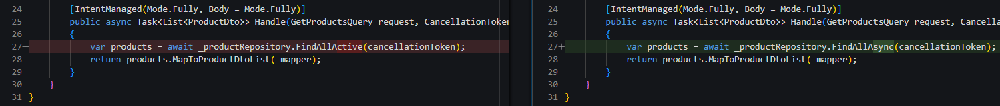
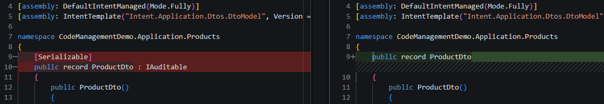

# Practical C# Code Management Examples

This guide provides practical examples for common code management scenarios in Intent Architect. Each example demonstrates how to handle real-world situations where you need to customize or extend generated code.

For a comprehensive explanation of code management concepts, see the [C# Code Management](xref:application-development.code-weaving-and-generation.about-code-management-csharp) documentation.

## Code Management Modes

Intent Architect creates and maintains large portions of your codebase through continuous code generation. When you need to customize the generated code, you can use _Code Management Instructions_ to control how Intent Architect handles specific sections of this code. This is achieved by adjusting the `Mode` for a section of code:

- **Fully** Mode: Intent Architect owns, governs and controls the generated code completely.
- **Ignore** Mode: The developer owns and controls the code completely. Intent Architect will not touch this code.
- **Merge** Mode: The Intent Architect generated code is intelligently merged with developer added code.

---

## When to use Code Management

The various code management techniques described below can be leveraged when:

- You want to put an exception or small tweak into the pattern output by Intent Architect.
- You want to extend the code which Intent Architect is generating.
- You want to completely customize the code Intent Architect is generating, either in an isolated fashion, or by opening the code up for broader changes.

The techniques can be applied in a number of ways depending on what you want to do and the intention you want to convey with the code management applied.

---

## Choosing the Right Code Management Technique

Intent Architect provides multiple code management techniques: `[IntentIgnore]`, `[IntentManaged(Mode.Ignore)]`, `// IntentIgnore` (along with other variants). The choice depends on where you're applying the instruction:

- **Attribute-based technique** (e.g., `[IntentIgnore]` or `[IntentManaged(Mode.Ignore)]`) - This should be the default technique and used most of the time (such as above classes, methods, properties, or any other C# element that supports attributes).

- **Comment-based techniques** (e.g., `// IntentIgnore`) - This should only be used when a C# attribute is not supported (such as inside method bodies or above individual lines of code).

> [!NOTE]
> Each file generated by Intent Architect will also have a `[DefaultIntentManaged]` attribute defined at the top of the file. This indicates the default instruction for the entire file and can be overridden at lower levels - either by modifying the existing code management attribute on the relevant code block (class, method, etc.) if present, or by adding it if not present.

---

## Practical Examples

### Intent Architect wants to remove my method

**Scenario:** You've manually added a method to a class, but Intent Architect wants to remove it during the Software Factory execution.

**Cause:** The class is fully managed (`[IntentManaged(Mode.Fully, Signature = Mode.Fully)]`), and Intent Architect doesn't recognize the custom method as part of the template output.

#### Solution 1: Apply Method-Level Ignore Attribute

**Use when:** You want to keep individual custom methods while keeping the class fully managed, or when you want to indicate that the class is _not_ open for extension generally.

Add the `[IntentIgnore]` attribute above the custom method:

[!code-csharp]

#### Solution 2: Use Class-Level Merge Mode

**Use when:** You are adding multiple custom methods to the same class, or when you want to indicate that the class is _generally_ open for extension with custom methods.

Change the class-level attribute to `[IntentManaged(Mode.Merge, Signature = Mode.Fully)]`. This instructs Intent Architect to merge generated methods with any developer-added methods.

[!code-csharp]

---

### Intent Architect wants to remove my custom code from a method

**Scenario:** You want to add custom code to an Intent Architect generated method, but Intent Architect wants to remove it during the Software Factory execution.

**Cause:** The method body is fully managed (`[IntentManaged(Mode.Fully, Body = Mode.Fully)]`), and Intent Architect doesn't recognize the custom code as part of the template output.

#### Solution 1: Use Method Body Merge Mode

**Use when:** You are adding multiple custom lines throughout a method body, or when you want to indicate that the method is _generally_ open for extension and you anticipate it will be extended.

Change the method attribute to `[IntentManaged(Mode.Fully, Body = Mode.Merge)]`. This instructs Intent Architect to merge generated code with custom code within the method body. The method signature and attributes remain fully managed.

[!code-csharp]

#### Solution 2: Use Statement-Level Ignore

**Use when:** You want to preserve specific lines of custom code while keeping the method body fully managed, or when you want to indicate that the method is _not_ open for extension generally.

If you need to add multiple lines to a method but still want to indicate that the method is not open for extension generally, an option is to extract those lines into their own method and add a single line to the Intent Architect generated method that invokes the new custom method.

Add the `// IntentIgnore` comment above the specific line or block you want to preserve. Since attributes cannot be applied to individual statements, the comment-based approach is required.

[!code-csharp]

Even though the body remains in `Fully` mode, the `// IntentIgnore` comment overrides management for that specific statement.

---

### I want to add to a code block generated by Intent Architect

**Scenario:** You need to add statements to a code block generated by Intent Architect, but the additions are removed during Software Factory execution.

> [!NOTE]
> This example covers _adding statements_ to a generated block. For _modifying existing statements_, see [Updating Generated Code Blocks](#i-want-to-update-a-code-block-generated-by-intent-architect).

#### Solution 1: Method Body Merge Mode

**Use when:** You are adding multiple custom statements across the method, or when you want to indicate that the method is generally open for extension and you expect it to be extended substantially.

Change the method attribute to `[IntentManaged(Mode.Fully, Body = Mode.Merge)]`. This allows Intent Architect to merge generated code with custom additions throughout the method body.

[!code-csharp]

#### Solution 2: Use Statement Block Merge

**Use when:** You want to add statement(s) to a specific code block while keeping other parts of the method fully managed, and when you want to indicate that the method is _not_ open for extension generally.

Add the `// IntentMerge` comment above the specific code block. This instructs Intent Architect to merge generated statements with your additions within that block only.

[!code-csharp]

---

### I want to update a code block generated by Intent Architect

**Scenario:** You need to modify a statement within a code block generated by Intent Architect, but the changes are reverted during Software Factory execution.

**Cause:** When you modify an existing generated statement (like changing `x => x.Active && x.Qty > 0`), Intent Architect cannot merge the code because the statement itself is being replaced, not added to.

> [!NOTE]
> This example covers _modifying existing statements_. For _adding new statements_, see [Adding to Generated Code Blocks](#i-want-to-add-to-a-code-block-generated-by-intent-architect).

#### Solution: Use Statement-Level Ignore

**Use when:** You need to modify a code block generated by Intent Architect, and when you want to indicate that the method is _not_ open for extension generally.

Add the `// IntentIgnore` comment above the modified statement to preserve your changes:

[!code-csharp]

You can apply this to individual statements within larger blocks. In the example below, only the `Description = GetProductDescription(request),` line is ignored:

[!code-csharp]

---

### I want to add to a method chain generated by Intent Architect

**Scenario:** You need to add a method call to a fluent method chain generated by Intent Architect, but the addition is removed during Software Factory execution.

#### Solution: Use Inline Ignore Comment

**Use when:** You need to add a specific method call to a fluent method chain while keeping other parts of the chain managed by Intent Architect.

Add the `// IntentIgnore` comment before the specific method call you want to preserve within the chain:

[!code-csharp]

---

### I want to override a statement Intent Architect generated with my own statement

**Scenario:** You want to replace a line of code generated by Intent Architect, with your own code, but the modification is being undone during the Software Factory execution.

#### Solution: Use Inline Ignore Comment with Match

**Use when:** You want to replace a line of code that Intent Architect has generated with a custom line of code, but want to keep the rest of the method fully managed.

Add the `// IntentIgnore` comment before the specific line you want to replace, with a `Match` parameter that specifies which generated line of code you want your line to replace.

The `// IntentIgnore(Match="var products = ")` instruction specifies: The following line should be ignored by the Software Factory, and it will replace a line of generated code which starts with `var products = `.

[!code-csharp]

---

### I want to add an interface or attribute to a Intent Architect generated class

**Scenario:** You want to add an _interface_ or _attribute_ to an Intent Architect generated class, but the added code element is removed during the Software Factory execution.

#### Solution 1: IntentMerge Attribute

**Use when:** You want to keep the manually added _interface/attribute_, as well as any Intent Architect generated _interfaces/attributes_, while indicating that the class _is_ open for extension generally.

Add the `[IntentMerge]` attribute to the class:

[!code-csharp]

#### Solution 2: IntentManaged Attribute with Targeted Merge

**Use when:** You want to keep the manually added _Interface/Attribute_, as well as any Intent Architect generated _interfaces/attributes_, while indicating that the class is _not_ open for extension generally.

The `[IntentManaged]` attribute can be added to the class, which allows for a more targeted approach to allow merging on specific aspects of the class. In the example below, the class remains `fully` managed, which the exception of `class signature` (the interfaces) and the `class attributes` which are both in `merge` mode.

[!code-csharp]

---
