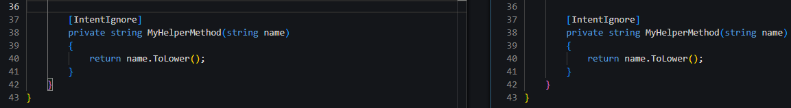

# C# Code Management Example

This document describes common real-world scenarios and use cases, with practical examples on how to handle these use cases.

If you would like a more in-depth, detailed explanation of code management in C#, please see the [C# Code Management page.](xref:application-development.code-weaving-and-generation.about-code-management-csharp)

## General Guidelines

There are a number of various code management techniques with different syntax: `[IntentIgnore]`, `[IntentManaged(Mode.Ignore)]`, `// IntentIgnore`, and shorthand alternatives. Which one to use when?

Generally any place where you are able to use a `C# attribute` (e.g. above a `class` or `method`), then the **attribute code management technique** (e.g. `[IntentIgnore]` or `[IntentManaged(Mode.Ignore)]`) should be used.

Where a `C# attribute` is not valid, such as in the body of a method, then the **comment code management technique** (e.g. `// IntentIgnore`) should be used.

---

## Practical Examples

### Intent wants to remove my custom method

You have a method you have manually added to a class, and Intent Architect wants to remove it:


This is happening, because the code management tags above the class indicate that the class is **fully managed by Intent Architect** (`[IntentManaged(Mode.Fully, Signature = Mode.Fully)]`) and the method is not part of the code generate by the Intent template.

There are two main ways to instruct Intent Architect to keep the custom method:

#### Class Merge Mode

The first option is to put the entire class into `Merge Mode` - at a class level, this instructs Intent to *merge generated methods with developer added methods*. To do this, the instruction above the class should be changed to `[IntentManaged(Mode.Merge, Signature = Mode.Fully)]`.

#### Method Ignore Attribute

The second option is to instruct Intent Architect to just ignore the individual method. This is achieved by adding the `[IntentIgnore]` attribute above the added method:



If you plan on adding a number of methods manually, the `Merge` option is more suitable as it only needs to be set once, and will apply to all methods added to the class.

---
---

### Intent wants to remove my custom code

There is a method generated by Intent Architect, and you need to augment the implemented code with your own code, but Intent Architect wants to remove it:


This is happening, because the code management tags above the method indicate that the method is **fully managed by Intent Architect** (`[IntentManaged(Mode.Fully, Body = Mode.Fully)]`) and the custom code is not part of the code generated by the Intent template.

There are a number of ways to instruct Intent Architect to keep the custom code:

#### Method Body Merge Mode

The first option is to put the **method body** into `Merge Mode` - this instructs Intent to *merge code generated in the body body of the method, with developer code manually added to the body*. To do this, the instruction above the class should be changed to `[IntentManaged(Mode.Fully, Body = Mode.Merge)]`.  
All other elements of the method (e.g. signature and attributes) will still be managed by Intent Architect, but the body specifically will allow merging.

``` csharp
[IntentManaged(Mode.Fully, Body = Mode.Merge)]
public async Task<Guid> Handle(CreateProductCommand request, CancellationToken cancellationToken)
{
    request.Name = MyHelperMethod(request.Name);

    var product = new Product
    {
        Name = request.Name,
        Description = request.Description,
        Qty = request.Qty
    };

    _productRepository.Add(product);
    await _productRepository.UnitOfWork.SaveChangesAsync(cancellationToken);
    return product.Id;
}
```

#### Method Statement Ignore

The second option is to instruct Intent Architect to just ignore the individual line/block statement. As attributes cannot be applied to a single line of code, is achieved by adding the `// IntentIgnore` comment above the line/block of code in question:

``` csharp
[IntentManaged(Mode.Fully, Body = Mode.Fully)]
public async Task<Guid> Handle(CreateProductCommand request, CancellationToken cancellationToken)
{
    // IntentIgnore
    request.Name = MyHelperMethod(request.Name);

    var product = new Product
    {
        Name = request.Name,
        Description = request.Description,
        Qty = request.Qty
    };

    _productRepository.Add(product);
    await _productRepository.UnitOfWork.SaveChangesAsync(cancellationToken);
    return product.Id;
}
```

Even though the `Body` is still in `Fully Mode` (fully managed by Intent Architect), the `// IntentIgnore` instruction can be used to instruct that a specific line/block be ignored.

### I need to add to an Intent generated code block

There is a block of code generated by Intent Architect, you want to add to the block of code, but Intent Architect wants to remove it:


> Note
Please also see the next section regarding [updating an Intent generated code block](#i-need-to-update-an-intent-generated-code-block), which is subtly different to *adding to a code block*.

#### Method Body Merge Mode - Code Block

As described in a [previous example](#method-body-merge-mode), one option is to put the **method body** into `Merge Mode` - this instructs Intent to *merge code generated in the body body of the method, with developer code manually added to the body*. To do this, the instruction above the class should be changed to `[IntentManaged(Mode.Fully, Body = Mode.Merge)]`.  
All other elements of the method (e.g. signature and attributes) will still be managed by Intent Architect, but the body specifically will allow merging.

``` csharp
[IntentManaged(Mode.Fully, Body = Mode.Merge)]
public async Task<Guid> Handle(CreateProductCommand request, CancellationToken cancellationToken)
{
    // IntentIgnore
    request.Name = MyHelperMethod(request.Name);

    var product = new Product
    {
        Name = request.Name,
        Description = request.Description,
        Qty = request.Qty,
        DateCreated = DateTime.UtcNow
    };

    _productRepository.Add(product);
    await _productRepository.UnitOfWork.SaveChangesAsync(cancellationToken);
    return product.Id;
}
```

#### Statement Block Merge

The second option is to instruct Intent Architect to *merge* the generated statement in the block, with developer added statements. As attributes cannot be applied to a single line of code, is achieved by adding the `// IntentMerge` comment above the /block of code in question:

``` csharp
[IntentManaged(Mode.Fully, Body = Mode.Fully)]
public async Task<Guid> Handle(CreateProductCommand request, CancellationToken cancellationToken)
{
    // IntentIgnore
    request.Name = MyHelperMethod(request.Name);

    // IntentMerge
    var product = new Product
    {
        Name = request.Name,
        Description = request.Description,
        Qty = request.Qty,
        DateCreated = DateTime.UtcNow
    };

    _productRepository.Add(product);
    await _productRepository.UnitOfWork.SaveChangesAsync(cancellationToken);
    return product.Id;
}
```

---
---

### I need to update an Intent generated code block

There is a block of code generated by Intent Architect, you want to change a statement in the block of code, but Intent Architect wants to undo it:


In this example, `x => x.Active && x.Qty > 0` is considered a single statement, so Intent Architect is unable to merge code - the actual statement itself is being changed.

> Note
Please also see the previous section regarding [add to an Intent generated code block](#i-need-to-add-to-an-intent-generated-code-block), which is subtly different to *updated a generated code block*.

#### Code Block Statement Ignore

The `// IntentIgnore` statement can be used to instruct Intent Architect to ignore changes made to the statement:

``` csharp
[IntentManaged(Mode.Fully, Body = Mode.Merge)]
public async Task<List<ProductDto>> Handle(GetProductsQuery request, CancellationToken cancellationToken)
{
    // IntentIgnore
    var products = await _productRepository.FindAllAsync(x => x.Active && x.Qty > 0, cancellationToken);
    return products.MapToProductDtoList(_mapper); 
}
```

This can also be applied to individual statements if they are easily separable. In the below example, just the `Description = $"{request.Description}...",` statement has been ignored.

``` csharp
[IntentManaged(Mode.Fully, Body = Mode.Fully)]
public async Task<Guid> Handle(CreateProductCommand request, CancellationToken cancellationToken)
{
    // IntentIgnore
    request.Name = MyHelperMethod(request.Name);

    // IntentMerge
    var product = new Product
    {
        Name = request.Name,
        // IntentIgnore
        Description = $"{request.Description}...",
        Qty = request.Qty,
        DateCreated = DateTime.UtcNow
    };

    _productRepository.Add(product);
    await _productRepository.UnitOfWork.SaveChangesAsync(cancellationToken);
    return product.Id;
}
```

---
---

### I need to add to an Intent Architect generate method chain

There is a method chain generated by Intent Architect, you want to add to the chain, but Intent Architect wants to remove it:


#### Method Chain Ignore

The `// IntentIgnore` statement can be used to instruct Intent Architect to ignore a specific method invocation added to the method chain:

``` csharp
builder.Property(x => x.Description)
    // IntentIgnore
    .HasAnnotation("Description", "Display name shown to customers")
    .IsRequired();
```

---
---