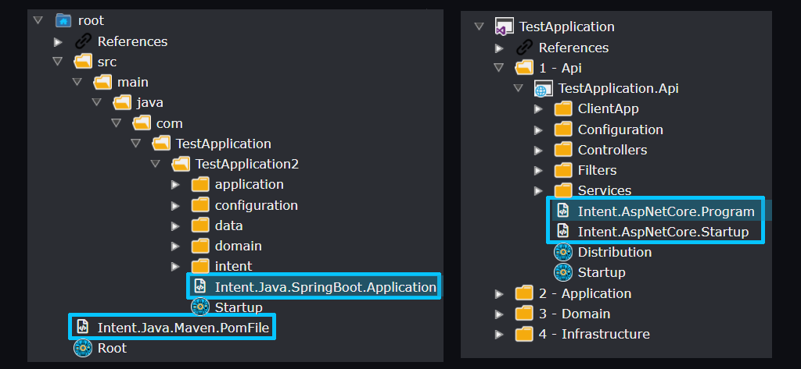
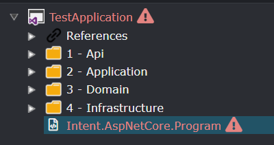
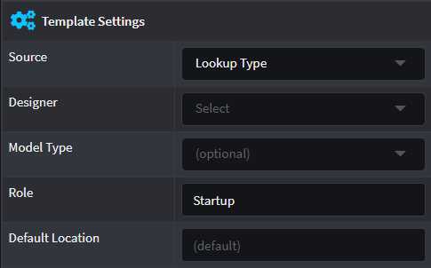
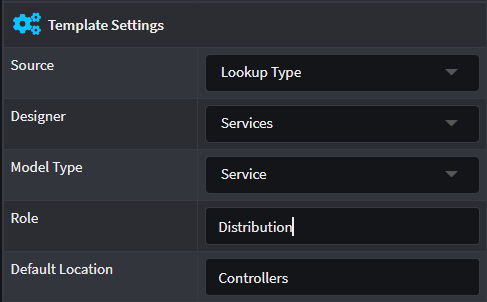
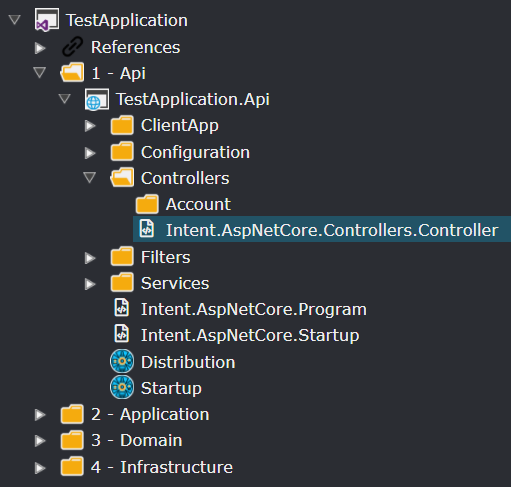

# About Template Output Targeting

## Overview

`Output Targeting` refers to how Intent Architect determines where a Template's output should be placed on the file system during the software execution through configuration within designers and the template itself.

Some designers (such as the "Folders" and "Visual Studio" designers) support "Output Configuration" which lets Intent Architect know during module installation that "Template Outputs" should be placed in it. During Software Factory Execution, those "Template Outputs" will mark clear locations where the output should be placed.

_Example features both a Folder (left) and Visual Studio (right) designer layout with Template Output items highlighted_

## Template Outputs

`Template Output`s in the designers are used by the Software Factory to know where on the file system that template output should be written, in particular under which sub-folder. As modules are installed, for each template within them, a `Template Output` is automatically created with its name being the value of the `TemplateId` property of the template as specified during module building.

## Unassigned Template Output

Some designers (such as the Visual Studio designer) will show unassigned Template Outputs in red:

And running the the SF while these template are unassigned will result in errors during the SF execution about there being unassigned templates.

Templates can specify where their "Template Output" should be placed by default during module installation so that things work automatically, this is covered in the next section.

## Roles and Default Locations

Templates in the module builder can have their Role and Default Location configured. These are used by Intent Architect during module installation to determine where the template's Template Output should be placed.

Here you can specify the name of the `Role` which the Template need to be associated with so that when a Module installs this Template, it will locate that Role and place the `Template Output` in the exact same place as the `Role` so that it will not be placed by default in the root location of the `Output Configuration Designer` and be considered an unassigned `Template Output`.

The `Default Location` field accepts a directory path relative to the location of where the `Role` is where the `Template Output` will be placed.

The following example depicts a Template created in the Module Builder and installed in a target Application.

The `Role` is set to "Distribution" and `Default Location` is set to "Controllers".

In the example above the `Distribution` Role can be identified by the blue badge icon and on the same tree level you will find the `Controllers` Folder.

Once that Module is installed, it will create the `Template Output` named "Intent.AspNetCore.Controllers.Controller" where the `Role` "Distribution" is located but in a folder location relative to the `Role` which is "Controllers".

> [!NOTE]
> Re-installing a Module may cause unassigned Template Outputs to be relocated, however assigned Template Outputs will remain untouched. This will allow you as a user to customize the output layout as you need it to be.
