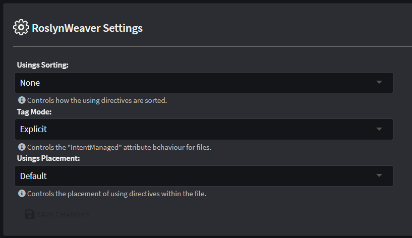

# C# Code Management

This article explains how to control [Code Management](xref:application-development.code-weaving-and-generation.code-management) (Code Weaving) behaviour for C# files when "RoslynWeaver" (the C# code management extension of the `Intent.OutputManager.RoslynWeaver` Module) is used.

## Introduction

C# files which are managed by the RoslynWeaver typically have a line at the top of them which is very similar to (if not exactly like) the following:

```csharp
[assembly: DefaultIntentManaged(Mode.Fully)]
```

This attribute is located on a global scope which will instruct the Roslyn Weaver to by default treat the whole file according to the configuration mode of `Fully` (in this case). It may be overridden in certain parts of the file which will be addressed later.

`Mode` comes with three configuration options:

* `Fully` - It has **full** control over the file for Code Automation (like typical Code Automation).
* `Merge` - It may only make modifications and additions to this file but it's not allowed to remove anything.
* `Ignore` - It has **no** control over the file and will not generate or overwrite anything in it.

## Syntax Nodes

The C# programming language (like any other programming language) can be represented in the form of an [Abstract Syntax Tree](https://en.wikipedia.org/wiki/Abstract_syntax_tree) and the RoslynWeaver interprets the C# code in the same way. Nodes may consist of Classes, Members, Methods, Parameters, etc.

## Override code management using `[IntentManaged]`

For example, to control code management behaviour for a method, you could add an `[IntentManaged]` attribute to it like so:

```csharp
[IntentManaged(Mode.Ignore)]
public void ChangeCountry(string country)
{
    throw new NotImplementedException();
}
```

When the RoslynWeaver sees this, it will know not to modify (or remove) this method in any way during code merging.

This attribute does have additional properties of configuration which gives a developer finer grain of control. Below can be seen the attribute written in C# in its entirety, followed by more in depth descriptions of what each piece does.

```csharp
[IntentManaged(Mode.Merge, Body = Mode.Ignore, Signature = Mode.Fully, Comments = Mode.Fully, Attributes = Mode.Fully)]
```

> [!NOTE]
> The `Mode` configuration works exactly the same as with the `DefaultIntentManaged` attribute, except that the scope is now on a method level and not a file level.

| Syntax Node Type    | Parameter         | Mandatory | Description                                                                                                                                                              |
|---------------------|-------------------|-----------|--------------------------------------------------------------------------------------------------------------------------------------------------------------------------|
| All                 | Default Parameter | Yes       | Sets the default values for all parameter types to instruct the RoslynWeaver what to do. Can be overridden on a per-parameter basis.                                     |
|                     | Attributes        | No        | By default the `Signature` parameter determines this parameter's setting but this parameter instructs the RoslynWeaver to treat the syntax node's Attribute differently. |
|                     | Comments          | No        | By default the `Signature` parameter determines this parameter's setting but this parameter instructs the RoslynWeaver to treat the syntax node's Comments differently.  |
| Class               | Signature         | No        | Instructs the RoslynWeaver to treat the definition of a Class (class name, inheritance, etc.) differently to the default parameter setting.                              |
|                     | Body              | No        | Instructs the RoslynWeaver to treat the members of a Class (methods, properties, etc.) differently to the default parameter setting.                                     |
| Constructor, Method | Signature         | No        | Instructs the RoslynWeaver to treat the definition of a Method (method name, parameters, return type, etc.) differently to the default parameter setting.                |
|                     | Body              | No        | Instructs the RoslynWeaver to treat the implementation part of a method (where the code goes) differently to the default parameter setting.                              |
| Field, Property     | Signature         | No        | Instructs the RoslynWeaver to treat the definition of a Field (field name, type, etc.) differently to the default parameter setting.                                     |
|                     | Body              | No        | Instructs the RoslynWeaver to treat the value differently to the default parameter setting.                                                                              |

## Module Settings



The `Intent.OutputManager.RoslynWeaver` Module has the following settings which will instruct Intent Architect to behave in certain ways:

### Usings Sorting

This will instruct Intent Architect to order the `using directives` located above or within a `namespace` scope within a C# file.

| Option                                        | Description                                                                                                               |
|-----------------------------------------------|---------------------------------------------------------------------------------------------------------------------------|
| None                                          | The order of the using directives will remain unchanged.                                                                  |
| Alphabetical                                  | The using directives will be sorted alphabetically in ascending order.                                                    |
| Alphabetical, place 'System' directives first | The using directives will be sorted alphabetically except it will give first priority to `System` based using directives. |

### Tag Mode

The RoslynWeaver takes instruction from `[IntentManaged]` attributes located within C# files that exist on your file system.

Note that Syntax Nodes that gets generated and written to existing C# files may also have `[IntentManaged]` attributes in them which gives the initial placement of those attributes from the first Software Factory Execution.

| Option        | Description                                                                                                                                                                                                                                                                                                                                                                                                                         |
|---------------|-------------------------------------------------------------------------------------------------------------------------------------------------------------------------------------------------------------------------------------------------------------------------------------------------------------------------------------------------------------------------------------------------------------------------------------|
| Explicit      | The RoslynWeaver will only look to the existing file for `IntentManaged` attributes except in the case where the Generated output will add new Syntax Nodes to the existing file.                                                                                                                                                                                                                                                   |
| Implicit      | The RoslynWeaver will look to the existing file for `IntentManaged` attributes and compare them with the ones found in the Generated output. If they happen to match then the ones found in the existing file will be removed. Any Syntax Nodes that do not happen to have any `IntentManaged` attributes on them in the existing file, will cause the RoslynWeaver to inspect the Generated output for `IntentManaged` attributes. |
| Template Only | The RoslynWeaver will only look at the Generated output for `IntentManaged` attributes. The only exception is on the first time the Software Factory is executed with this mode selected, which will afterwards remove all `IntentManaged` attributes from the existing file.                                                                                                                                                       |

### Usings Placement

This will instruct Intent Architect where to place the `using directives` within a C# file.

| Option                   | Description                                                            |
|--------------------------|------------------------------------------------------------------------|
| Default                  | All using directives will be placed at the top of the C# file.         |
| Move to inside namespace | All using directives will be placed within the scope of a `namespace`. |

## Frequently Asked Questions

### How can I disable the RoslynWeaver from formatting my C# files?

By default the RoslynWeaver will automatically format files under [code management](xref:application-development.code-weaving-and-generation.code-management). If this is undesired you can disable this behaviour by using the method `WithAutoFormatting` with the first parameter set to `false` in the `DefineFileConfig` method of your template:

```csharp
protected override CSharpFileConfig DefineFileConfig()
{
    return new CSharpFileConfig(
        className: "MyClass",
        @namespace: OutputTarget.GetNamespace())
        .WithAutoFormatting(false);
}
```

### Why can the RoslynWeaver not remove my `using directives`?

By default, RoslynWeaver uses `Merge` as the management mode for `using directives`, where it will only ever add new ones and never remove existing ones. This can be overridden by adding an `[assembly: DefaultIntentManaged(Mode.Fully, Targets = Targets.Usings)]` in your file, typically just beneath the existing `DefaultIntentManaged` attribute, for example:

```csharp
[assembly: DefaultIntentManaged(Mode.Fully)]
[assembly: DefaultIntentManaged(Mode.Fully, Targets = Targets.Usings)]
```
