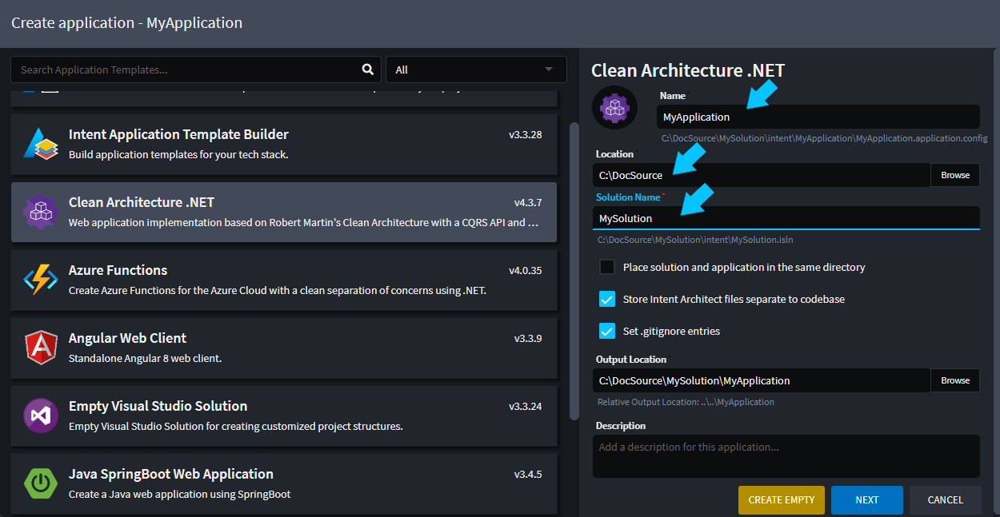
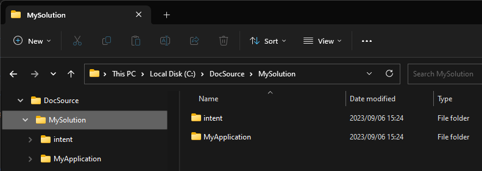
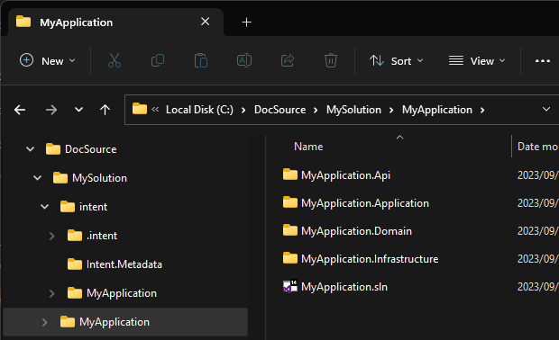
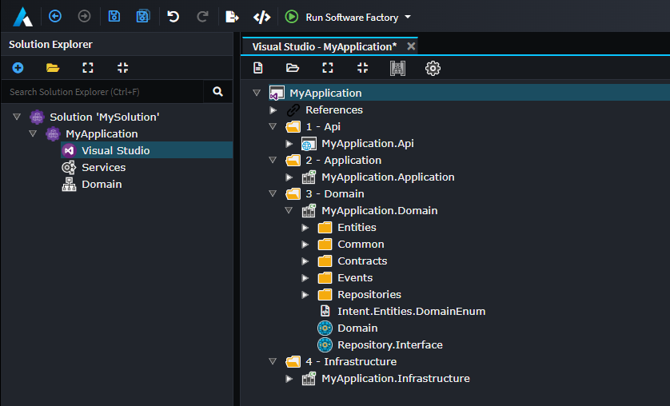
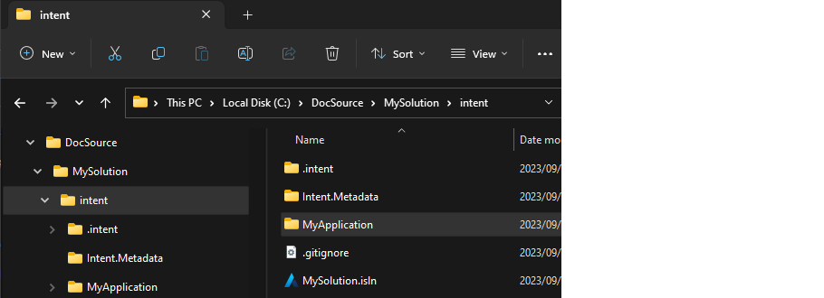
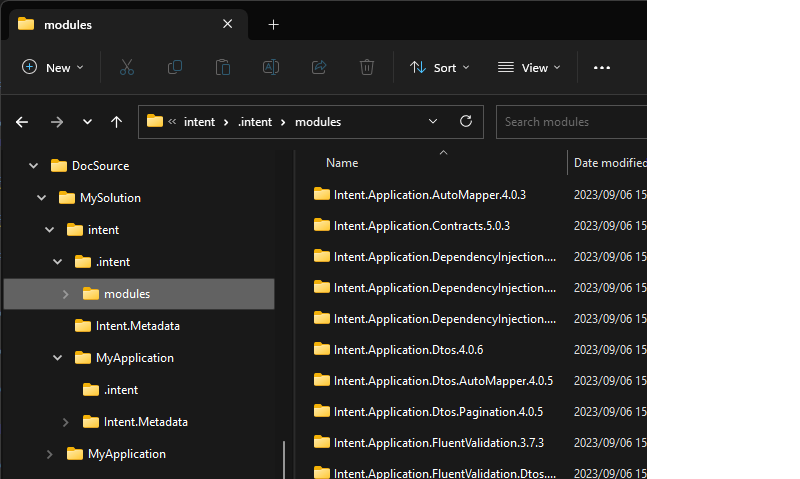
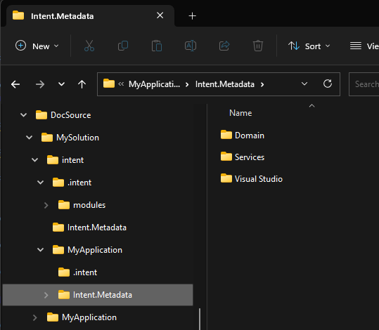

# How Intent Architect Solutions are structured on the File System

This article covers how Intent Architect solutions are structured on you local file system.

## How Intent Architect solutions are structured

When you create an Intent Architect solution, it creates many folders and files related to the solution, at a high level there are a few concepts you should be aware of. The application wizard, allows you to specify several settings which influence this structure, as follows:



The main settings we will be concerned with here are:

* Location
* Solution Name
* Application Name

### Folder structure basics

Intent Architect will create a folder `{Location}\{Solution Name}`, everything related to the solution will be stored in this folder. This folder contains 2 sub-folders, namely `intent` and `{Application Name}`.

The `intent` folder contains all data related to this specific solution, this includes:

* Solution / Application settings, Intent Architect configuration information.
* Designer Metadata, all designer related data, i.e. domain models, service models, etc.
* Module manifests, details on what specific modules, (and their versions) are being used.

The `{Application Name}` folder contains the full source code for the {Application Name} application. In the context of a .Net application, this would be:-

* Visual Studio solution file
* Various `CSProj` files and their related artifacts.

> [!NOTE]
> Every additional Application you add to your Intent Architect solution will add an additional folder here, with that application's source code in it.

### The Intent Architect solution file (`.isln`)

The Intent Architect solution file, `.isln` file extension, is the entry point file for your Intent Architect solution, very analogous to a Visual Studio solution file. Double-clicking this file will open the solution in Intent Architect. When you create a new Solution within Intent Architect it will create an `isln` file for you in the following location:

```csharp
{Location}\{Solution Name}\intent\{Solution Name}.isln
```

### Solution folder structure

When you create a new Intent Architect solution, you are presented with several option on how you would like it configured. The section will cover the defaults options, any variations should be intuitive. The application template wizard will present you with a screen as per below.


If you proceed through the wizard and create the solution, Intent Architect will create a folder structure as follows:



Note the folder structure of created inline with your selected options i.e. {Location}\{Solution Name}. Within this folder there are 2 sub-folders namely:

* `intent`, this folder contains all the Intent Architect data for this solution.
* `MyApplication`({Application Name}), this folder contains the source code for the `MyApplication` Intent Application.

### Application source code

Looking inside the `MyApplication` folder, you will find all the source code for the application. (Assuming you have run the Software Factory and applied the changes)
If you have worked with C# solutions before, this should look familiar to you. Here we can see a C# solution file (MyApplication.sln) which contains 4 C# projects. This c# solution is source code realization of the Intent Architect application and it's designs.



> [!NOTE]
> If you are wondering why the C# solutions / projects are generated the way they are, this has been configured in the [`Visual Studio Designer`](xref:application-development.applications-and-solutions.about-the-visual-studio-designer) or `Folder Designer` with in Intent Architect.
> 

### Intent Architect Solution data

Investigating the `intent` folder, you will find the following:



This folder contains the following items:-

* `.intent\modules` folder, this folder is the `Module Cache` and contains copies of downloaded and installed modules the solution is running.
* `Intent.Metadata` folder, this folder contains Intent Architect solution related data.
* `MyApplication` folder, this folder contains Intent Architect application related data, for the `MyApplication` application.
* `.gitignore` file, this file is setup so that the module cache folder, mentioned above, does not get committed into version control.
* `MySolution.isln` file, the Intent Architect solution file, for this solution. Double clicking this file will open the solution in Intent Architect. (This is very analogous to a .sln file for your C# IDE)

### Module cache

This folder is very analogous to a NuGet package folder, it is a directory on your solution where Intent Architect modules it has downloaded are cached for use by the Intent Architect Applications. If you take a look at what's in this folder, you will see folders, corresponding to the Modules you have installed across your various Applications.



> [!NOTE]
> Similar to NuGet, this folder is a cache and does not need to be version controlled and can be cleared if required. The Applications keep track of what modules they need and at what specific version (modules.config). There is a `.gitignore` configured to ensure the actual module binaries don't get committed into version control.

### Intent Architect Application data

The `MyApplication` folder contains application specific data, looking into this folder the following items are of interest:-

* `MyApplication.application.config`, this file contains all the application specific configuration information.
* `Intent.Metadata` folder, this folder contains all the Metadata described in the installed `Designer`s.
* `modules.config` file, this file contains which modules , and a what specific version, are being referenced by the Application.

### Application Metadata folder

This Folder contains all the Metadata described in the installed `Designer`s, for example let's say you have the following 3 designers installed:

* Domain Designer
* Services Designer
* Visual Studio Designer

Then this folder would contain 3 sub-folders, one for each designer where each of these children would contain all the Metadata for their designer.


