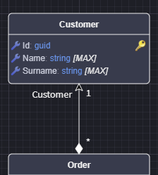
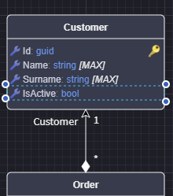
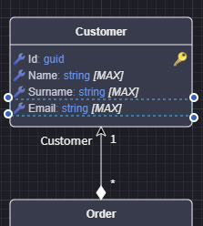
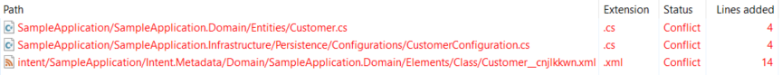
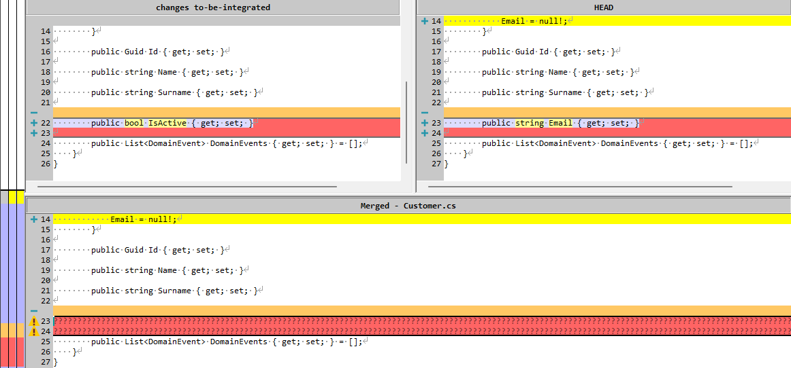
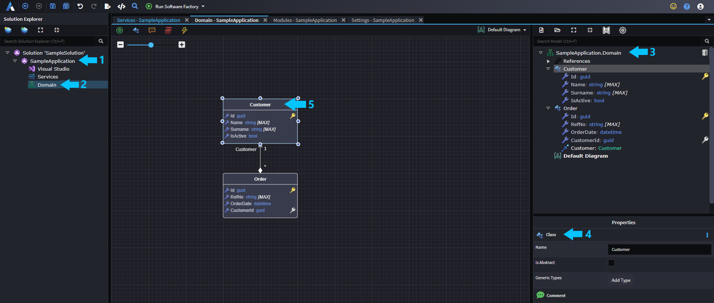
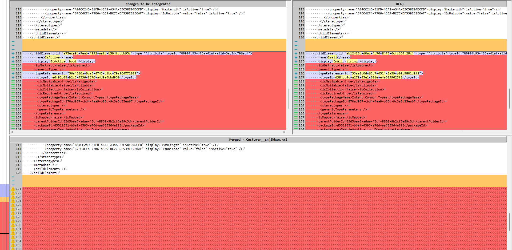
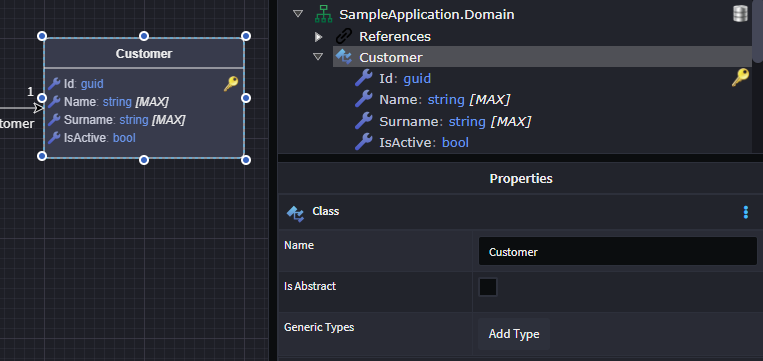
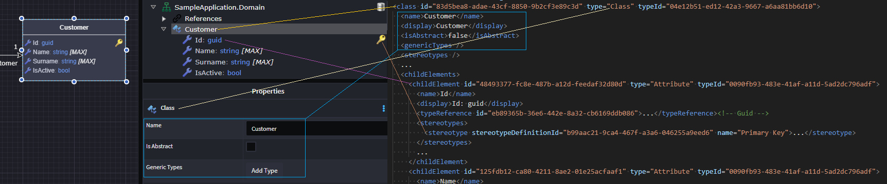
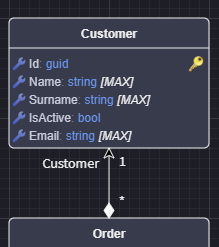

# Understanding and resolving merge conflicts involving Intent Architect metadata files

Everything you design within Intent Architect is persisted inside the `intent` folder as `.xml` files. As with any files stored in a repository, it's possible for the same file to be edited differently across branches or by multiple users. In that case you may encounter a **merge conflict** that must be resolved.

This is similar to resolving conflicts in a `.csproj` file. Resolving the conflicts is generally very straightforward once you understand the largely self-evident cleartext file format.

We strive to keep our metadata files human-readable and appropriately sized to minimize conflicts, in particular different concepts (e.g. `Class`, `DTO`, `Service`) each have separate files meaning that unless multiple developers are working on the exact same concept, they shouldn't interfere with each other at all.

To reduce the frequency and complexity of merge conflicts, apply standard development practices:

- **Pull frequently** – Regularly fetch and merge changes from the main branch to stay in sync.
- **Keep branches short-lived** – Work in small, focused branches and merge them quickly.
- **Communicate with your team** – Coordinate when multiple people are working on related areas.
- **Avoid large commits** – Make atomic commits that are easier to review and merge.
- **Rebase instead of merging (when appropriate)** – Keeps history clean and makes conflicts easier to manage.
- **Use tools for visual diffing** – Tools like Beyond Compare, Meld, or IDE-integrated tools help clarify changes.

## Understanding a merge conflict by example

Assume you have a `Customer` entity, and this design has already been committed to the `development` branch.



Now you want to make a change to the `Customer`. In this example, an **IsActive** `Attribute` has been added.



Now let’s assume another developer made a different change—adding an `Email` attribute to the `Customer`—and pushed it into the `development` branch.



When you try to merge your changes into `development`, you'll encounter a merge conflict that looks something like this:



Looking at the files involved, we can categorize the conflicts into two groups:

- **Codebase files** – `...Customer.cs` and `...CustomerConfiguration.cs`
- **Intent Architect metadata files** – `Customer__cnjlkkwn.xml`

### Merging Codebase Files

Let’s look at `Customer.cs` as an example.



This is a standard merge conflict that developers are accustomed to resolving. In this case, the resolution is simply to add both properties to the `Customer` class.

> [!NOTE]
> If these codebase files are **fully automated**—i.e. the code is fully generated with no customizations—it doesn’t really matter how you resolve these conflicts, as the files will be regenerated once you’ve resolved the metadata conflicts and re-run the Software Factory.

### Merging Intent Architect Metadata Files

Now let’s look at merging the `Customer__cnjlkkwn.xml` file. Even before viewing its contents, there’s useful context available in the filename.

```text
...\intent\SampleApplication\Intent.Metadata\Domain\SampleApplication.Domain\Elements\Class\Customer__cnjlkkwn.xml
```

Here’s a breakdown of the folder and filename structure:

```text
...\intent\{Application Name}\Intent.Metadata\{Designer Name}\{Package Name}\Elements\{Element Type}\{Instance Name}__cnjlkkwn.xml
```

Extracting the Data

| No | Concept          | Value                    |
|----|------------------|--------------------------|
| 1  | Application Name | SampleApplication        |
| 2  | Designer         | Domain                   |
| 3  | Package Name     | SampleApplication.Domain |
| 4  | Element Type     | Class                    |
| 5  | Instance Name    | Customer                 |

Visually, we can locate this in Intent Architect as follows:



In this example, you already know the nature of the conflict because the scenario was explained. However, even without that context, you could reasonably infer—from the filename alone—that both you and another developer made changes to the `Customer` entity in the `Domain` designer of the `SampleApplication` application.

Looking at the actual merge conflict, we would see the following:



Before diving into the resolution, let's explore this file a bit to understand what we're looking at.

This is what we have modelled:



And this is what the **Customer metadata file** looks like:

```xml
<?xml version="1.0" encoding="utf-8"?>
<class id="83d5bea8-adae-43cf-8850-9b2cf3e89c3d" type="Class" typeId="04e12b51-ed12-42a3-9667-a6aa81bb6d10">
  <name>Customer</name>
  <display>Customer</display>
  <isAbstract>false</isAbstract>
  <genericTypes />
  <stereotypes />
  ...
  <childElements>
    <childElement id="48493377-fc8e-487b-a12d-feedaf32d80d" type="Attribute" typeId="0090fb93-483e-41af-a11d-5ad2dc796adf">
      <name>Id</name>
      <display>Id: guid</display>
      <typeReference id="eb89365b-36e6-442e-8a32-cb6169ddb086">...</typeReference><!-- Guid -->
      <stereotypes>
        <stereotype stereotypeDefinitionId="b99aac21-9ca4-467f-a3a6-046255a9eed6" name="Primary Key">...</stereotype>
      </stereotypes>
      ...
    </childElement>
    <childElement id="125fdb12-ca80-4211-8ae2-01e25acfaaf1" type="Attribute" typeId="0090fb93-483e-41af-a11d-5ad2dc796adf">
      <name>Name</name>
      <display>Name: string</display>
      ...
    </childElement>
    <childElement id="8495e09c-999a-40b9-b72d-1b77c49e0627" type="Attribute" typeId="0090fb93-483e-41af-a11d-5ad2dc796adf">
      <name>Surname</name>
      <display>Surname: string</display>
      ...
    </childElement>
```

Looking at the XML metadata file, you can see how it structurally maps to the visuals you see in the **Tree View**. If you select elements like the `Entity` or an `Attribute` and inspect the **Property Pane**, you'll start to notice values that match those in the XML file.



Now that we understand what’s going on in the file, let’s revisit the merge conflict:


With a better understanding of the file, it’s clear that two attributes were added: `IsActive` (added by you) and `Email` (added by another developer), each attribute is encapsulated in a `<childElement>...</childElement>` XML element so what we need is both versions of the `<childElement>`s and their nested elements. Now you’re well positioned to resolve the conflict—by keeping both attributes.

### After Resolution, Run the Software Factory

Once the conflicts are resolved, go back to Intent Architect. It will prompt you to reload the designers since the underlying files have changed.

In the Domain Designer, you’ll now see the updated `Customer` in the domain model:



Re-run the Software Factory to ensure the generated codebase is correctly aligned with the design after merging.
