# Intent Architect standard patterns and architectures

Intent Architect offers patterns and templates for many "industry standard" architectures.

Before possibly [making your own modules or patterns](xref:module-building.overview), we recommend first assessing what we already have available as they can provide the following benefits organizations:

- **Focus on your own project** - Jump straight to development of your application without needing to spend significant time researching technologies or building your own modules first.
- **Use "best practices"** - The Intent Architect team has already done the work of researching the general industry accepted best practices for working with particular technologies.
- **Highly mature** - The modules built by the Intent Architect team already cover a wide variety of requirements for particular technologies while also covering many edge-cases, some of which you may not even be aware of yet.
- **Leave module updates and improvements to us** - If there is a bug, or additional functionality you require with the module, we can take care of it for you.
- **Get improvements for free** - We're constantly evolving and improving our modules based on client requirements and new capabilities available for the underlying patternized technology, there is no need for you to set aside time to update your own modules to be able to take advantage of new features of patternized technology.
- **Open Source** - All our modules are [open source](https://github.com/IntentArchitect/), if you need an improvement or fix "immediately", you can fork our repository, make the change on your side and then create a pull request for us to apply it our own releases.

## The Clean Architecture (C#)

Overwhelmingly, our most popular application template is _Clean Architecture .NET_:

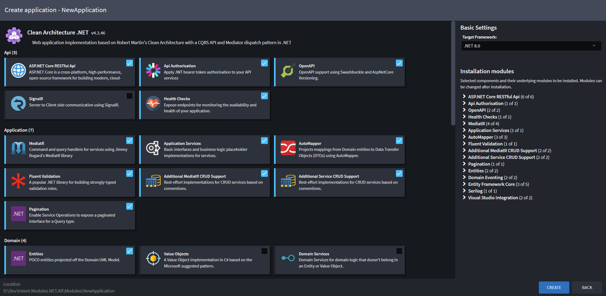

For a great overview on this architecture, we highly recommend watching our [CEO's, Gareth Baars, webinar where he does a deep dive into domain modeling](https://intentarchitect.com/#/insights-deep-dive-domain-modeling).

### Anemic and Rich Domain Model DDD support

Our Clean Architecture fully supports both the "anemic" and "rich" domain model approaches discussed by well respected industry leaders in regards the DDD (Domain Driven Design) space such as Eric Evans and Martin Fowler.

#### Simple Rich Domain Model Example

In this example, we've modeled a `Customer` and `Address` in our _Domain_ designer and an `AddAddress` _Operation_ on `Customer`:

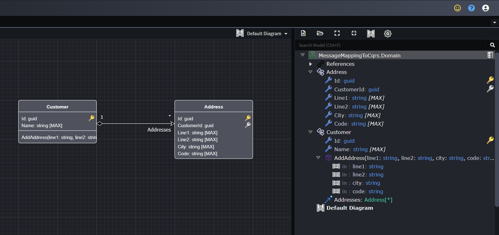

Then in our _Services_ designer we've used the the _Create CRUD CQRS Operations_ script to create the following:

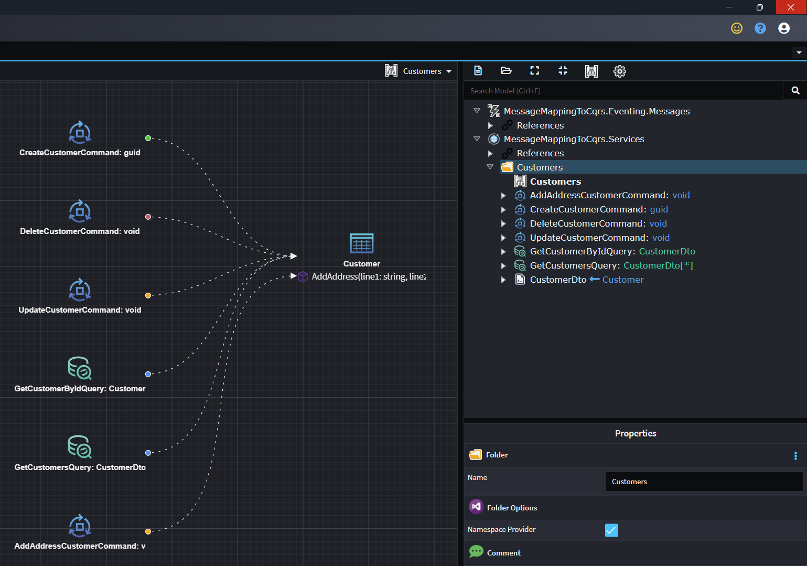

Notice how it automatically created an `AddAddressCustomerCommand` which is mapped to the operation in our Domain, this capability was added to our script as part of our strong support for Rich Domain Modeling.

To add to this example, it's also possible for incoming integration messages to call domain operations to.

In our Eventing Package in the same designer, we've created a `CustomerAddressAdded` message:

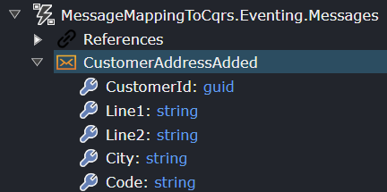

We drag the message onto the diagram, then right-click it and select the _New Integration Event Handler_ option:

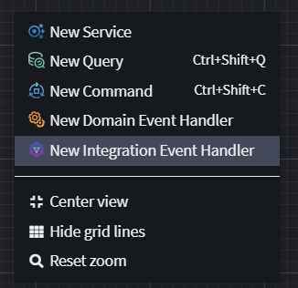

We right-click the handler and select the _Subscribe to Integration Event_ option and drop the other end onto the message:

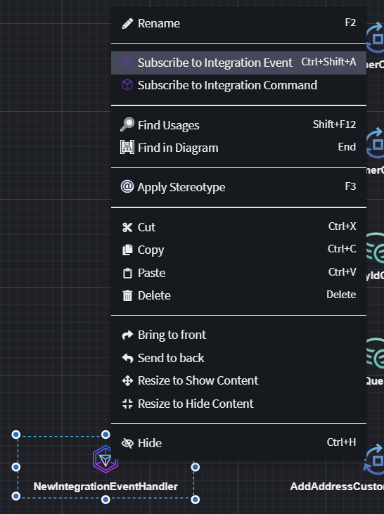

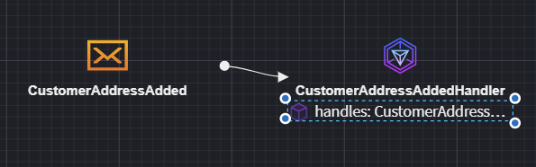

Right-click the `handles` _Operation_ on the _Integration Event Handler_ and select the _Send Command_ option and drop the end on the _Command_:

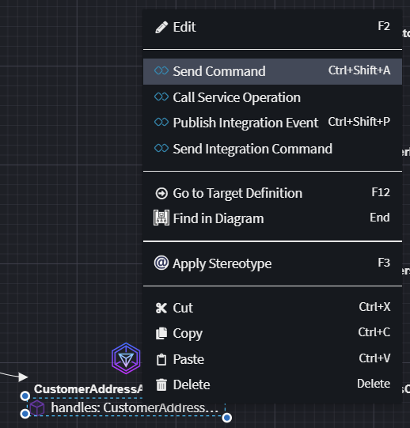

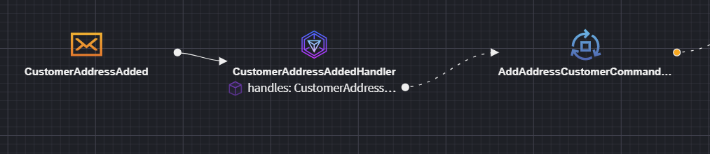

Right-click the association and select the _Map to Command_ option and map the fields as desired:

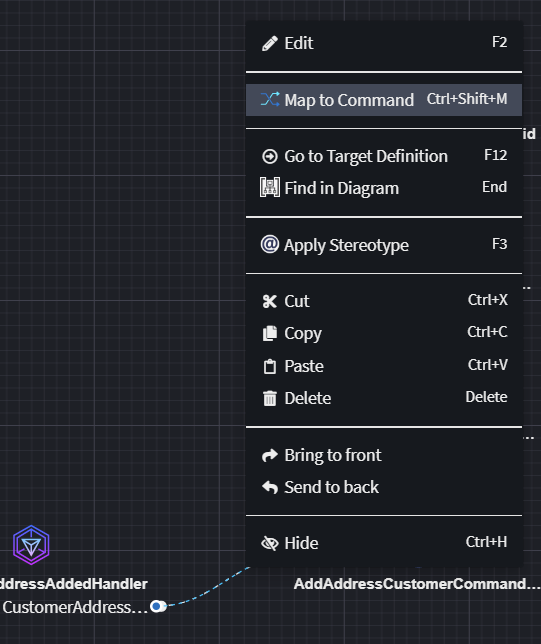

Intent will then generate the correct code to dispatch the _Command_:

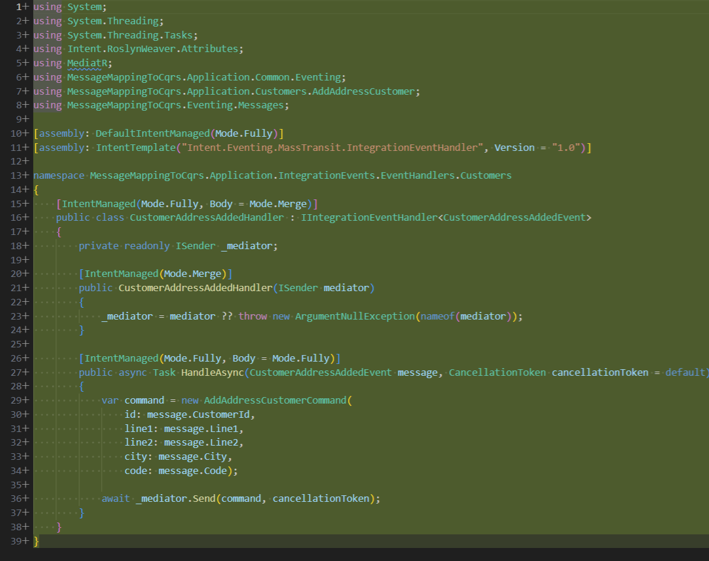
