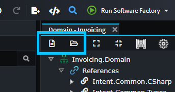
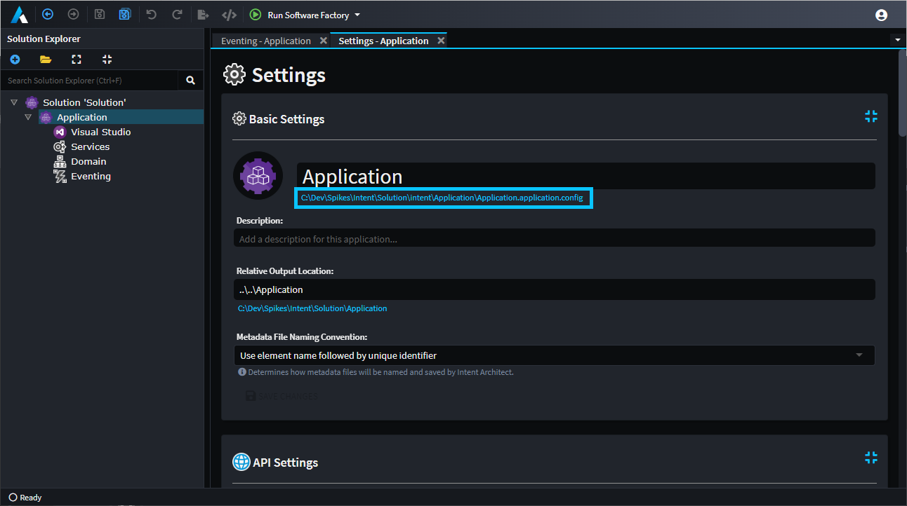

# About Packages

A Package in Intent Architect is a file system folder containing a `.pkg.config` file and various subfolders with `.xml` files for persistence of metadata modeled in Intent Architect [Designers](xref:application-development.modelling.about-designers).

Designers can reference any number of Packages and Packages can reference other Packages.

_In the example in the picture above, the `Eventing` Designer has two Packages, `Application.Eventing` and `Application.Eventing.Messages`, and `Application.Eventing` has a reference to the `Application.Eventing.Messages` Package._

## Creating new or adding existing Packages to a designer

To create a new Package or add an existing Package to a Designer use the `Create new package` and `Add existing package` buttons on the Designer toolbar:

When "adding an existing package" a Designer reference is created which is referring relatively to the chosen path and the actual Package content itself is not copied. If the added Package is in a folder outside of the source code management (e.g. Git) repository for the Application, it may make more sense to first copy it to the [default packages location](#default-package-locations).

## Default Package locations

By default, Package folders are placed in the `Intent.Metadata/<designer-name>` folder which is relative to an application's `.application.config` file. One can easily open an Application's `.application.config` file's containing folder by clicking the path link beneath the Application's name on the [Application Settings](xref:module-building.application-settings) screen of the application:

