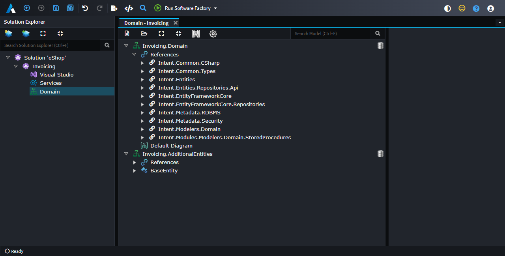
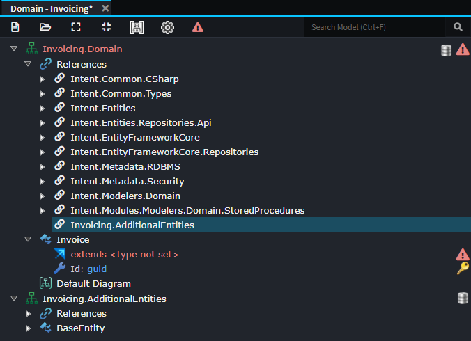
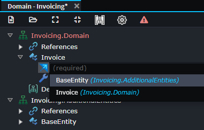
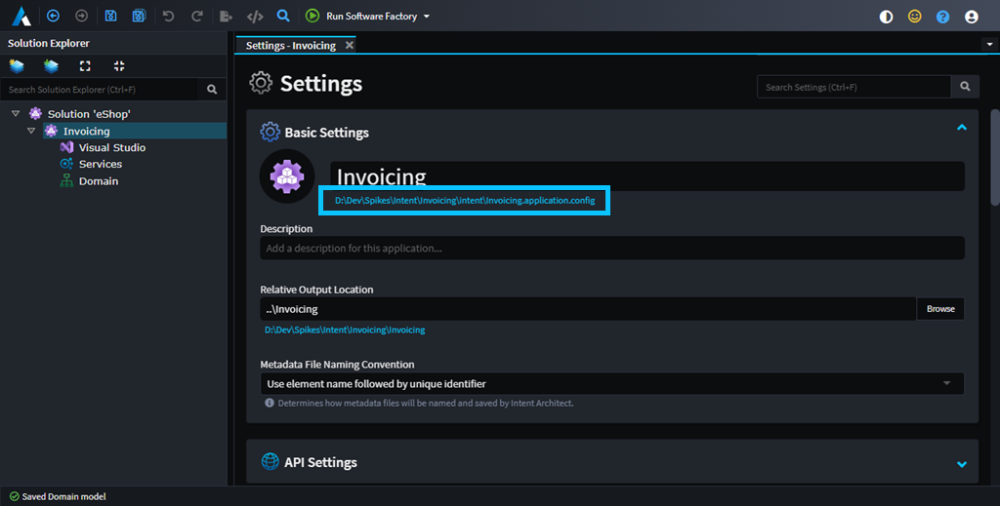

# About Packages

A Package in Intent Architect is a file system folder containing a `.pkg.config` file and various subfolders with `.xml` files for persistence of metadata modeled in Intent Architect [Designers](xref:application-development.modelling.about-designers).

Designers can reference any number of Packages and Packages can reference other Packages.

_In the example in the picture above, the `Domain` Designer has two Packages loaded/referenced, `Invoicing.Domain` and `Invoicing.AdditionalEntities`._

## Creating new or adding existing Packages to a designer

To create a new Package or add an existing Package to a Designer use the `Create new package` and `Add existing package` buttons on the Designer toolbar:

When "adding an existing package" a Designer reference is created which is referring relatively to the chosen path and the actual Package content itself is not copied. If the added Package is in a folder outside of the source code management (e.g. Git) repository for the Application, it may make more sense to first copy it to the [default packages location](#default-package-locations).

## Adding references to other packages

Before a type or element in one package can refer to or use types or elements in another package, it requires a reference to the package containing the type or element, otherwise the element or type will not be available for selection.

As an example, in the screenshot above the `Invoicing.AdditionalEntities` package has a `BaseEntity` inside of it. If we were to try use it for inheritance from the `Invoicing.Domain` package, it is not on the list of items which can be selected:

To make it available for selection we need to add a reference to the other package. Right-click the `References` node and then select the `Add Package Reference...` option:

Then ensure the package you want referenced is checked, in this case `Invoicing.AdditionalEntities`, and then press `OK`:

The `Invoicing.AdditionalEntities` package is now present if you were to expand the `References` node:

And BaseEntity can now be selected as an option for inheritance:

## The `Is External` checkbox

All packages in Intent Architect have a checkbox option labelled `Is External`. When checked, the Software Factory will generally ignore the concepts modelled in that package.

For example in the below picture there are two packages. `OnlineShop.Customers.Domain` has the `Is External` checkbox option selected and this is also visible by the `[external]` text next to the package name in the tree view.

In this case, entities within it (`Address` and `Customer`) will not be generated by the Software Factory, while entities in the "non-external" `OnlineShop.Invoice.Domain` (`Invoice`, `Line` and `Product`) package will.

## Default Package locations

By default, Package folders are placed in the `Intent.Metadata/<designer-name>` folder which is relative to an application's `.application.config` file. One can easily open an Application's `.application.config` file's containing folder by clicking the path link beneath the Application's name on the [Application Settings](xref:module-building.application-settings) screen of the application:

