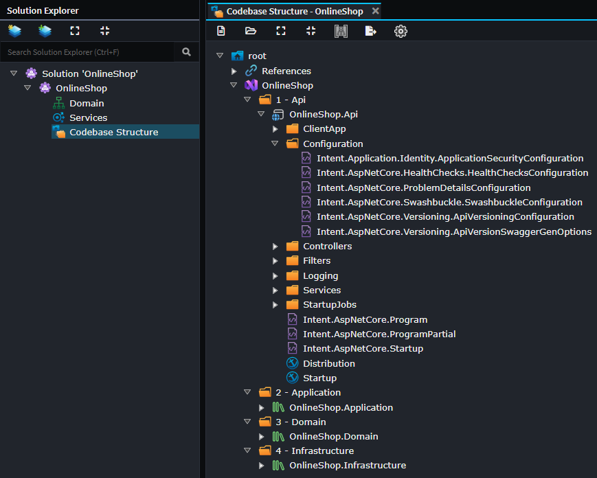

# Codebase Structure Designer

The **Codebase Structure Designer** is used for configuring the file system and folder structure into which files for an application are to be generated into or laid out. This designer will allow you to create new Folders, new [Output Anchors](#output-anchors) and to change the location of [Template Outputs](#template-outputs).

## Template Outputs

`Template Output`s are used by the Software Factory to determine for each template where it should be generated to on your file system. They are automatically created/removed/renamed by Intent Architect when Modules are installed, updated or uninstalled and cannot be manually created or renamed.

By reorganizing them into different folders within the `Codebase Structure` Designer, you are able to control the layout and structure of your codebase. Depending on the template, their output may go into file system sub-folders from their `Template Output`, for example DTOs placed in folders in the Services Designer will be generated into corresponding sub-folders on your file system.

As long as Module authors ensure that their templates use the default of suggested APIs to dynamically work out relative locations of related templates, an application's codebase structure can be completely customized.

Initial placement of `Template Output`s are controlled by [Output Anchors](#output-anchors). Once an `Output Template` is placed, its location within your codebase structure is not changed when a module is updated or reinstalled, this is to allow users to customize their codebase structure without a module update undoing it. To force a `Template Output` to be re-placed at its default location you will need to completely uninstall and then install the module again.

## Output Anchors

`Output Anchor`s are arbitrary tags used to control the initial placement of a [Template Outputs](#template-outputs) at the time Modules are being installed or updated.

They allow high level configuration of `Template Output` locations without each individual `Template Output`'s location needing to be individually considered when creating a new application or later installing additional modules into it.

For example, if you have a domain-oriented module, when it's installed the `Template Output`s for its various templates will be automatically placed relative to the location of the `Output Anchor` named `Domain`.

In this way Module authors are able to target generalized logical locations for their templates as opposed to specific ones.

## See also

- **[Visual Studio Module](https://docs.intentarchitect.com/articles/modules-dotnet/intent-visualstudio-projects/intent-visualstudio-projects.html)** - Extends the Codebase Structure Designer with Visual Studio concepts such as solutions and projects.
