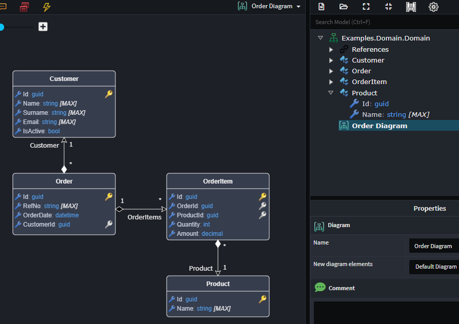
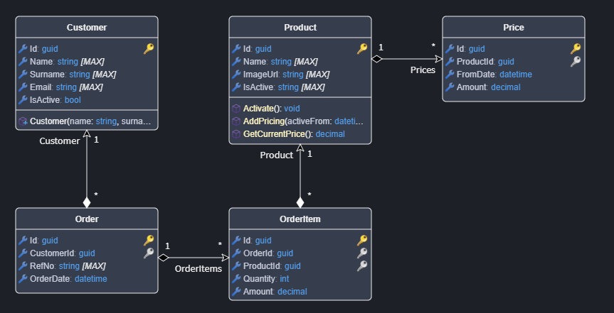
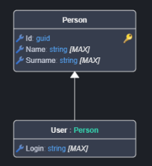
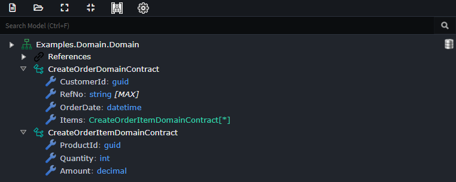

# Modeling the Domain

## Adding a Diagram

You can add `Diagram`s to your `Domain Package`. By default, `Application Template`s typically include a default one. Diagrams are useful for:

- Visualizing your domain.
- Visually modeling your domain.
- Visualizing subsets or logical areas of a large domain.

1. Right-click on the **Domain** package and select **New Diagram**.
2. If the designer was in Tree-view, it will switch to a diagram view.
3. Rename the diagram by right-clicking it in the Tree-view and selecting **Rename**.
4. Add domain elements to your diagram:
   - From the context menu, select **Add to Diagram** and choose `Elements` to add to the `Diagram`.
   - Drag domain elements, like `Class`s, from the Tree-view onto the diagram.
   - Model new domain elements.
5. Optionally, create multiple diagrams for different perspectives. The Tree-view remains the source of truth.

> [!TIP]
> Hold down **CTRL** while dragging elements from the Tree-view to include directly associated elements.

## Creating an Entity

An `Entity` is a core building block in domain modeling that represents a uniquely identifiable object within a system, such as a Customer or Order. Entities are essential because they encapsulate business rules and behavior, ensuring the system consistently reflects the real-world concepts they model.

> [!NOTE]
> While we typically do domain modeling in diagrams, it's important to realize that the Tree-view is the source of truth. Diagrams are simply a visualization of the domain or a part of the domain.

1. `Add an Entity` to the diagram.
2. Give your `Entity` a name.

> [!NOTE]
> The `Entity`'s element type is `Class`.

You can now model various aspects of your entity:

- **Attributes**: Model the data of your `Entity`.
- **Associations**: Model the relationships between your `Entity`s.
- **Constructors**: Model the construction of your `Entity`.
- **Operations**: Model the behavior of your `Entity`.

### Capturing Attributes

To model the data of an `Entity`:

1. `Add Attribute` (Ctrl + Shift + A) on a class.
2. Enter the name of the `Attribute`.
3. Press **Tab** and select the `Type` for the attribute.

> [!TIP]
> Pressing F2 on an attribute allows you to rename and change its type.  
> [!TIP]
> If you have an `Attribute` selected, pressing **CTRL+ENTER** will add a new `Attribute` to the class and begin editing it. This is very useful for rapidly capturing attributes.

### Adding Entity Associations

To model the relationships an `Entity` has with other `Entity`s:

1. Ensure both `Entity`s are on the diagram; use `Add to Diagram` if needed.
2. Right-click on the `Entity` that will own the relationship, hover your mouse over **New Association**, and select the type of relationship you want from the submenu (e.g., `Many to One`).
3. Left-click on the related `Entity` to create the association between them.

> [!NOTE]
> For more details on modeling domain `Association`s, [click here](#modeling-entity-associations).

## Inheritance with Entities

To inherit one `Entity` from another:

1. Right-click on the `Entity` that will inherit and select **New Inheritance**.
2. Select the parent `Entity`.

## Creating a Domain Contract

A `Domain Contract` encapsulates a specific intent or operation to be performed within a domain, bundling the data required for that operation into a single object. They help maintain clear and explicit boundaries in the domain, promoting separation of concerns and ensuring the domain logic operates on well-defined inputs. Domain `Data Contract`s are sometimes referred to as (domain) Data Transfer Objects or Command Objects.

> [!NOTE]
> The `Domain Contract`'s element type is `Data Contract`.

1. `Add Domain Contract` in the Tree-view.
2. Name your `Domain Contract`.
3. Right-click the `Domain Contract` and select **Add Attribute** to define its data.
4. Add complex data types as needed:
   - *Domain Contract* for modeling nested structures.
   - *Enum* for modeling enumerations.

## Modeling Entity Associations

To Do
