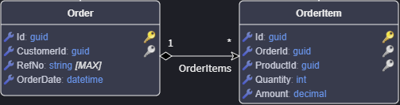

# Modeling the Domain

## Adding a Diagram

You can add `Diagram`s to your `Domain Package`. By default, `Application Template`s typically include a default one. Diagrams are useful for:

- Visualizing your domain.
- Visually modeling your domain.
- Visualizing subsets or logical areas of a large domain.

1. Right-click on the **Domain** package and select **New Diagram**.
2. If the designer was in Tree-view, it will switch to a diagram view.
3. Rename the diagram by right-clicking it in the Tree-view and selecting **Rename**.
4. Add domain elements to your diagram:
   - From the context menu, select **Add to Diagram** and choose `Elements` to add to the `Diagram`.
   - Drag domain elements, like `Class`s, from the Tree-view onto the diagram.
   - Model new domain elements.
5. Optionally, create multiple diagrams for different perspectives. The Tree-view remains the source of truth.

> [!TIP]
> Hold down **CTRL** while dragging elements from the Tree-view to include directly associated elements.

## Creating an Entity

An `Entity` is a core building block in domain modeling that represents a uniquely identifiable object within a system, such as a Customer or Order. Entities are essential because they encapsulate business rules and behavior, ensuring the system consistently reflects the real-world concepts they model.

> [!NOTE]
> While we typically do domain modeling in diagrams, it's important to realize that the Tree-view is the source of truth. Diagrams are simply a visualization of the domain or a part of the domain.

1. `Add an Entity` to the diagram.
2. Give your `Entity` a name.

> [!NOTE]
> The `Entity`'s element type is `Class`.

You can now model various aspects of your entity:

- **Attributes**: Model the data of your `Entity`.
- **Associations**: Model the relationships between your `Entity`s.
- **Constructors**: Model the construction of your `Entity`.
- **Operations**: Model the behavior of your `Entity`.

### Capturing Attributes

To model the data of an `Entity`:

1. `Add Attribute` (Ctrl + Shift + A) on a class.
2. Enter the name of the `Attribute`.
3. Press **Tab** and select the `Type` for the attribute.

> [!TIP]
> Pressing F2 on an attribute allows you to rename and change its type.  
> [!TIP]
> If you have an `Attribute` selected, pressing **CTRL+ENTER** will add a new `Attribute` to the class and begin editing it. This is very useful for rapidly capturing attributes.

### Adding Entity Associations

To model the relationships an `Entity` has with other `Entity`s:

1. Ensure both `Entity`s are on the diagram; use `Add to Diagram` if needed.
2. Right-click on the `Entity` that will own the relationship, hover your mouse over **New Association**, and select the type of relationship you want from the submenu (e.g., `Many to One`).
3. Left-click on the related `Entity` to create the association between them.

> [!NOTE]
> For more details on modeling domain `Association`s, [click here](#modeling-entity-associations).

## Inheritance with Entities

To inherit one `Entity` from another:

1. Right-click on the `Entity` that will inherit and select **New Inheritance**.
2. Select the parent `Entity`.

## Creating a Domain Contract

A `Domain Contract` encapsulates a specific intent or operation to be performed within a domain, bundling the data required for that operation into a single object. They help maintain clear and explicit boundaries in the domain, promoting separation of concerns and ensuring the domain logic operates on well-defined inputs. Domain `Data Contract`s are sometimes referred to as (domain) Data Transfer Objects or Command Objects.

> [!NOTE]
> The `Domain Contract`'s element type is `Data Contract`.

1. `Add Domain Contract` in the Tree-view.
2. Name your `Domain Contract`.
3. Right-click the `Domain Contract` and select **Add Attribute** to define its data.
4. Add complex data types as needed:
   - *Domain Contract* for modeling nested structures.
   - *Enum* for modeling enumerations.

## Modeling Entity Associations

Entity `Association`s are modeled using a UML style visualization, and define the relationships between `Entity`s.

Visually the `Association`s communicates the following:

-**Multiplicity**, the numbers above the `Association` indicate the multiplicity, 1 to Many (1 -*) in the example above.
-**Ownership**, denoted by the diamond shape, its colour indicates the type of ownership.
-**Navigability**, arrows on the line show navigability from one entity to another, `Order` will have a `OrderItems` property.

### Multiplicity

When adding an association you can use the sub-menu to choose the multiplicity you want e.g. 1 to Many, 1 to 1 etc. You can adjust the multiplicity, in the `Properties pane` by changing the `Is Nullable` and `Is Collection` properties on the Association Ends (Source End and Target End).

Multiplicity for an `Association End` is configured as follows:

| Multiplicity | IsNullable | IsCollection |
|--------------|------------|--------------|
| **1**        | ⬜         | ⬜          |
| **0..1**     | ✅         | ⬜          |
| **\***       | ⬜         | ✅          |

### Ownership

When creating an Association the `Entity` you create it from will be the owner, you can see this visually by the diamond on the `Association` line attached to the owning `Entity`.

There are two types of ownership which can be modeled and this ownership is inferred by the multiplicity. These ownership types are `Composition` (black diamond) and `Aggregation` (white diamond).

#### Composition relationship

 1. When attempting to represent real-world whole-part relationships, e.g. an engine is a part of a car.
 2. When the container is destroyed, the contents are also destroyed, e.g. a university and its departments.

*- [Wikipedia](https://en.wikipedia.org/wiki/Class_diagram#Composition)*

> [!TIP]
> An entity should never have multiple `Composition` relationships pointint to different owners, this is a logical modeling error as an Entity can only have 1 owner.

#### Aggregation relationship

1. When representing a software or database relationship, e.g. car model engine ENG01 is part of a car model CM01, as the engine, ENG01, may be also part of a different car model.[8]
2. When the container is destroyed, the contents are usually not destroyed, e.g. a professor has students; when the professor dies the students do not die along with them.

*- [Wikipedia](https://en.wikipedia.org/wiki/Class_diagram#Composition)*

| Relationship  | Ownership Type |
|---------------|----------------|
| 0..1 -> 0..1  | white diamond  |
| 0..1 -> 1     | white diamond  |
| 0..1 -> *     | white diamond  |
| 1    -> 0..1  | black diamond  |
| 1    -> 1     | black diamond  |
| 1    -> \*    | black diamond  |
| \*    -> 0..1 | white diamond  |
| \*    -> 1    | white diamond  |
| \*    -> \*   | white diamond  |

> [!TIP]
> You can convert a `black diamond` relationship to a `white diamond` by changing the owner of the relationship, i.e. create the relationship from the other `Entity`.  

### Navigability

By default `Navigability` is configured to be from `Owner` to target Entity. If you want bi-directional navigation, simply check **Navigable** on the `Source End` of the association in the `Properties pane`.

Modeling `Entity` associations can be a bit of an art who "owns" a relationship can be subjective and should be driven by your use cases.
