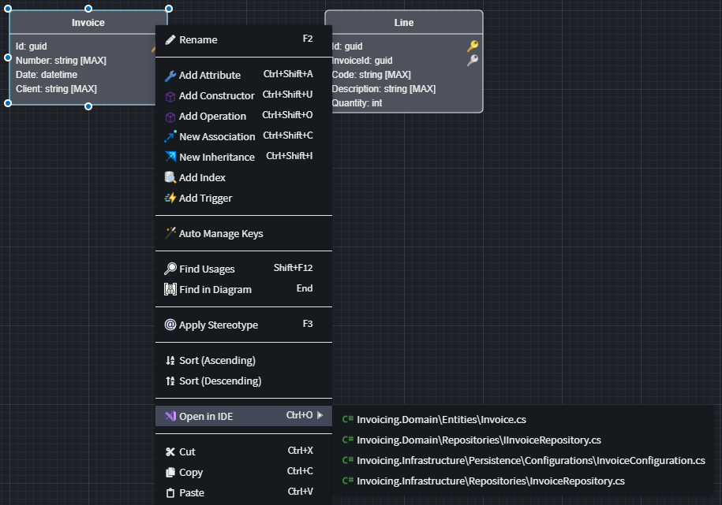
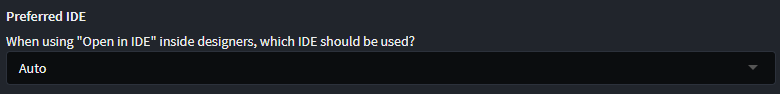

# Open in IDE

Intent Architect designers can open generated files associated with a particular element by right-clicking on it:

In the screenshot above there are 4 files which Intent Architect determined are associated with the selected element.

> [!NOTE]
>
> Intent Architect will not show or update the list of files associated with an element until [Software Factory](xref:application-development.software-factory.about-software-factory-execution) changes have been applied.
>
> The list of associated files is stored in an application's `.intent` folder which [should not be committed into source control management systems (such as Git)](xref:application-development.applications-and-solutions.git-and-scm-guidance#folders-which-should-always-be-ignored), so if you've just checked out a repository or recently pulled changes into your branch, re-run the Software Factory and apply changes to ensure your local list is fully up to date.

## How does Intent Architect choose which IDE to use to open the file?

The IDE to use is controlled by the "Preferred IDE" option in [user settings](xref:application-development.user-interface.how-to-change-user-settings) which by default is set to "Auto":

When set to "Auto", Intent Architect will check in common locations on your computer for supported IDEs and use the first one it can locate based on the following priority:

- Microsoft Visual Studio
- JetBrains Rider
- Visual Studio Code

If there is a particular IDE you would prefer that Intent Architect uses, you can change the option to one of the following:

- JetBrains IntelliJ IDEA

  > [!NOTE]
  > Intent Architect is not able to auto-detect the path for IntelliJ's executable and its path will need to be manually specified in the "IntelliJ IDEA Executable" field.

- JetBrains Rider

  Intent is generally able to auto-detect the location of Rider's executable, but you can manually specify the path if required.

- Microsoft Visual Studio
- Microsoft Visual Studio Code
- Other

  You can have Intent use any other IDE of your choosing by specifying its executable location and the launch arguments where Intent Architect will substitute `%FILE_PATH%` with the full path of the file to open.
