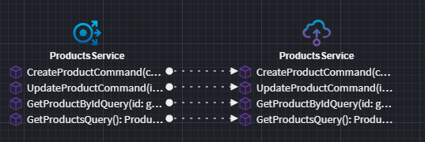

# Modeling Service Proxies

## What is a Service Proxy?

In distributed architectures, services often need to communicate with one another. Writing service clients manually can be time-consuming, error-prone, and inconsistent. A _Service Proxy_ simplifies this process by allowing developers to reference _already defined services_ in other Intent Architect applications and automatically generate strongly typed clients that adhere to the specified service contract.

The generated `Service Proxy` acts as an intermediary between an application and an external service, providing a strongly typed API that abstracts away the complexity of request configuration and client setup.

## Configuring Service References

Before creating a `Service Proxy`, the service to be proxied must be added as a reference in the `Services Designer`.

In the example below, we have an **Order Service** and a **Product Service**, where we will generate a **Product Service Proxy** inside the **Order Service**.

The **Product Service** has services modeled and exposed:

In the `Services Designer` of the **Order Service** (the consuming service), a reference must be added to the **Product Service Services Package** (the consumed service):

Once this reference is established, a `Service Proxy` can be created for the **referenced service** (Product Service in this case).

## Creating a Service Proxy

Once the consuming service (the Order service in this example) has a reference to the service to be consume (Product Service), a `service proxy` can be created in the `Services Designer` of the **consuming service**.

1. Right-click on the `Service Package` (the root) or on a `folder`, and select `New Service Proxy`

    > [!NOTE]
    > If the `New Service Proxy` menu item is not available, the most likely cause is that a required module (e.g. `Intent.Integration.HttpClients` for .NET HTTP client proxies) has not been installed.

2. Select the Service for which you are creating the proxy:

    

3. Choose the operations to include in the service proxy, then click **DONE**:

    

    > [!TIP]
    > If a `Service Operation` or `Command/Query` is greyed out and unable to be selected, check the following:
    >
    > - Ensure the operation, command, or query has been **exposed as an HTTP endpoint**. Service proxies can only be created for exposed services.
    > - Verify that the command or query is **inside a folder in the Services Designer of the consumed service**. Service proxies cannot be created for commands and queries placed directly in the root of the Services package.

## Updating a Service Proxy

Since a`Service Proxy` is based on an existing service, its details (parameters, return type, etc.) cannot be changed directly. Instead, modifications must be made in the underlying service, and then the proxy must be updated to reflect those changes.

However, an existing `Service Proxy` can be modified to include additional operations or remove existing ones:

1. Right click on the `Service Proxy` and select `=> Service Reference`
2. Select the operations to include/exclude and click `DONE`

## Invoking a Service Proxy

The `Advanced Mapping` feature in the _Services Designer_ allows for easy invocation and mapping of `Service Proxy` operations. Additionally, several `accelerators` can generate CQRS operations or service operations that automatically map to proxy operations.

### Manual Mapping to Invoke Proxy Operation

To manually configure a call to a `Service Proxy` operation, use `Call Service Operation`.

Select the `Proxy Operation` to invoke:

Next, map the input parameters for the selected operation:

Then, adjust the execution order if needed. In the example below, the call to the service proxy operation has been moved up to occur **before** persisting the entity to the domain.

The return values from the service call can now be mapped for subsequent operations, such as persisting the entity:

### Auto Mapping from CQRS Operations

An `accelerator` is available to automatically create CQRS operations and map them to service proxy operations.

Right-click on the `Service Proxy` or specific `Service Proxy Operation(s)`, then select **Create CQRS Operations** / **Create CQRS Operation**.

This generates CQRS operations that call the `Proxy Service`, with parameters and return types matching those of the proxy service.

> [!NOTE]
> The `Create CQRS Operations` and `Create Service` options are available at a **Proxy Service** level. These options will accelerate the creation of the `commands/queries/operations` that don't already exist. Selecting them again will have no effect if all `commands/queries/operations` have already been created.

> [!NOTE]
> The `Create CQRS Operation` and `Create Service Operations` options are available at the **Proxy Operation** level. These options will accelerate the **creation or updating** of the selected `command/query/operation`. If selected for a proxy operation which is already linked to a proxy `command/query/operation`, the proxy `command/query/operation` synced with the source `command/query/operation`. Attributes, attribute types, and default values will be updated to match the source as closely as possible. Be aware this could result in a loss of manual changes which have been made to linked proxy `command/query/operation`.

### Auto Mapping from Service

An `accelerator` is also available to automatically create service operations and map them to proxy operations.

Right-click on the `Service Proxy` or specific `Service Proxy Operation(s)`, then select **Create Service** / **Create Service Operation**.

This generates service operations that call the `Proxy Service`, with parameters and return types matching those of the proxy service.

> [!NOTE]
> The `Create CQRS Operations` and `Create Service` options are available at a **Proxy Service** level. These options will accelerate the creation of the `commands/queries/operations` that don't already exist. Selecting them again will have no effect if all `commands/queries/operations` have already been created.

> [!NOTE]
> The `Create CQRS Operation` and `Create Service Operations` options are available at the **Proxy Operation** level. These options will accelerate the **creation or updating** of the selected `command/query/operation`. If selected for a proxy operation which is already linked to a proxy `command/query/operation`, the proxy `command/query/operation` synced with the source `command/query/operation`. Attributes, attribute types, and default values will be updated to match the source as closely as possible. Be aware this could result in a loss of manual changes which have been made to linked proxy `command/query/operation`.

## Service Proxy for a 3rd party service

A `Service Proxy` can also be created for third-party services, provided the service definition is modeled in Intent Architect.

Regardless of the approach used, a **separate application must be created in the Intent Architect solution to represent the third-party service**.

- Right-click on the solution in Intent Architect and select **Create new application**.
- Name the application appropriately to clearly identify it as a third-party service.

### Using Intent.OpenApi.Importer

If a Swagger document is available for the third-party service, the [Intent.OpenApi.Importer](https://docs.intentarchitect.com/articles/modules-dotnet/intent-openapi-importer/intent-openapi-importer.html) module can import the service definition directly into the `Services Designer`.

Once the service is defined, follow the steps above to [create a service proxy](#creating-a-service-proxy).

### Manually modeling the service

If a Swagger document is not available, the third-party service can be manually modeled in the `Service Designer`. Once modeled, follow the steps above to [create a service proxy](#creating-a-service-proxy).