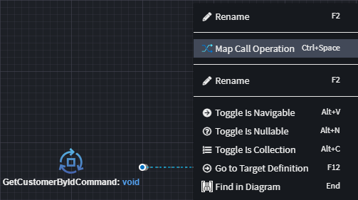

# Invoking HTTP Endpoints

In distributed architectures, services often need to communicate with one another. Writing service clients manually can be time-consuming, error-prone, and inconsistent. A _Service Proxy_ simplifies this process by allowing developers to reference _already defined services_ in other Intent Architect applications and automatically generate strongly typed clients that adhere to the specified service contract.

The generated `Service Proxy` acts as an intermediary between an application and an external service, providing a strongly typed API that abstracts away the complexity of request configuration and client setup.

This article explains how to model `Perform Invocation` relationships which are then realized in generated code as Service Proxies which will use HTTP to communicate with target endpoints.

> [!NOTE]
>
> Historically, [](xref:application-development.modelling.proxy-designer.proxy-designer) was required to invoke HTTP Endpoints, although that method is still fully supported, going forward the approach of using `Perform Invocation` as described in this article is recommended.

This article will describe the process of creating a Service Proxy from an example `eShop.Invoicing` application to an `eShop.Customers` application in the following solution:


The Services designer for the `eShop.Customers` application has the following CQRS requests modeled:


## Adding the Customer CQRS requests to a diagram

We will start by adding the CQRS requests from the `eShop.Customers` applications onto a diagram in the `eShop.Invoicing` application's Services designer.

In the Services designer of the `eShop.Invoicing` application:

- [Add a package reference](xref:application-development.modelling.about-packages) to the `eShop.Customers.Services`.

  

  This will make the CQRS requests from the referenced package available for use in our designer.

- Right-click the package on the designer and select the `New Folder` option:

  

- Give the folder a name, such as `Customers`.
- Right-click the folder and select the `New Diagram` option:

  

- Give the diagram a name such as `Customers`.
- Right-click the background of the diagram and select the `Add to Diagram` option:

  

- You can filter by `Customer` and then select all the Commands and Queries and then press DONE:

  

  

## Creating a request and have it invoke a CQRS request over HTTP

- Right-click the diagram and choose the `New Query` option:

  

- Give the Command a name such as `GetCustomerByIdCommand`.
- Right-click the Command and select the `Invoke Service` option:

  

- Click the `GetCustomersByIdQuery` to set it as the Target End.

  

- Right-click the association line and select the `Map Call Operation` option:

  

- Double click the `GetCustomerByIdQuery` element in the right-pane to map the command from the left-pane to it:

  

- Right-click the `CommandCustomerByIdCommand` in the left pane and select the `Add Property` option:

  

- Give it a name of `Id` and type of `Guid`:

  

- You can now double click the `Id: guid` in the right-pane to specify that its field needs to be populated from the `Id` on the command in the left pane:

  

- Press DONE.

## Run the Software Factory

Run the Software Factory and review the proposed changes:


Reviewing the changes, observe the following in particular:

- `ICustomersService` is being is being created and registered up in `HttpClientConfiguration` against the also created `CustomersServiceHttpClient`.
- Other related contract files such as the Command and its referenced DTOs are being created.
- The `GetCustomerByIdCommandHandler` has an implementation as follows:

```csharp
public class GetCustomerByIdCommandHandler : IRequestHandler<GetCustomerByIdCommand>
{
    private readonly ICustomersService _customersService;

    [IntentManaged(Mode.Merge)]
    public GetCustomerByIdCommandHandler(ICustomersService customersService)
    {
        _customersService = customersService;
    }

    [IntentManaged(Mode.Fully, Body = Mode.Fully)]
    public async Task Handle(GetCustomerByIdCommand request, CancellationToken cancellationToken)
    {
        var result = await _customersService.GetCustomerByIdAsync(new GetCustomerByIdQuery
        {
            Id = request.Id
        }, cancellationToken);
    }
}
```

## Invoking Service Operations

The procedure for invoking traditional Service Operations is essentially the same as the above where `Invoke Service` associations are created with service operations as their target end:


## Service Proxy for a 3rd party service

You can have a proxy created for a third-party services and invoke it, provided the service definition is modeled in Intent Architect. Invoking the service follows the same steps described [above.](#invoking-http-endpoints)

To represent a third-party service, you must create a **separate application** in your Intent Architect solution. Use the _External API_ application template for this purpose:

- Right-click the solution in Intent Architect and select **Create New Application**.
- Choose the `External API` application template.  
  
- Give the application a clear, descriptive name to identify it as a third-party service.
- An empty Intent Application will be created and added to your solution, pre-configured with the necessary modules to model an external API.

### Using Intent.OpenApi.Importer

If the third-party service provides a OpenApi document, you can import it directly into the `Services Designer` using the [Intent.OpenApi.Importer](https://docs.intentarchitect.com/articles/modules-dotnet/intent-openapi-importer/intent-openapi-importer.html) module.

Once imported, follow the steps outlined above to [invoke the service](#invoking-http-endpoints).

> [!NOTE]
>
> The [Intent.OpenApi.Importer](https://docs.intentarchitect.com/articles/modules-dotnet/intent-openapi-importer/intent-openapi-importer.html) module is automatically installed when creating an application using the `External API` template.

### Manually Modeling the Service

If no OpenApi document is available, you can manually model the third-party service in the `Service Designer`. Once modeled, follow the same steps above to [invoke the service](#invoking-http-endpoints).

## Summary

This article guided you through using the `Invoke Service` association to invoke HTTP endpoints.

## Next steps

You can try invoking other endpoints in the same way as described above.
