# Message-Based Integration Modeling

## What is Message-Based Integration / Event-Driven Architecture

Message-based integration is a design approach for systems to communicate asynchronously. It uses a message broker, such as RabbitMQ, Kafka, or Azure Service Bus, to exchange messages. This approach decouples systems, allowing each service to operate independently. It improves scalability, fault tolerance, and flexibility in system design.

By exchanging data or triggering actions without direct dependency on other systems’ availability or implementation, message-based integration fosters resilience. It is especially useful in distributed systems requiring real-time or asynchronous processing, such as processing orders, handling events, or coordinating microservices.

## How to Model Message-Based Integrations

Within Intent Architect, you can model your application’s Message-Based Integration or Event-Driven Architecture.

The diagram below illustrates this type of design:

This example demonstrates the following:

- The application subscribes to a `CustomerCreated` integration message.
- This triggers an `AccountCreatedCommand` service endpoint.
- The process publishes an `AccountCreated` integration message for subscribed applications.

You can model this design in the Services Designer with these simple steps:

1. **Model the message contracts**: Design the data contracts that flow between your systems.
2. **Model where these messages are published**: Specify which parts of the application send integration messages to other systems.
3. **Model who subscribes to the messages**: Configure which integration messages your application wants to process.

> [!NOTE]
> Integration message are typically categorized as either an `Integration Event` or an `Integration Command`. Within Intent Architect the model type which represents a Integration Event is a `Message`.

## Integration Events vs Integration Commands

When modeling integration messages, you can use either model Integration Events (`Message`) or `Integration Command`s. While similar from a modeling perspective, they have distinct characteristics.

The table below summarizes their differences:

| Aspect                    | Integration Event                 | Integration Command         |
|---------------------------|-----------------------------------|-----------------------------|
| **Technical realization** | Topic                             | Queue                       |
| **Purpose**               | Notifies about an occurrence      | Instructs an action         |
| **Recipients**            | Multiple subscribers (potentially)| Single recipient            |
| **Expectations**          | No action mandated; subscribers decide how to react | Sender expects the action to be performed |
| **Ordering of messages**  | Unordered                         | Naturally ordered (queued)  |

In general, Integration Events are more commonly used, and many systems adopt a purely event-driven paradigm.

## Integration Message Naming Conventions

You can use any naming convention for integration messages. Within the Intent Architect ecosystem, visual distinctions between concepts like `Message`, `Integration Command`, and `Domain Event` make them easy to identify.

However, when working in an IDE, naming overlaps may cause confusion. For example, having both a `CustomerCreated` domain event and a `CustomerCreated` integration message could be unclear. To address this, you can apply suffix-based naming conventions, such as `CustomerCreatedDomainEvent` or `CustomerCreatedDE`.

## Making Integration Messages Available in Other Applications

When modeling Message-Based Integrations, you define the message contracts your application publishes. These contracts are stored as `Message`s and `Integration Command`s in an `Eventing Package` within the publishing application.

To use these messages in a subscribing application:

1. In the `Services Designer`, under the `Service Package`, right-click `References` and select **Add a Package Reference**.
2. In the `Package Reference Manager` dialog, select the package containing the integration messages, e.g., `PublishingApp.Eventing.Messages`.

You can now use these integration messages in the diagrams of the subscribing application.

## Publishing an Integration Event

You can publish an Integration Event from any of the following elements:

- Service `Command`
- Service `Operation`
- `Domain Event Handler`
- `Integration Event Handler`

### Creating and Publishing a New Integration Event

1. On a diagram, hover over the element and click the `Suggestion` icon :bulb:.
2. Select **Publish Integration Event**.
   - This adds a new `Message` and associates it with the selected element.
3. Enter a name for the `Message` and press **Enter**.
4. Use the **Advanced Mapping Dialog** to map the structure of the `Message`:
   - Double-click elements on the left-hand side to add and map them to your `Message`.

### Publishing an Existing Integration Event

1. Add the existing `Message` to the diagram using **Add to Diagram**.
2. Right-click on the service `Command` and select **Publish Integration Event**. Link it to the `Message`.
3. Right-click the `Publish Integration Event` association and select **Map to Message**.
4. Map the relevant data between the service `Command` and the `Message`.

> [!TIP]
> If the `Message` you want to use isn’t available in the **Add to Diagram** dialog, ensure the package containing the `Message` is referenced in the `Services Package`.

## Create an Integration Event

To create a new Integration Event (`Message`):

1. Add a `Integration Event` to any diagram in the `Services Designer`. This typically represents an integration message your application will publish.
2. Name your `Integration Event`.
3. Right-click the `Integration Event` and select **Add Property** to define its data.
4. Add complex data types as needed:
   - *Eventing DTO* for modeling nested structures.
   - *Enum* for modeling enumerations.

> [!NOTE]
> `Message`s are modeled in an `Eventing Package` to facilitate sharing between applications.
> [!TIP]
> Using the **Advanced Mapping Dialog** while [publishing the integration message](#publishing-an-integration-event) can speed up message structure definition.

## Subscribing to an Integration Event

If your application (`SubApp`) wants to subscribe to a `Message` published by another application (`PubApp`):

> [!NOTE]
> These steps assume you already have a package reference to the publishing application's messages. If you don't, [add a package reference to the publishing application's integration messages](#making-integration-messages-available-in-other-applications).

### Subscribing with a new `Integration Event Handler`

1. On a diagram, select **Add to Diagram** and choose the `Message` to subscribe to.
2. Hover over the `Message`, click the `Suggestion` icon :bulb:, and select **Create Integration Event Handler**.

> [!TIP]
> If the `Message` you want to subscribe to doesn’t exist in the `Eventing Package` (e.g., it’s from outside the Intent Architect ecosystem), model the `Message` as described in [Create an Integration Message](#create-an-integration-event).

### Subscribing with an existing `Integration Event Handler`

1. On a diagram, select **Add to Diagram** and choose the `Message` you want to subscribe to.
2. Right-click on the `Integration Event Handler` and select **Subscribe to Integration Event**.
3. Left-click on the `Message` you want the `Integration Event Handler` to handle.

## Publishing an Integration Command

You can publish an 'Integration Command` from any of the following elements:

- Service `Command`
- Service `Operation`
- `Domain Event Handler`
- `Integration Event Handler`

### Creating and Publishing a New `Integration Command`

1. On the diagram, hover over the element and click the `Suggestion` icon :bulb:.
2. Select **Publish Integration Command**.
   - This adds a new `Integration Command` and associates it with your `Command`.
3. Enter the name of your `Integration Command` and press Enter.
4. Use the **Advanced Mapping Dialog** to project the structure of your message:
   - Double-click elements on the left-hand side to add and map them to the `Integration Command`.

### Publishing an Existing `Integration Command`

1. On the diagram, select **Add to Diagram**, and choose the existing `Integration Command` you want to send.
2. Right-click on the service `Command`, select **Publish Integration Command**, and left-click the `Integration Command` to link them.
3. Right-click on the `Publish Integration Command` association and select **Map to Message**.
4. Map the relevant data between the service `Command` and the `Integration Command`.

> [!TIP]
> If the `Integration Command` you are looking for is not available in the **Add to Diagram** dialog, ensure you have added the `Package` containing the `Integration Command` as a reference to the `Services Package`.

## Create an Integration Command

To create an `Integration Command`:

1. Add a new `Integration Command` to any diagram in the `Services Designer`. This typically represents an integration message your application will send.
2. Name your `Integration Command`.
3. Right-click on the `Integration Command` and select **Add Property** to start modeling the data structure of the message.
4. Add additional data types as needed:
   - **Eventing DTO** - for modeling complex child objects.
   - **Enum** - for modeling enumerations.

> [!NOTE]
> `Integration Command`s are modeled in an `Eventing Package` to facilitate sharing between applications.
> [!TIP]
> Using the **Advanced Mapping Dialog** while [publishing the integration message](#publishing-an-integration-command) can speed up message structure definition.

## Subscribing to an Integration Command

If your application (`SubApp`) wants to subscribe to an `Integration Command` published by another application (`PubApp`):

> [!NOTE]
> These steps assume you already have a package reference to the publishing application's messages. If you don't, [add a package reference to the publishing application's integration messages](#making-integration-messages-available-in-other-applications).

### Subscribing with a new `Integration Event Handler`

1. On a diagram, select **Add to Diagram** and choose the existing `Integration Command` you want to subscribe to.
2. Hover over the `Integration Command`, click the `Suggestion` icon :bulb:, and select **Create Integration Event Handler**.

> [!TIP]
> If the `Integration Command` you want to subscribe to does not exist in an `Eventing Package` (e.g., it is outside the Intent Architect ecosystem), you can model it manually as [described here](#create-an-integration-command).

### Subscribing with an existing `Integration Event Handler`

1. On a diagram, select **Add to Diagram** and choose the `Integration Command` you want to subscribe to.
2. Right-click on the `Integration Event Handler` and select **Subscribe to Integration Command**.
3. Left-click on the `Message` you want the `Integration Event Handler` to handle.

## Invoking Application Services from Integration Event Handlers

When subscribing in an integration message, you may want to delegate the handling of that message to an existing Service Endpoint.

## Invoking CQRS Commands from Integration Event Handlers

1. On a diagram, select **Add to Diagram** and choose the `Command` you want to delegate to.
2. Right-click on the `Integration Event Handler` and select **Send Command**.
3. Left-click on the `Command` you want the `Integration Event Handler` to delegate to.
4. Right-click on the linking `Association` and select **Map to Command**.

## Invoking Traditional Service operations from Integration Event Handlers

1. On a diagram, select **Add to Diagram** and choose the `Service` you want to delegate to.
2. Right-click on the `Integration Event Handler` and select **Call Service Operation**.
3. Left-click on the service `Operation` you want the `Integration Event Handler` to delegate to.
4. Right-click on the linking `Association` and select **Map to Service Operation**.

## Realizing Your Message-Based Integration in Technologies

Your message-based integration can be realized in a specific technology depending on the installed modules. Options include:

- [MassTransit](https://github.com/IntentArchitect/Intent.Modules.NET/blob/development/Modules/Intent.Modules.Eventing.MassTransit/README.md) (supports RabbitMQ, Azure Service Bus, Amazon SQS)
- [Kafka](https://github.com/IntentArchitect/Intent.Modules.NET/blob/development/Modules/Intent.Modules.Eventing.Kafka/README.md)
- [Solace](https://github.com/IntentArchitect/Intent.Modules.NET/blob/development/Modules/Intent.Modules.Eventing.Solace/README.md)

[mi](#migrating-from-the-eventing-designer)

## Migrating from the Eventing Designer

As of version `6.0.0` of the `Intent.Modelers.Eventing` module, the Eventing Designer is no longer available and all message based integration modelling will need to be performed in the Services designer going forward.

If you were modelling message based integration using the Eventing Designer then a straight forward manual migration will need to be performed or you will otherwise get an error when running the software factory directing you to this page.

You should perform the migration before upgrading to `6.0.0` or newer of the `Intent.Modelers.Eventing` module.

- Open the Eventing Designer and make a note of the following:
  - The name of each message to which the current application is a subscriber.

    For example, in the following image, the `EventingMigration` is an "Application" element and it has one subscriber, `SubscribedEvent`, indicated by the `subscribe:` prefix:

    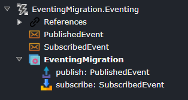

  - Select the Eventing package (the root most node) for the current application and in the properties pane select the context menu button and click the `Copy file path to clipboard option`:

    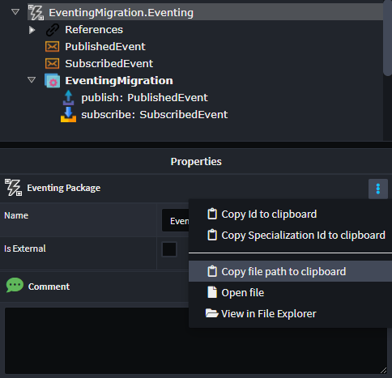

- Open the Services Designer
- Click the `Add Existing Package` button on the toolbar:

  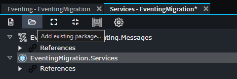

- You can paste the complete path from your clipboard into the "File name" field and simply press "Open":

  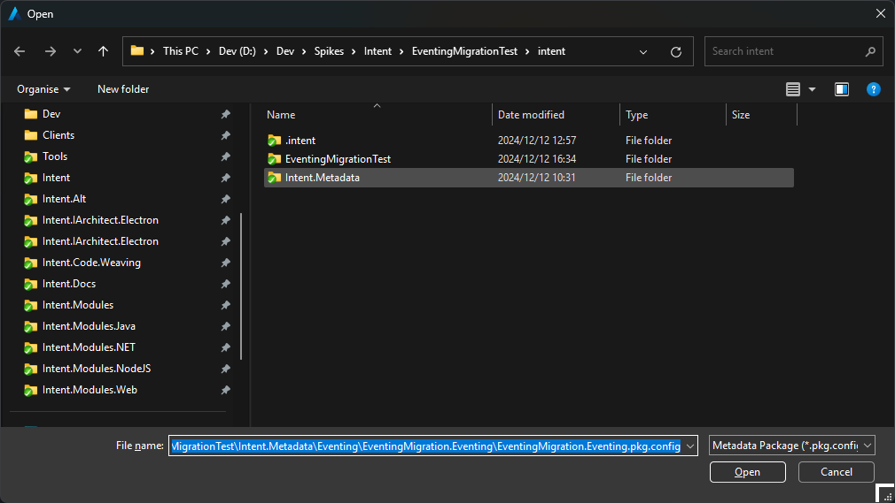

- You will see the following warning on which you can press OK to proceed:

  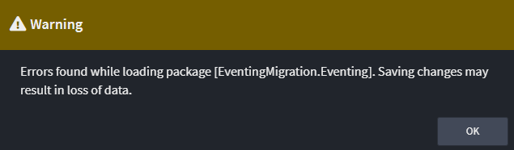

- Delete any "Application" elements which are distinguishable by having a grey box icon and when selected they have `Application (not found)` in the properties pane:

  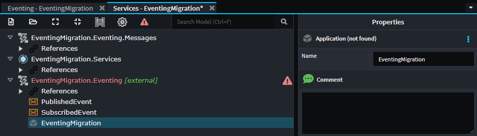

- Click the package and uncheck the `Is External` option:

  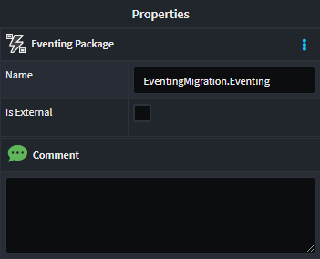

- You can now save the designer and on the Confirmation dialogue warning of undetected errors click the "YES" button.
- There should no longer be errors in the designer:

  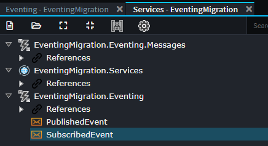

- Right-click on `References` under the `Services` package and select the `Add Package Reference...` option:

  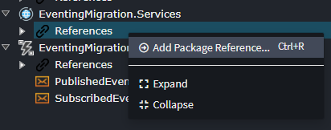

- Ensure you have the opened package selected in the list:

  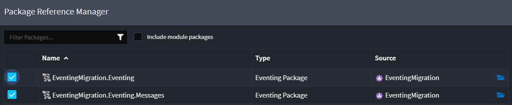

- You can now model Integration Message Handlers as per the [Subscribing to an Integration Event](#subscribing-to-an-integration-event) section of this article.

> [!NOTE]
>
> The generated files for the Integration Message Handlers may not align with the existing handler implementations and you may need to either try change the names to align or alternatively manually copy the implementations from the old to the new files manually in your IDE.

## Common Problems

### New Integration Event or Command Doesn’t Appear

If using the `New Integration Event/Command` menu item or the `Publish Integration Event/Command` suggestion does not result in a new element being added, the issue is most likely due to a missing `Eventing Package` in the Services Designer.

To resolve this:

- Add a new `Eventing package` to your Services Designer:

  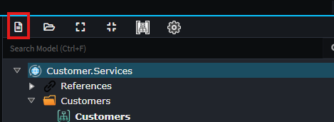

  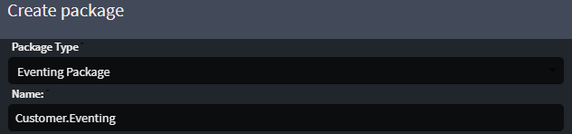

- In your `Service Package`, right-click `References` and select **Add Package Reference**.

  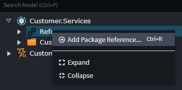

  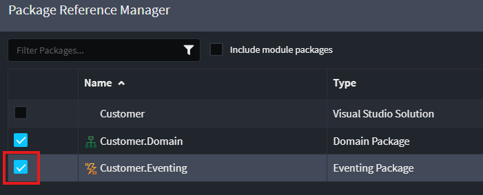

Once the reference is added, you will be able to successfully create and publish Integration Events and Integration Commands.
