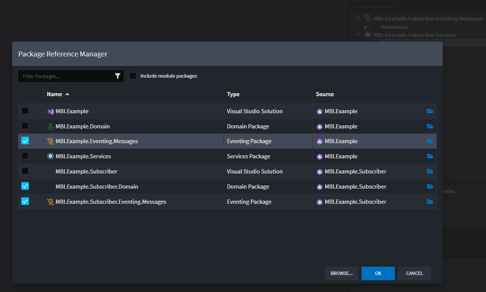
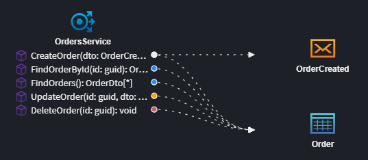
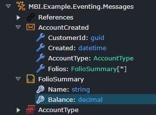
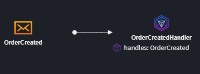
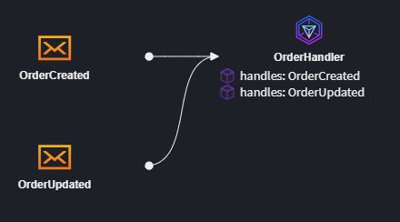
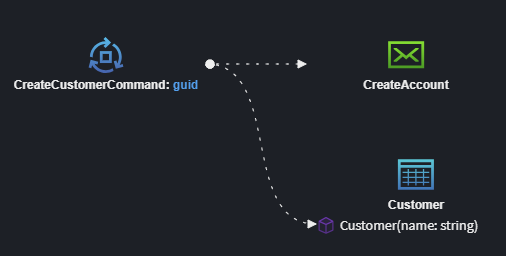
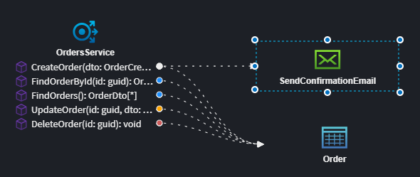
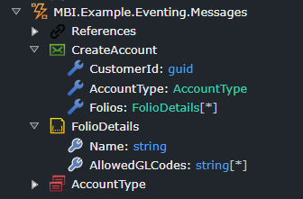
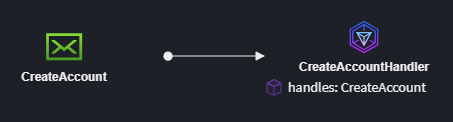
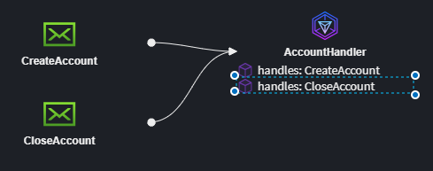

# Message-Based Integration Modeling

## What is Message-Based Integration / Event Driven Architecture

Message-based integration is a design approach where systems communicate asynchronously by exchanging messages through a message broker, such as RabbitMQ, Kafka, or Azure Service Bus. This approach decouples systems, meaning each service can operate independently, improving scalability, fault tolerance, and flexibility in system design. It allows services to exchange data or trigger actions without being directly dependent on each other’s availability or implementation, fostering resilience and enabling integration across diverse platforms and technologies. Message-based integration is particularly useful in distributed systems where real-time or asynchronous processing is required, such as processing orders, handling events, or coordinating microservices.

## How to Model Message-Based Integrations

With in Intent Architect you can model your applications Message-Based Integration or Event-Driven Architecture.

The image below illustrates this type of design.

Here we can see the following

- The application subscribes to a `CustomerCreated` integration message.
- Which fires off a `AccountCreatedCommand` service end point.
- This process published as `AccountCreated` integration message for any applications which are subscribed.

This can all be done in the Services Designer with a few simple steps.

- *Model the message contracts*, design the data contracts which will flow between your systems.
- *Model where these messages are published*, explicitly model which parts the application send integration messages to other systems.
- *Model who subscribes to the messages*, configure which integration messages the applications wants to know about.

## Integration Messages vs Integration Commands

When modeling Integration messages you can can use either `Message` or `Integration Message`. `Message`s can be thought of as Integration Events, from a modeling perspective these are fairly similar but tend to have different implementations.

The table below describes the characteristics of `Message`s vs `Integration Command`s.

| Aspect  | Message | Command |
| --------| ------- |--------|
| Technical realization | Topic | Queue |
| Purpose  | Notifies about an occurrence | Instructs an action |
| Recipients | Multiple subscribers (potentially) | Single recipient |
| Expectations | No action is mandated; subscribers decide how to react | Sender expects the action to be performed |
| Ordering of messages |Unordered | Naturally ordered (i.e. Queued) |

In general `Message`s are more commonly used and many systems are modelled using a purely `Eventing` (`Message`) paradigm.

## Integration Message Naming Conventions

You can name your integration messages using any convention you would like, and with-in the Intent Architect ecosystem it is very easy to visually distinguish the various concept, as they have different icons, for example `Message`, `Integration Command` and `Domain Event`. It's worth mentioning, when you are looking at these concepts in code, i.e. in your IDE, it may not be so obvious what you are looking at. For example it may be confusing in your IDE to have a `CustomerCreated` domain event and a `CustomerCreated` integration message. If this is something you are worried about you can simply name these elements with a convention based suffix, e.g. `CustomerCreatedDomainEvent` or `CustomerCreatedDE`.

## Making Integration Messages Available in Other Applications

When modeling out your Message-Based Integrations you are defining the message contracts your various applications publish. These contracts are stored as `Message`s and `Integration Command`s in an `Eventing Package` with in the application which published them.

When you want to subscribe to these messages in another application, you can simply reference this package to do so.
In your subscribing application, do the following,

1. In the `Services Designer`, in the `Service Package`, `Right click` on 'References' and select `Add a Package Reference`.
2. In the `Package Reference Manager` dialog, select the package which contains the integration message you want to subscribe to, e.g. `PublishingApp.Eventing.Messages`.

You can now using these integration messaging in the `Diagram`'s of the subscribing application.

## Publishing an Integration Message from a Service Command

1. On this diagram, hover your mouse over the service `Command` and click the `Suggestion` icon, :bulb:.
2. Select the `Publish Integration Event` option.
This will add a new `Message` and a associate it with your command
3. Type in the name of your `Message` and press 'Enter'.
4. You can now using the Advanced Mapping Screen to project the structure of you message.
Double clicking elements on the left hand side will add and map them onto your `Message`.

## Publishing an Existing Integration Message from a Service Command

Given you have a diagram with your service `Command` on, which you want to publish an existing integration `Message`.

1. Select `Add to Diagram`, and choose the existing `Message` you want to publish.
2. 'Right click' on the service `Command`, and select `Publish Integration Event`, `Left click` the `Message` to link them.
3. 'Right click' on the `Publish Integration Event` association and select `Map to Message`
4. Map the relevant data between the service `Command` and the `Message`.

> [!TIP]
> If the`Message` you are looking for is not available in the `Add to Diagram` dialog, ensure you have added the `Package` which contains the `Message` as a reference to the `Services Package` which contains diagram.

## Publishing an Integration Message from a Domain Event Handler

To Do

## Publishing an Existing Integration Message from a Domain Event Handler

To Do

## Publishing an Integration Message from a Service

1. On the diagram, hover your mouse over the `Service`'s `Operation` and click the `Suggestion` icon, :bulb:.
2. Select the `Publish Integration Event` option.
This will add a new `Message` and a associate it with your `Operation`.
3. Type in the name of your `Message` and press 'Enter'.
4. You can now using the Advanced Mapping Screen to project the structure of you message.
Double clicking elements on the left hand side will add and map them onto your `Message`.

## Create an Integration Message

Start by adding a new `Message` on any `Diagram` in the `Services Designer`, this would typically represent an integration message your application will publish.

> [!NOTE]
> `Message`s are modelled in an `Eventing Package`, as opposed to a `Services Package`, this is because these messages are contracts which are designed to be shared with other applications.

Next you can model out the data requirements of you message.

Right click on the `Message`, and select `Add Property` to start modeling the data of your message.

You can also add the following data types as required.

- *Eventing DTO* - for modeling complex children.
- *Enum* - for modeling enumeration.

> [!NOTE]
> It is often faster to define/map your message structure using the `Advanced Mapping Dialog`, while [publishing the message](#publishing-an-integration-message-from-a-service-command).

## Subscribing to an Integration Message

In this scenario you are typically have an application, say `SubApp`, wanting to subscribe to a `Message` published by another application, say `PubApp`.

In the subscribing application you want to do the following:

1. [Add a package reference to the publishing applications integration messages](#making-integration-messages-available-in-other-applications).
2. On a Diagram, select `Add to Diagram`, and choose the existing `Message` you want to subscribe to.
3. Hover your mouse over the `Message` and click the `Suggestion` icon, :bulb:, and select `Create Integration Event Handler`

> [!TIP]
> If the`Message` you want to subscribe to, does not already exist in an `Eventing Package` i.e. you are subscribing to a `Message` outside of the Intent Architect ecosystem, you can simply model the `Message` as [follows](#create-an-integration-message).

## Subscribing to an Integration Message with an existing Integration Event Handler

1. On a Diagram, select `Add to Diagram`, and choose the `Message` you want to subscribe to.
2. 'Right click' on the `Integration Event Handler`  and select `Subscribe to Integration Event`.
3. 'Left click' on the `Message` you want the `Integration Event Handler` to handle.
  

> [!NOTE]
> These steps are assuming you already have a package reference to publishing applications messages. If you don't simply [add a package reference to the publishing applications integration messages](#making-integration-messages-available-in-other-applications).

## Publishing an Integration Command from a Service Command

1. On th diagram, hover your mouse over the service `Command` and click the `Suggestion` icon, :bulb:.
2. Select the `Publish Integration Command` option.
This will add a new `Integration Command` and a associate it with your command
3. Type in the name of your `Integration Command` and press 'Enter'.
4. You can now using the Advanced Mapping Screen to project the structure of you message.
Double clicking elements on the left hand side will add and map them onto your `Integration Command`.

## Publishing an Existing Integration Command from a Service Command

Given you have a diagram with your service `Command` on, which you want to publish an existing `Integration Command` from,

1. Select `Add to Diagram`, and choose the existing `Integration Command` you want to send.
2. 'Right click' on the service `Command`, and select `Publish Integration Command`, `Left click` the `Integration Command` to link them.
3. 'Right click' on the `Publish Integration Command` association and select `Map to Message`
4. Map the relevant data between the service `Command` and the `Integration Command`.

> [!TIP]
> If the`Integration Command` you are looking for is not available in the `Add to Diagram` dialog, ensure you have added the `Package` which contains the `Integration Command` as a reference to the `Services Package`.

## Publishing an Integration Command from a Domain Event Handler

To Do

## Publishing an Existing Integration Command from a Domain Event Handler

To Do

## Publishing an Integration Command from a Service

1. On the diagram, hover your mouse over the `Service`'s `Operation` and click the `Suggestion` icon, :bulb:.
2. Select the `Publish Integration Command` option.
This will add a new `Integration Command` and associate it with your `Operation`.
3. Type in the name of your `Integration Command` and press 'Enter'.
4. You can now using the Advanced Mapping Screen to project the structure of you message.
Double clicking elements on the left hand side will add and map them onto your `Integration Command`.

//To do

## Create an Integration Command

Start by adding a new `Integration Command` on any `Diagram` in the `Services Designer`, this would typically represent an integration message your application will send.

> [!NOTE]
> `Integration Command`s are modelled in an `Eventing Package`, as opposed to a `Services Package`, this is because these messages are contracts which are designed to be shared with other applications.

Next you can model out the data requirements of you message.

Right click on the `Integration Command`, and select `Add Property` to start modeling the data of your message.

You can also add the following data types as required.

- *Eventing DTO* - for modeling complex children.
- *Enum* - for modeling enumeration.

> [!NOTE]
> It is often faster to define/map your message structure using the `Advanced Mapping Dialog`, while [publishing the integration message](#publishing-an-integration-command-from-a-service-command).

## Subscribing to an Integration Command

In this scenario you are typically have an application, say `SubApp`, wanting to subscribe to a `Message` published by another application, say `PubApp`.

In the subscribing application you want to do the following:

1. [Add a package reference to the publishing applications integration messages](#making-integration-messages-available-in-other-applications).
2. On a Diagram, select `Add to Diagram`, and choose the existing `Integration Command` you want to subscribe to.
3. Hover your mouse over the `Integration Command` and click the `Suggestion` icon, :bulb:, and select `Create Integration Event Handler`

> [!TIP]
> If the`Integration Command` you want to subscribe to, does not already exist in an `Eventing Package` i.e. you are subscribing to a `Integration Command` outside of the Intent Architect ecosystem, you can simply model the `Integration Command` as [follows](#create-an-integration-command).

## Subscribing to an Integration Command with an existing Integration Event Handler

1. On a Diagram, select `Add to Diagram`, and choose the `Integration Command` you want to subscribe to.
2. 'Right click' on the `Integration Event Handler`  and select `Subscribe to Integration Command`.
3. 'Left click' on the `Message` you want the `Integration Event Handler` to handle.

> [!NOTE]
> These steps are assuming you already have a package reference to publishing applications messages. If you don't simply [add a package reference to the publishing applications integration messages](#making-integration-messages-available-in-other-applications).

## Realize your Message-Based Integration in any of the following Technologies

Your message-based integration will be realize in a specific technology depending on which modules you have installed. Here are some of the options available.

- [MassTransit](https://github.com/IntentArchitect/Intent.Modules.NET/blob/development/Modules/Intent.Modules.Eventing.MassTransit/README.md), this message broker can be used over Rabbit MQ, Azure Service Bus and Amazon SRS
- [Kafka](https://github.com/IntentArchitect/Intent.Modules.NET/blob/development/Modules/Intent.Modules.Eventing.Kafka/README.md)
- [Solace](https://github.com/IntentArchitect/Intent.Modules.NET/blob/development/Modules/Intent.Modules.Eventing.Solace/README.md)
