# Modeling Services

The Services Designer in Intent Architect is a powerful tool that allows developers to model "Application Services" for their applications. This module's primary focus is to define how your application can be interacted with at the service level, effectively allowing for the creation of internal services and publicly exposed endpoints.

## What is an Application Service?

An application service is a layer in the architecture of an application that serves as the intermediary between the domain layer (or business logic) and the presentation layer (such as a user interface or API). It typically contains high-level orchestration logic for use cases or business processes, delegating detailed domain logic to the domain layer.

### Key Characteristics of an Application Service

- **Coordinates Use Cases**: Encapsulates a specific use case or application workflow, such as "Register a user" or "Place an order."
- **Delegates Domain Logic**: Delegates core business logic to domain entities or domain services rather than implementing it directly.
- **Handles Input/Output**: Processes input from the presentation layer (e.g. HTTP requests) and returns output to it (e.g. HTTP responses or data transfer objects).
- **Transaction Management**: Controls transaction boundaries (e.g. starting, committing, or rolling back database transactions).
- **Keeps Layers Separate**: Ensures that the presentation layer doesn't interact directly with the domain layer, maintaining separation of concerns.
- **Interacts with Infrastructure**: Uses repositories, mappers, or other infrastructure components to fetch or persist data.

## Different Service Modeling Paradigms

Intent Architect empowers you to model your application services using two distinct paradigms: CQRS (Command Query Responsibility Segregation) and Traditional Services. This flexibility allows you to tailor your service design to match your system's architectural requirements. Whether you need the separation of read and write logic for scalability and clarity or prefer a unified traditional approach, Intent Architect helps you efficiently structure your services, ensuring maintainable and scalable solutions.

Here you are modeling the flow of data in and out of your service and / or application, i.e. the data contracts of your service. You can also, optionally, model implementations for your service.

### CQRS Paradigm

- Separates read and write responsibilities into distinct models, each optimized for its purpose.
- Commands handle state-changing operations, focusing on business logic and domain consistency.
- Queries handle data retrieval, often accessing read-optimized data stores or projections.
- Ideal for systems with complex requirements or high scalability demands.
- Use case-centric.

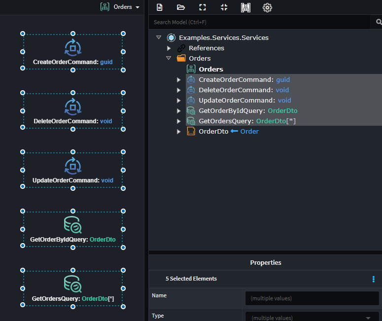

### Traditional Service Paradigm

- Combines read and write logic into a single service.
- Simplifies development by using a unified data model and service structure.
- Common in systems with straightforward requirements or minimal scalability concerns.

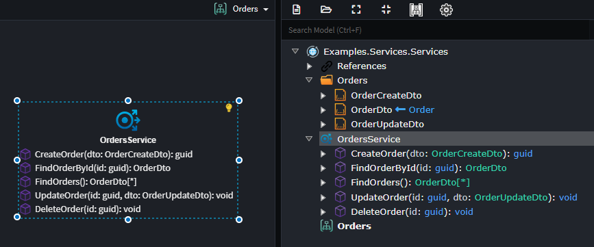

Both paradigms have their strengths, and Intent Architect provides the tools to model your services effectively within either approach.

## Exposing an Application Service

When modeling Application Services, by default, these application services are only available internally within the application.
It is very common to want to expose these so that external applications can consume them, this is an explicit action the modeler must take as there are several decisions which need to be made:

- Which Service end points are exposed ?
- What technology are they exposed over?
- Any technology specific configurations, for example security or addressing.

The various ways in which your Application Services can be exposed will depend on which modules you have installed, as an example if you have the `Intent.Metadata.WebApi` module installed you can `Expose as Http Endpoint` which will expose your service over Http using REST conventions.

## Creating a CQRS Command

1. Add a `Command` to any diagram in the `Services Designer`.
2. Name your `Command`, typically suffixed with `Command`, e.g. `CreateCustomerCommand`.
3. Right-click the `Command` and select **Add Property** to define its data.
4. Add complex data types as needed:
   - *DTO* for modeling nested structures.
   - *Enum* for modeling enumerations.
5. *Optional*: Define the return type of your `Command` in the property pane or by pressing F2 on the `Command`.

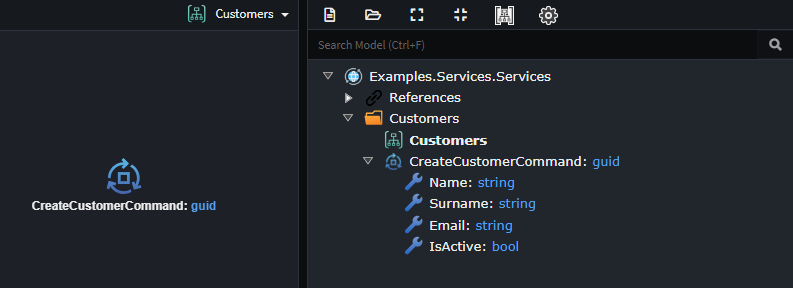

Once applied to your codebase, implement your business logic as follows:

1. Right-click on the `Command` and select **Open in IDE -> ...{CreateCustomer}CommandHandler.cs**.
2. Implement your business logic in the `Handle` method.

> [!NOTE]
> Many service implementations are predictable and repetitive. Intent Architect can generate these implementations for you: [Modeled Service Implementations](#modeled-service-implementations).
> [!TIP]
> Quickly model or bootstrap your services using the [CQRS CRUD Accelerator](#create-crud-cqrs-operations-accelerator).

## Creating a CQRS Query

1. Add a `Query` to any diagram in the `Services Designer`.
2. Name your `Query`, typically suffixed with `Query`, e.g. `GetCustomerByIdQuery`.
3. Right-click the `Query` and select **Add Property** to define its data.
4. Add complex data types as needed:
   - *DTO* for modeling nested structures.
   - *Enum* for modeling enumerations.
5. Define the return type of your `Query` in the property pane or by pressing F2 on the `Query`.

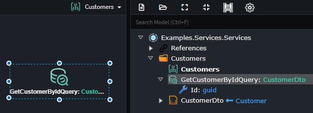

Once applied to your codebase, implement your business logic as follows:

1. Right-click on the `Query` and select **Open in IDE -> ...QueryHandler.cs**.
2. Implement your business logic in the `Handle` method.

> [!NOTE]
> Many service implementations are predictable and repetitive. Intent Architect can generate these implementations for you: [Modeled Service Implementations](#modeled-service-implementations).
> [!TIP]
> Quickly model or bootstrap your services using the [Traditional Service CRUD Accelerator](#create-crud-traditional-service-accelerator).

## Creating a Traditional Application Service

To create a service with operations:

1. Right-click on the diagram and select `New Service`, then provide it with a unique name.
2. Right-click on the Service and select `Add Operation`, then provide it with a name.
3. Right-click on the Operation and select `Add Parameter`. Provide it with a name and a type. If the type represents an inbound payload, select the corresponding DTO.
4. If the Operation does not return anything, leave the Type as `void`. Otherwise, select the appropriate return type.

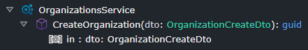

Once applied to your codebase, implement your business logic as follows:

1. Right-click on the `Service` and select **Open in IDE -> {OrganizationsService}.cs**.
2. Implement your business logic in the method corresponding to your modeled `Operation`, e.g. `CreateOrganization`.

> [!NOTE]
> Many service implementations are predictable and repetitive. Intent Architect can generate these implementations for you: [Modeled Service Implementations](#modeled-service-implementations).
> [!TIP]
> Quickly model or bootstrap your services using the [Traditional Service CRUD Accelerator](#create-crud-traditional-service-accelerator).

## Creating a DTO

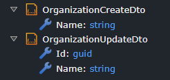

To create a DTO:

1. Right-click on the Service Package or a containing Folder within and select `New DTO`, then provide it with a unique name.
2. Right-click on the DTO and select **Add Field**. Provide it with a name and type.

## Inheriting from a DTO

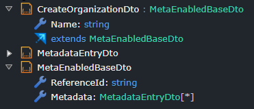

To inherit one DTO from another:

1. Right-click on the DTO that will inherit and select `New Inheritance`.
2. Select the DTO to inherit from.

## Mapping an Outbound DTO

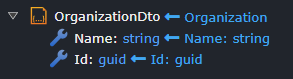

To map outbound DTOs:

1. Right-click on the DTO that will receive mapped information and select `Map From Domain`.
2. In the dialog, specify the Domain entity and select the attributes to include in the outbound DTO.
3. Check the desired attributes and click `Done`. This links your Domain data to the DTO.

## Adding a Diagram to the Services Designer

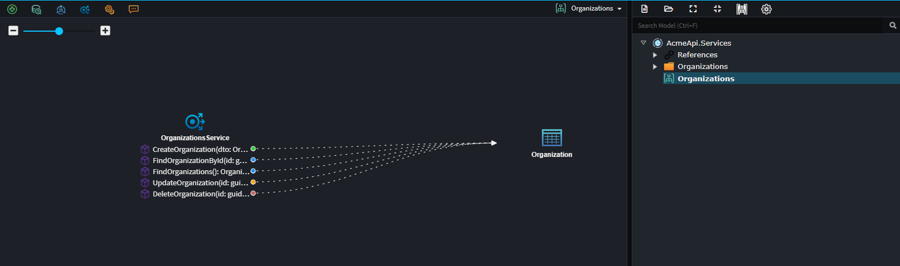

To enhance visual organization:

1. Right-click on the Services package and select `New Diagram`.
2. If the designer was in Tree-view, it switches to a diagram view.
3. Rename the diagram by right-clicking it in the Tree-view and selecting `Rename`.
4. Drag Services from the Tree-view onto the diagram to create visual representations.
5. Optionally, create multiple diagrams for different perspectives, though the Tree-view remains the source of truth.

> [!TIP]
> Hold down CTRL while dragging elements from the Tree-view to include directly associated elements.

## Using Accelerators to Rapidly Model Services

Accelerators are marcos or scripts which can automate modeling tasks.

### Create CRUD CQRS Operations Accelerator

This accelerator will model a CQRS paradigm service with a CRUD implementation, including the following:

- Create Entity Command
- Update Entity Command
- Delete Entity Command
- Get Entity by Id Query
- Get All Entities Query
- `Command`s based on the `Entity`'s operations.

1. Right-click on the `Services Package`, select the `Create CRUD CQRS Operations`.
2. Select the domain `Entity` to would like to model the service around.

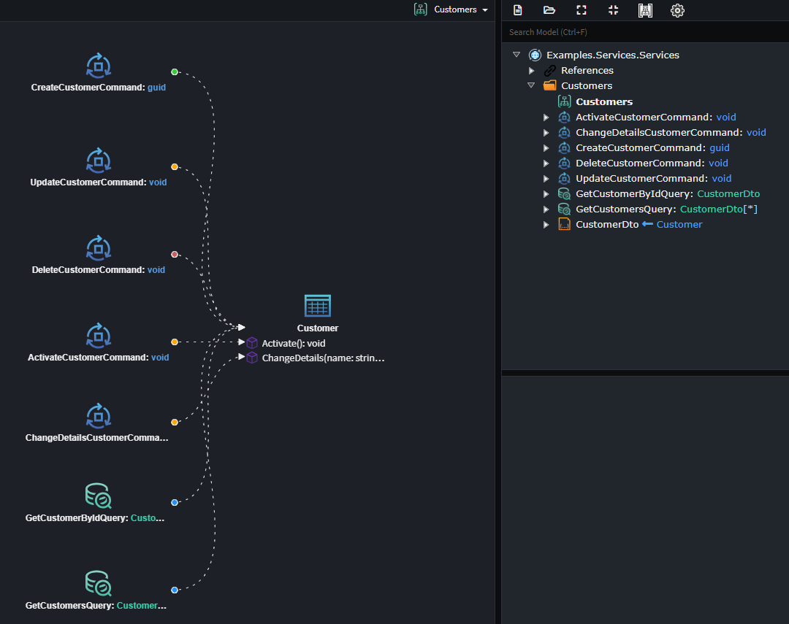

> [!NOTE]
> You can also run this accelerator on a `Folder` in the `Services Designer`.

### Create CRUD Traditional Service Accelerator

This accelerator will model a Traditional Service with a CRUD implementations, including the following operations:

- Create Entity
- Update Entity
- Delete Entity
- Get Entity by Id
- Get All Entities
- `Operations`'s based on the `Entity`'s operations.

1. Right-click on the `Services Package`, select the `Create CRUD Traditional Service`.
2. Select the domain `Entity` to would like to model the service around.

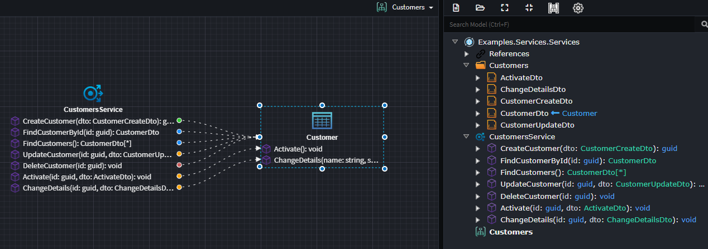

### Paginate Accelerator

`Pagination` on an operation allows large datasets to be returned in smaller, more manageable chunks. The `Paginate` accelerator is available for any `Operation` or `Query` that returns a **collection**.

1. Right-click on the qualifying `Operation` or `Query`, and select `Paginate`.
2. Select the domain `Entity` that you would like to model the service around.

This accelerator will automatically perform the following actions:

- The return type of the `Operation` or `Query` will be changed from the configured return type `TReturnType` to `PagedResult<TReturnType>`.
- Three `parameters`/`attributes` will be added to the `Query`/`Operation` respectively:

  - **PageNo**: Specifies the page number of the data to retrieve, based on the *PageSize*.
  - **PageSize**: Specifies how many records should be included in a single page.
  - **OrderBy**: Specifies how data should be sorted before pagination is applied. This field is optional, and if no value is supplied, the default database ordering will be used.

> [!NOTE]  
> If using the default CRUD implementation, the `PageNo` parameter is *1-based*. That is, the first page of the dataset has a page number of 1. Changing the name of the `parameter`/`attribute` to `PageIndex` will change the pagination to be *0-based*, with the first page of the dataset having a page number of 0.

> [!TIP]  
> The `OrderBy` parameter can be supplied with a *single* entity property, or multiple properties. Additionally, sorting can be applied to each property. These are all valid `OrderBy` formats:
>
> - `name`
> - `name asc`
> - `name desc`
> - `created, name`
> - `created desc, name asc`

## Modeled Service Implementations

### Create Entity Action

### Update Entity Action

### Delete Entity Action

### Query Entity Action

### Call Service Operation Action

### Processing Actions
