# Modeling Services

The **Services Designer** in Intent Architect is a powerful tool for modeling "Application Services" in your applications. This module enables developers to define how an application can be interacted with at the service level, allowing for the creation of both internal services and publicly exposed endpoints.

## What is an Application Service?

An application service is a layer in an application's architecture that serves as an intermediary between the domain layer (business logic) and the presentation layer (e.g., user interface or API). It orchestrates use cases and workflows, delegating detailed domain logic to the domain layer.

### Key Characteristics of an Application Service

- **Coordinates Use Cases**: Encapsulates specific use cases or workflows, such as "Register a User" or "Place an Order."
- **Delegates Domain Logic**: Delegates core business logic to domain entities or domain services.
- **Handles Input/Output**: Processes input from the presentation layer (e.g., HTTP requests) and returns output (e.g., HTTP responses or data transfer objects).
- **Transaction Management**: Manages transaction boundaries, such as starting, committing, or rolling back database transactions.
- **Separates Layers**: Prevents the presentation layer from interacting directly with the domain layer, maintaining separation of concerns.
- **Interacts with Infrastructure**: Uses repositories, mappers, or other infrastructure components to fetch or persist data.

## Service Modeling Paradigms

Intent Architect provides two paradigms for modeling application services: **CQRS (Command Query Responsibility Segregation)** and **Traditional Services**. This flexibility allows you to design services tailored to your system's architectural requirements, whether you prioritize scalability and clarity or prefer a unified approach.

Modeling services focuses on defining the flow of data into and out of your application (data contracts). You can also optionally model implementations for your services.

### CQRS Paradigm

- Separates read and write responsibilities into distinct models optimized for their respective purposes.
- **Commands** handle state-changing operations, focusing on business logic and domain consistency.
- **Queries** handle data retrieval, often accessing read-optimized data stores or projections.
- Ideal for systems with complex requirements or high scalability demands.
- Use case-centric.

### Traditional Service Paradigm

- Combines read and write logic into a single service.
- Simplifies development by using a unified data model and service structure.
- Common in systems with straightforward requirements or minimal scalability concerns.

Intent Architect enables you to effectively model services using either approach.

## Exposing an Application Service

By default, application services are only available internally. To expose these services for external consumption, you must take explicit action. This involves making critical decisions:

- Which service endpoints will be exposed?
- Over which technology will they be exposed?
- What are the technology-specific configurations (e.g., security, addressing)?

The methods available for exposing services depend on the modules installed. For example, if you have the `Intent.Metadata.WebApi` module installed, you can **Expose as HTTP Endpoint** to expose services over HTTP using REST conventions.

## Creating a CQRS Command

1. Add a `Command` to a diagram in the **Services Designer**.
2. Name the `Command`, typically suffixed with `Command` (e.g., `CreateCustomerCommand`).
3. Right-click the `Command` and select **Add Property** to define its data.
4. Add complex data types as needed:
   - **DTO** for nested structures.
   - **Enum** for enumerations.
5. *Optional*: Define the return type of the `Command` in the property pane or by pressing **F2**.

### Implementing the Command

Once applied to your codebase:

1. Right-click on the `Command` and select **Open in IDE -> {CreateCustomerCommandHandler.cs}**.
2. Implement your business logic in the `Handle` method.

> [!NOTE]
> Many service implementations are predictable and repetitive. Intent Architect can generate these implementations for you: [Modeled Service Implementations](#modeled-implementations).
> [!TIP]
> Quickly model or bootstrap your services using the [CQRS CRUD Accelerator](#create-crud-cqrs-operations-accelerator).

## Creating a CQRS Query

1. Add a `Query` to a diagram in the **Services Designer**.
2. Name the `Query`, typically suffixed with `Query` (e.g., `GetCustomerByIdQuery`).
3. Right-click the `Query` and select **Add Property** to define its data.
4. Add complex data types as needed:
   - **DTO** for nested structures.
   - **Enum** for enumerations.
5. Select return type of the `Query` in the property pane or by pressing **F2** (typically a `DTO`).

### Implementing the Query

Once applied to your codebase:

1. Right-click on the `Query` and select **Open in IDE -> {QueryHandler.cs}**.
2. Implement your business logic in the `Handle` method.

> [!NOTE]
> Many service implementations are predictable and repetitive. Intent Architect can generate these implementations for you: [Modeled Service Implementations](#modeled-implementations).
> [!TIP]
> Quickly model or bootstrap your services using the [Traditional Service CRUD Accelerator](#create-crud-traditional-service-accelerator).

## Creating a Traditional Application Service

To create a service with operations:

1. Right-click on the diagram and select **New Service**, then provide a unique name.
2. Right-click the service and select **Add Operation**, then provide a name.
3. Right-click the operation and select **Add Parameter**. Specify its name and type. If it represents an inbound payload, select the corresponding DTO.
4. Leave the type as `void` for operations with no return value, or choose an appropriate return type.

### Implementing the Service

Once applied to your codebase:

1. Right-click the `Service` and select **Open in IDE -> {OrganizationsService.cs}**.
2. Implement your business logic in the method corresponding to your modeled `Operation` (e.g., `CreateOrganization`).

> [!NOTE]
> Many service implementations are predictable and repetitive. Intent Architect can generate these implementations for you: [Modeled Service Implementations](#modeled-implementations).
> [!TIP]
> Quickly model or bootstrap your services using the [Traditional Service CRUD Accelerator](#create-crud-traditional-service-accelerator).

## Creating a DTO

To create a DTO:

1. Right-click on the **Service Package** or a containing folder and select **New DTO**, then provide a unique name.
2. Right-click the DTO and select **Add Field**. Specify the name and type.

## Inheriting from a DTO

To inherit one DTO from another:

1. Right-click on the DTO that will inherit and select **New Inheritance**.
2. Select the parent DTO.

## Mapping an Outbound DTO

To map outbound DTOs:

1. Right-click on the DTO that will receive the mapped information and select **Map From Domain**.
2. In the dialog, specify the domain entity and select the attributes to include in the outbound DTO.
3. Check the desired attributes and click **Done**. This links your domain data to the DTO.

## Adding a Diagram to the Services Designer

To enhance visual organization:

1. Right-click on the **Services** package and select **New Diagram**.
2. If the designer was in Tree-view, it will switch to a diagram view.
3. Rename the diagram by right-clicking it in the Tree-view and selecting **Rename**.
4. Drag services from the Tree-view onto the diagram to create visual representations.
5. Optionally, create multiple diagrams for different perspectives. The Tree-view remains the source of truth.

> [!TIP]
> Hold down **CTRL** while dragging elements from the Tree-view to include directly associated elements.

## Using Accelerators to Rapidly Model Services

Accelerators are macros or scripts that automate repetitive modeling tasks, saving time and ensuring consistency.

### Create CRUD CQRS Operations Accelerator

This accelerator models a CQRS service with a CRUD implementation, including the following:

- **Commands**:
  - Create Entity Command
  - Update Entity Command
  - Delete Entity Command
- **Queries**:
  - Get Entity by Id Query
  - Get All Entities Query
- `Commands` based on the `Entity`'s operations.

1. Right-click on the **Services Package**, and select **Create CRUD CQRS Operations**.
2. Select the domain `Entity` to model the service around.

> [!NOTE]
> You can also run this accelerator on a **Folder** in the **Services Designer**.

### Create CRUD Traditional Service Accelerator

This accelerator models a Traditional Service with CRUD implementations, including the following operations:

- Create Entity
- Update Entity
- Delete Entity
- Get Entity by Id
- Get All Entities
- `Operations` based on the `Entity`'s operations.

1. Right-click on the **Services Package**, and select **Create CRUD Traditional Service**.
2. Select the domain `Entity` to model the service around.

### Paginate Accelerator

Pagination enables large datasets to be returned in smaller, more manageable chunks. The `Paginate` accelerator is available for any **Operation** or **Query** that returns a collection.

1. Right-click on the qualifying **Operation** or **Query**.
2. Select the **Paginate** menu item.

#### Actions performed by this accelerator

- Changes the return type of the `Operation` or `Query` from `TReturnType` to `PagedResult<TReturnType>`.
- Adds three parameters/properties to the `Operation`/`Query`:
  - **PageNo**: Specifies the page number to retrieve, based on the *PageSize*.
  - **PageSize**: Specifies how many records should be included in a single page.
  - **OrderBy**: Specifies how data should be sorted before pagination. This is optional, and defaults to database ordering if omitted. It will order data in **ascending order** by default.

> [!NOTE]  
> If using the default CRUD implementation, the `PageNo` parameter is *1-based* by default (first page = 1), renaming the parameter to `PageIndex` will make it *0-based* (first page = 0).
> [!TIP]  
> The CRUD modules treat the `OrderBy` as a dynamic LINQ statement. The `OrderBy` parameter supports, a single entity property (e.g., `name`), multiple entity properties (e.g., `created, name`), sorting directions for each property (e.g., `name desc`, `created desc, name asc`).

Examples of valid `OrderBy` formats:

- `name`
- `name asc`
- `name desc`
- `created, name`
- `created desc, name asc`

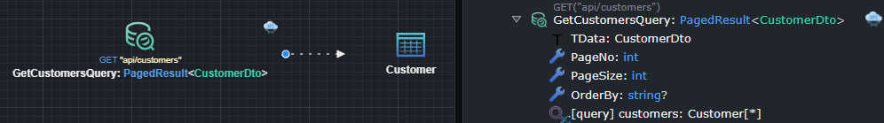

## Modeled Implementations

### Create Entity Action

This action allows you to model the creation of a domain `Entity` (`Class`) using either an `Object Initializer` or a `Constructor`.  
It can be applied to a `Command`, a service `Operation`, or a `Domain Event Handler Association` (referred to as the `Element` below).

#### Creating a Domain Entity using Object Initialization

1. On a diagram, select **Add to Diagram** and choose the domain `Entity` you want to create.
2. Right-click on the `Element` and select **Create Entity**.
3. Connect the `Element` to the `Entity` by left-clicking it.

This opens the `Create Entity Mapping` dialog to map data from the `Element` to the `Entity`.

1. Double-click the `Entity` in the right-hand panel.  
   A purple line appears, indicating the creation of the `Entity` using an `Object Initializer`.
2. Map data from the `Element` to the `Entity`:
   - **Double-click the `Entity` again** to map all attributes and add missing ones.
   - **Double-click an `Entity` attribute or `Element` property** to automatically map (or create and map) them.
   - **Drag an an `Entity` attribute or `Element` property to it's counter part***, to map them.
   - **Drag multiple mappable items from either side to the other side's background**, this will batch map the items, adding items if applicable.

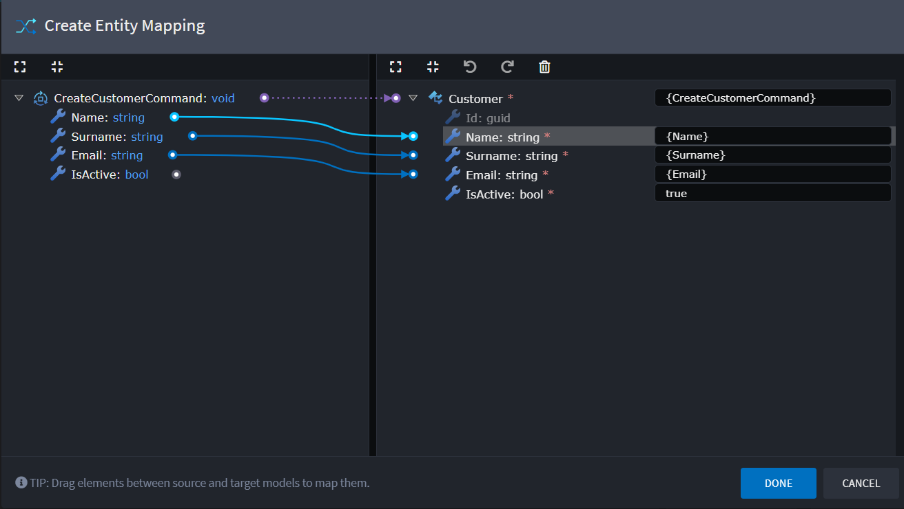

> [!TIP]  
> If no mappable property exists, you can define an expression (e.g., `true`, `0`, `""`) in the text box next to the attribute.

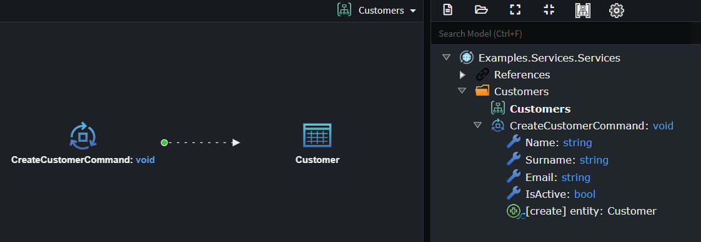

> [!TIP]  
> To revisit the mapping screen, right-click on the `Create Entity Action` or the association linking the `Element` and `Entity`, and select **Map Entity Creation**.

#### Creating a Domain Entity using a Constructor

1. On a diagram, select **Add to Diagram** and choose the domain `Entity` you want to create.
2. Right-click on the `Element` and select **Create Entity**.
3. Connect `Element` to a `Constructor` on the `Entity` Left-click on the `Constructor`.

This will open the `Create Entity Mapping` Dialog, this dialog helps you map data from the `Element` to the `Entity`.

1. Double-Click the `Constructor` in right hand panel.
This will add purple line between the `Element` and the `Constructor`, this represents how the `Entity` will be created i.e. using this `Constructor`.
2. Map how the data from the `Element` to the `Constructor`,  this can be done in several ways:

    - **Double-click the `Constructor` again**, this map all the `Constructor` parameters to the corresponding `Element` properties, adding missing ones where required.
    - **Double-click an `Constructor` attribute or `Element` property** to automatically map (or create and map) them.
    - **Drag an an `Constructor` attribute or `Element` property to it's counter part***, to map them.

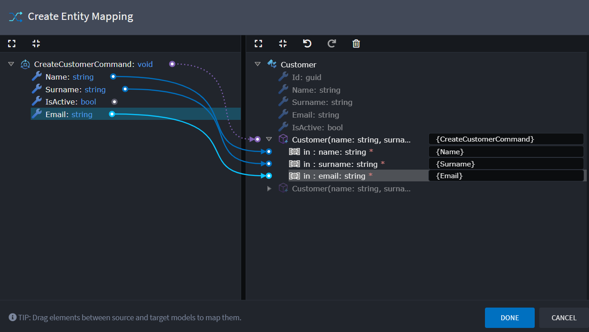

> [!TIP]  
> If no mappable property exists, you can define an expression (e.g., `true`, `0`, `""`) in the text box next to the attribute.

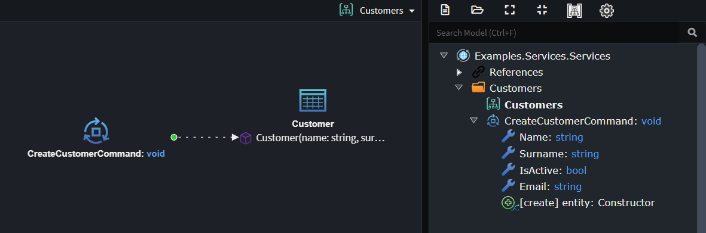

> [!TIP]  
> To revisit the mapping screen, right-click on the `Create Entity Action` or the association linking the `Element` and `Entity`, and select **Map Entity Creation**.

### Update Entity Action

This action models updates to a domain `Entity` (`Class`) using its `Attributes` or an entity `Operation`.  
It applies to a `Command`, a service `Operation`, or a `Domain Event Handler Association` (referred to as the `Element` below).

#### Updating a Domain Entity Using Its Properties

1. On a diagram, select **Add to Diagram** and choose the domain `Entity` you want to update.
2. Right-click on the `Element` and select **Update Entity**.
3. Connect the `Element` to the `Entity` by left-clicking the `Entity`.

This opens the `Update Entity Mapping` dialog, where you can:

1. Map data from the `Element` to the `Entity`:
    - **Select `Entity` attributes, drag them to the background of the left-hand side**, mapping the `Entity` attributes to the corresponding `Element` properties.
    - **Double-click an `Entity` attribute or `Element` property** to automatically map (or create and map) them.
    - **Drag an individual `Element` property onto a `Entity` attribute**, this will map the two elements.
    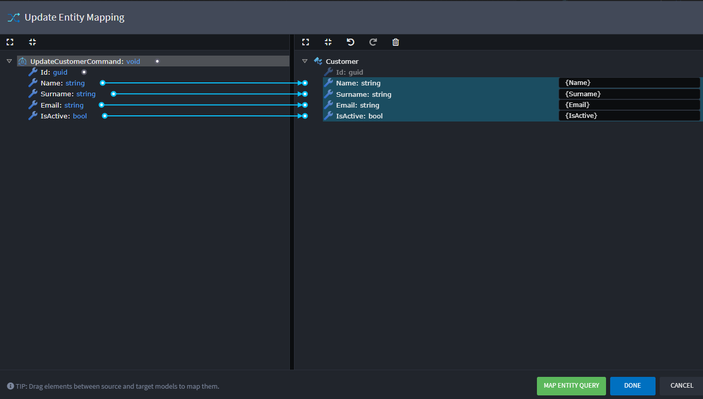
2. Click **Map Entity Query** to define how the `Entity` should be retrieved:
   - Map the primary key of the `Entity` to corresponding `Element` properties.
  
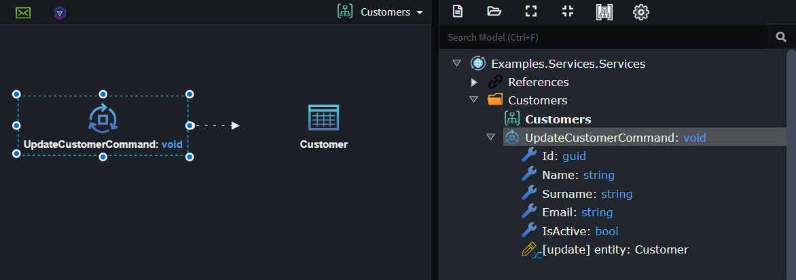

> [!TIP]  
> Revisit the mapping screen by right-clicking the `Update Entity Action` or the association and selecting **Map Entity Update**.

#### Updating a Domain Entity using a Domain Entity Operation

1. On a diagram, select **Add to Diagram** and choose the domain `Entity` you want to create.
2. Right-click on the `Element` and select **Update Entity**.
3. Connect `Element` to an `Operation` on the `Entity` by left-clicking the `Operation`.

This opens the `Update Entity Mapping` dialog, where you can:

1. Map how the `Operation` will be invoked :
    1. Double-click the `Operation` in right hand panel.
    This will add purple line between the `Element` and the `Operation`, this represents the invocation of the `Operation`.
    2. Map data from the `Element` to the `Operation`:
      - **Double-click the `Operation` again**, this map all the `Operation` parameters to the corresponding `Element` properties, adding missing ones where required.
      - **Double-click an `Operation` parameter or `Element` property** to automatically map (or create and map) them.
      - **Drag an individual `Element` property onto a `Operation` parameter**, this will map the two elements.
    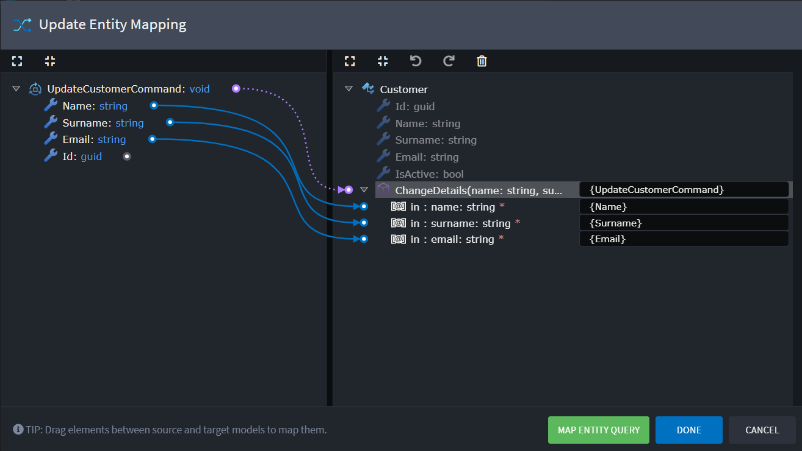
2. Click **Map Entity Query** to define how the `Entity` should be retrieved:
   - Map the primary key of the `Entity` to corresponding `Element` properties.

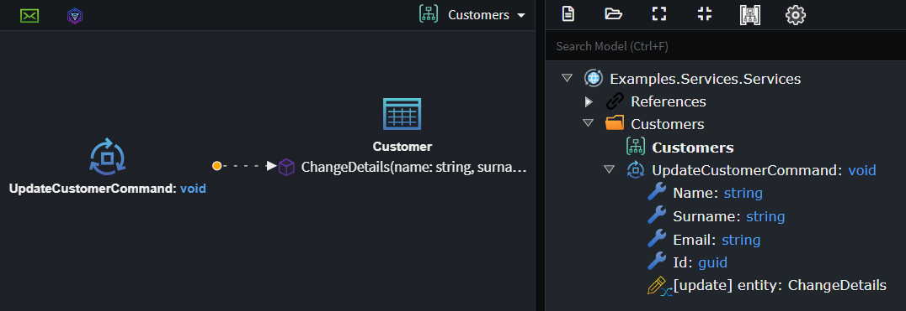

> [!TIP]  
> Revisit the mapping screen by right-clicking the `Update Entity Action` or the association and selecting **Map Entity Update**.

### Delete Entity Action

This action allows you to model the deletion of a domain `Entity` (`Class`).  
It can be applied to a `Command`, a service `Operation`, or a `Domain Event Handler Association` (referred to as the `Element` below).

1. On a diagram, select **Add to Diagram** and choose the domain `Entity` you want to delete.
2. Right-click on the `Element` and select **Delete Entity**.
3. Connect the `Element` to the `Entity` by left-clicking the `Entity`.

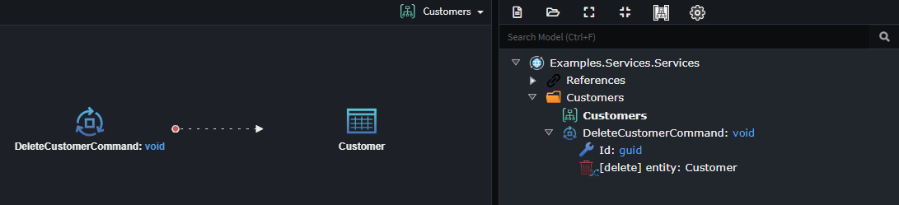

> [!NOTE]  
> For `Domain Event Handler` you will need to configure how the Domain Entity is queries, simply right-click on the `Delete Entity Action` (Connecting Association) and select **Map Entity Filter** and map the domain `Entity`s primary key.

### Query Entity Action

This action allows you to model the querying of a domain `Entity` (`Class`).  
It can be applied to a `Query`, `Command`, service `Operation`, or `Domain Event Handler Association` (referred to as the `Element` below).

### How to Query a single Entity

1. On a diagram, select **Add to Diagram** and choose the domain `Entity` you want to query.
2. Right-click on the `Element` and select **Query Entity**.
3. Connect the `Element` to the `Entity` by left-clicking the `Entity`.
4. Select the `Association` you just created (`Query Entity Action`).
5. Right-click and select **Map Entity Query**.
This opens the `Query Entity Mapping` dialog, where you model the criteria for Entity Select:
6. Map the filter criteria for querying your Entity, here are a few ways you could do this
   - Double-click the primary key of the `Entity`.
   - Map the primary key of the `Entity` to corresponding `Element` properties.
   - Map one or more `Entity` attributes, which uniquely identify the `Entity`, to corresponding `Element` properties.
7. Click **Done** to complete the mapping (even if no filter criteria are applied).

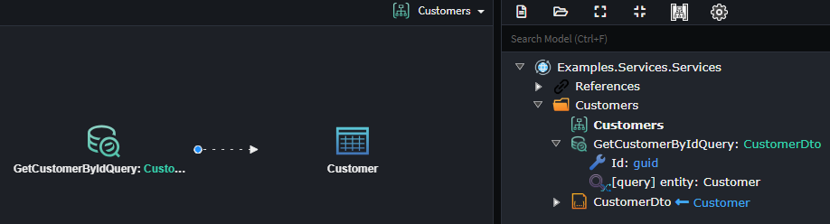

### How to Query a Collection of Entities

1. On a diagram, select **Add to Diagram** and choose the domain `Entity` you want to query.
2. Right-click on the `Element` and select **Query Entity**.
3. Connect the `Element` to the `Entity` by left-clicking the `Entity`.
4. Select the `Association` you just created (`Query Entity Action`).
5. In the **Properties** pane, check **Is Collection** (shortcut: `Alt + C`).
You can also rename the Name **entity** to "entities" or similar (this will be the name of the variable the query results are assigned to).
6. Right-click the association and select **Map Entity Query**.
This opens the `Query Entity Mapping` dialog, where you model the criteria for Entity Select:
7. *Optionally* [Map Filter criteria](#how-to-apply-mapped-filters-to-a-query) for the `Entity` selection.
8. Click **Done** to complete the mapping (even if no filter criteria are applied).

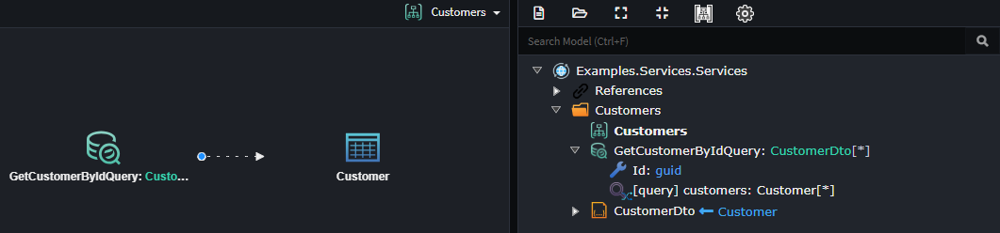

### How to apply mapped filters to a Query

1. On a Query that has a field used for filtering, right click on the Query action and select **Map Entity Query**. This opens the `Query Entity Mapping` dialog.
2. Map one or more `Entity` attributes, which uniquely identify the `Entity`, to corresponding `Query` properties. You can double-click on an `Entity` attribute to create a corresponding field on the `Query` element that is also mapped.
3. Click **Done** to complete the mapping.

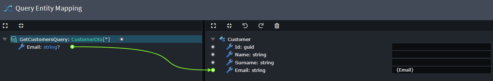

> [!NOTE]  
> Currently, filter criteria mapping only supports "==" conditions. More complex filters must be implemented in code.

### Service Returns and Query Entity Actions

`Query Entity Action` is designed specifically for modeling the querying of data and is not directly tied to the **Return Type** of the `Element` it is modeled on.

Suppose you are modeling a `Query` named `GetCustomersQuery`. This query would likely return a collection of `CustomerDto`s. The implementation of the `GetCustomersQueryHandler` would involve the following steps:

1. Query the database to get a list of `Customer`s.
2. Transform the `Customer`s to `CustomerDto`s and return the `DTO`s.

The `Query Entity Action` focuses solely on step 1 — querying the database. It is unrelated to step 2, which involves transforming the data into a different return type.

When using `Query Entity Action` alongside our **CRUD** modules, these modules employ heuristic algorithms to handle the wiring for step 2 automatically.

This mapping can be established using the **Map From Domain** context menu option on the `DTO`. This ensures that the transformation from the queried type (`Customer`) to the return type (`CustomerDto`) is recognized and automated.
The return type and query type must also share the same value for **Is Collection**. If the query retrieves a collection of entities, the return type should also be a collection. Similarly, if the query retrieves a single entity, the return type should not be a collection.

### Call Service Operation Action

The **Call Service Operation Action** allows you to model the invocation of `Service` or `Domain Service` operations.  
It can be applied to a `Command`, `Query`, service `Operation`, or `Domain Event Handler Association` (collectively referred to as the `Element` below).

1. On a diagram, select **Add to Diagram** and choose a `Service` or `Domain Service` you want to invoke.
2. Right-click on the `Element` and select **Call Service Operation**.
3. Connect the `Element` to the `Operation` you want to invoke, by left-clicking the `Operation`.

This opens the `Service Operation Mapping` dialog, where you can:

1. Map data from the `Element` to the `Operation` invocation:
    - **Double-click the `Operation` again**, this map all the `Operation` parameters to the corresponding `Element` properties, adding missing ones where required.
    - **Double-click an `Operation` attribute or `Element` property** to automatically map (or create and map) them.
    - **Drag an an `Operation` attribute or `Element` property to it's counter part**, to map them.
    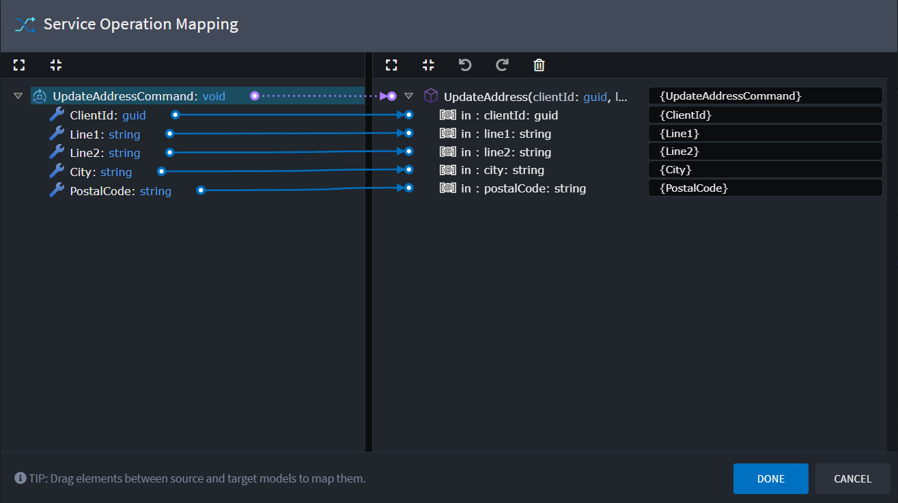

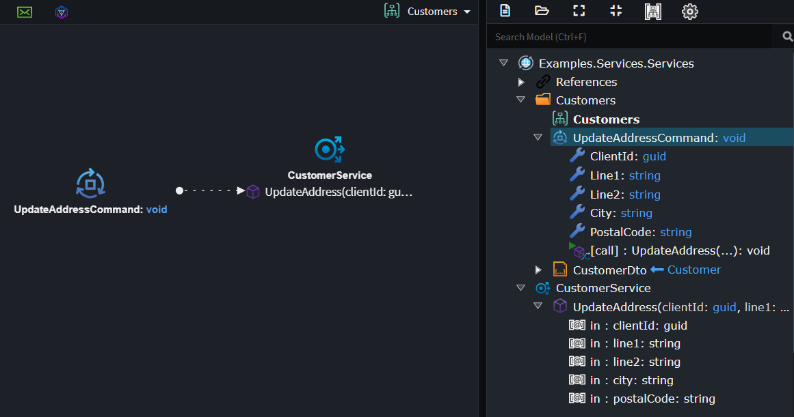

### Processing Actions

> [!WARNING]  
> This is an experimental feature and likely to change in the future

**Add Processing Action** allows you configure additional implementation details through additional mappings. These mappings are able to link any existing **actions** together.

Here are a few examples of what is possible.

- Invoke an Operation on a Domain Entity you are updating.
- Map data from the result of a **Service Operation Call** onto an entity.
