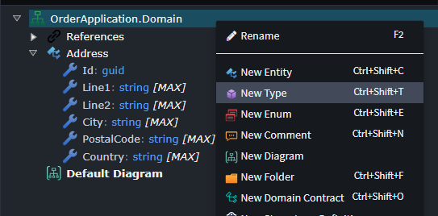
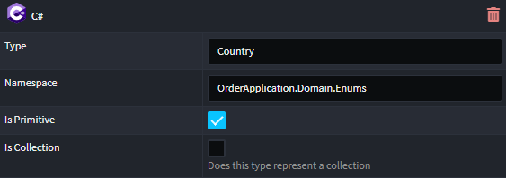
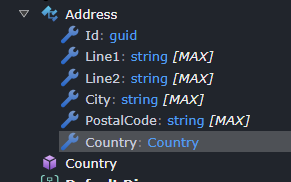

# Type Definitions

Reference any Types you have defined in your codebase inside your designers in Intent Architect by using `Type Definitions`.

As an example let's assume you're building an Orders application in .NET and you would like to introduce an Enum `Country` to your `Address` Entity as an `Attribute` in your Domain designer, however in your codebase there already is a `Country` Enum that is quite lengthy due to the 249 countries defined in it. Trying to reproduce it in your designer is time consuming.

```c#
namespace OrderApplication.Domain.Enums;

public enum Country
{
    [Display(Name = "Afghanistan", ShortName = "AF", Description = "AFG:004")]
    Afghanistan = 4,
    
    [Display(Name = "Albania", ShortName = "AL", Description = "ALB:008")]
    Albania = 8,
    
    [Display(Name = "Algeria", ShortName = "DZ", Description = "DZA:012")]
    Algeria = 12,
    
    [Display(Name = "American Samoa", ShortName = "AS", Description = "ASM:016")]
    AmericanSamoa = 16,
    
    [Display(Name = "Andorra", ShortName = "AD", Description = "AND:020")]
    Andorra = 20,

    // ... Additional countries omitted for brevity ...
    
    [Display(Name = "United Kingdom", ShortName = "GB", Description = "GBR:826")]
    UnitedKingdom = 826,
    
    [Display(Name = "United States", ShortName = "US", Description = "USA:840")]
    UnitedStates = 840,
    
    [Display(Name = "Zimbabwe", ShortName = "ZW", Description = "ZWE:716")]
    Zimbabwe = 716
}
```

Rather than redefining it in your Domain designer, you can introduce this Type without defining a whole Enum element. Right click on the Domain package and select `New Type`.



Perform the following steps on this new `Type`:

- Name it `Country`.
- Right click on the type and select `Apply Stereotype`.
- Select the `C#` stereotype.
- In the `C#` stereotype properties specify the `Type` to be `Country`, the `Namespace` to be `OrderApplication.Domain.Enums` and ensure `Is Primitive` is `checked`.



In the `Address` Entity, replace the `Country` Attribute's type from `string` to `Country`.



Now when the code gets generated you will see the `Address` Entity class looking like this:

```c#
using Intent.RoslynWeaver.Attributes;
using OrderApplication.Domain.Common;
using OrderApplication.Domain.Enums;

[assembly: IntentTemplate("Intent.Entities.DomainEntity", Version = "2.0")]

namespace OrderApplication.Domain.Entities;

public class Address : IHasDomainEvent
{
    public Address()
    {
        Line1 = null!;
        Line2 = null!;
        City = null!;
        PostalCode = null!;
    }

    public Guid Id { get; set; }

    public string Line1 { get; set; }

    public string Line2 { get; set; }

    public string City { get; set; }

    public string PostalCode { get; set; }

    public Country Country { get; set; }

    public List<DomainEvent> DomainEvents { get; set; } = [];
}

```

The `Country` type is now the return type for the `Country` property and the namespace `OrderApplication.Domain.Enums` has been added as a using directive for referencing that type.
