## Angular UI Modeling with AI

This article explains how to use Intent Architect to rapidly build professional Angular UIs, leveraging both deterministic (pattern-based) and non-deterministic (AI/LLM-driven) code generation.

The high-level workflow is:

- **Design and generate your View Models**: Define which services to interact with and how UI navigation should work.

  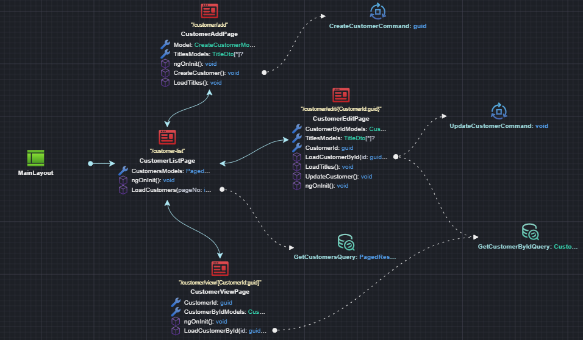

- **Implement with AI**: Use the "Implement with AI" accelerator to have your chosen LLM generate the View. Intent Architect manages the context and LLM interactions for you. Review the proposed changes as a code diff, similar to a regular Software Factory execution.
  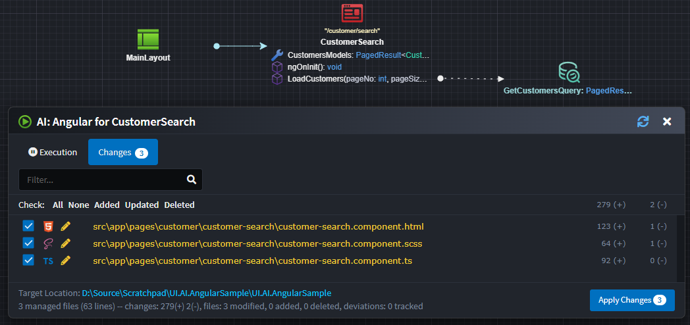

- **Review and validate the code**: Since LLMs are non-deterministic, always review the generated code. With a bit of luck, you’ll get a screen like this:
  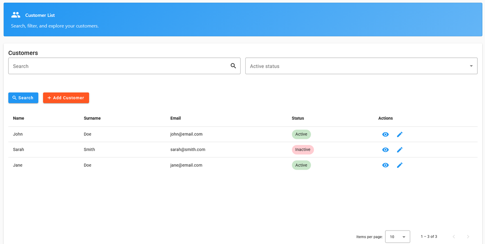

> [!NOTE]
> While the samples use Material Components, the approach is not Material-specific. You can configure for other component libraries as needed.

> [!NOTE]
> The Angular modules and application template are currently in **beta**. If you encounter issues, please let us know. See [Known Issues and Snags](#known-issues-and-limitations) for current limitations.

---

## Design and Generate Your View Model

To get started, create an Angular Web Application in Intent Architect (using the Angular Web Application architecture template)

  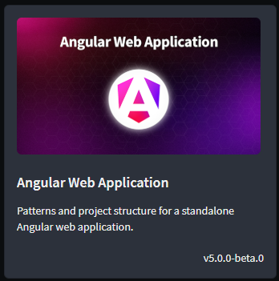

> [!NOTE]
> The Angular modules and architecture template are currently in beta. Make sure `Include prerelease` is checked to see the templates and modules.

> [!NOTE]
> A comprehensive Angular Sample application is also available. To use it, select **Explore Samples** on the left, then choose `Angular Web Application`.

When creating the application, ensure the `Angular AI`, `Material`, and `Http Clients` components are all selected (these are ticked by default):

  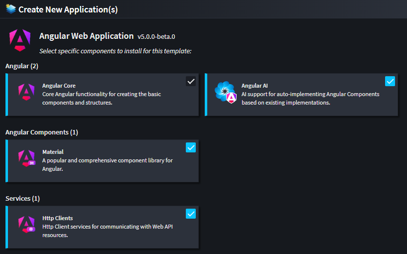

### Initial Code Generation and Module Installation

Run the **Software Factory** to generate the initial application structure and infrastructure code.

Before running the application, install the referenced modules. Open a console window at your application's output location (a shortcut is provided at the bottom of the Software Factory execution window).

Install the modules:

```cmd
npm i
```

Then start the application:

```cmd
ng serve
```

### Modeling Pages

1. Add a `Page` to a diagram in the **UI Designer**.
2. Name the `Page` to describe its function (e.g., `CustomerSearch`, `CustomerAdd`).
3. *(Optional)* Adjust the route in the property pane.

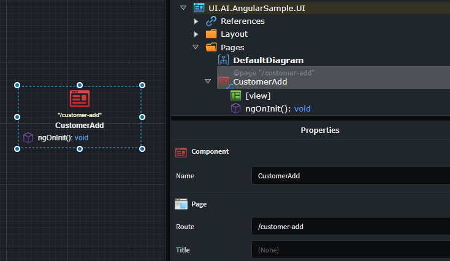

### Adding Route Parameters to a Page

If your page needs **Route Parameters** (e.g., `customers/edit/{customerId}`):

1. Right-click the `Page` → **Add Property**.
2. Name the property (e.g., `CustomerId`) and set its type (e.g., `Guid`).
3. Apply the `Route Parameter` stereotype to the property (press **F3**).

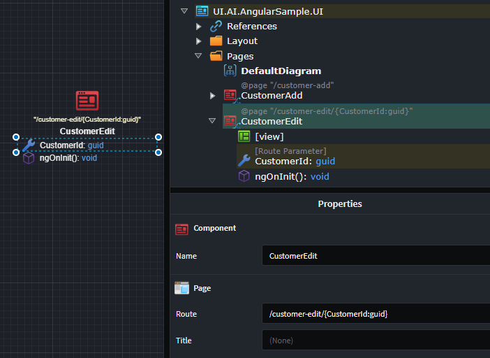

The page route updates automatically based on the route parameters.

---

### Modeling a Dialog

1. Add a `Page` to a diagram in the **UI Designer**.
2. Name the `Page` with a **Dialog** suffix (e.g., `CustomerAddDialog`).

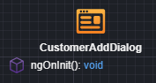

If your dialog needs parameters:

1. Right-click the **Dialog** → **Add Property**.
2. Name the property (e.g., `CustomerId`) and set its type (e.g., `Guid`).
3. Apply the `Route Parameter` or `Bindable` stereotype (press **F3**).

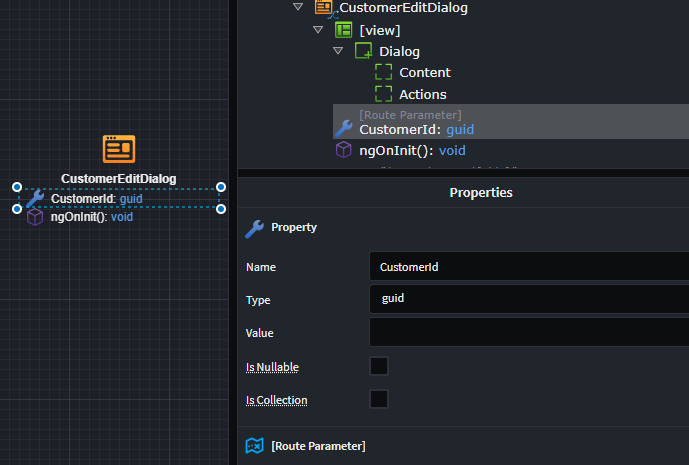

---

### Modeling UI Navigation

#### Navigation to a Page

1. Right-click the `Page` (or Dialog) → **Add Navigation**.
2. Connect the navigation arrow to the destination by left-clicking the target.

#### Navigation to a Dialog

1. Right-click the `Component` (Page or Dialog) → **Add Operation**.
2. Name the operation (e.g., `AddNewCustomer`).
3. Right-click the operation → **Show Dialog**.
4. Connect the navigation to the dialog by left-clicking the destination.

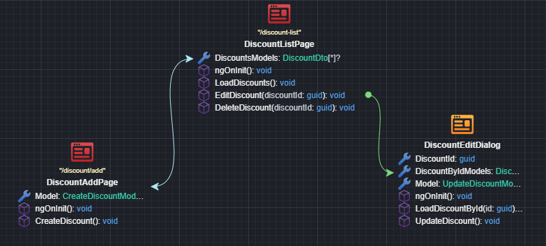

If your `Component` has `Route Parameters`, a mapping dialog will open for you to bind those parameters. Usually, you add these parameters to your navigation `Operation`.

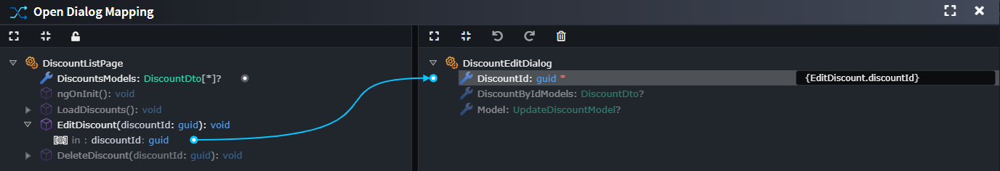

---

### Connecting UI Components to Services in Other Applications

UI `Component`s interact with services to retrieve data or trigger changes in the system. Model this as follows:

To use external services in your UI application:

1. In the `User Interface Designer`, under the `User Interface Package`, right-click `References` → `Add a Package Reference`.
2. In the `Package Reference Manager`, select the package containing the services (e.g., `OtherApplication.Services`).

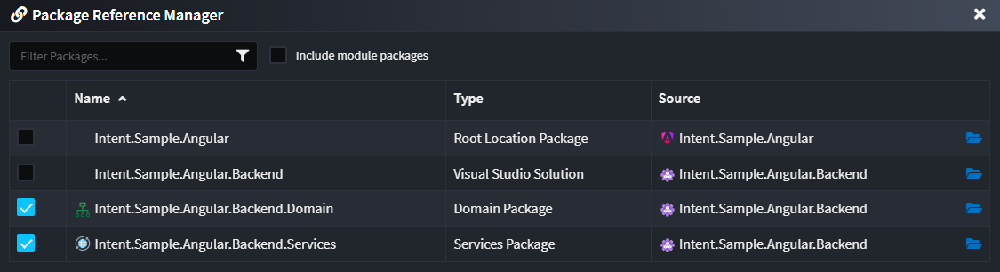

You can now use these external services in your UI diagrams.

1. In the `Component`'s suggestions, click `Call Backend Service`.
2. In the **Call Backend Service** dialog, select the service endpoint to call.

> [!NOTE]
> If you don't see the desired services, remember to add a package reference to the `Service Package` containing those services in the UI Designer.

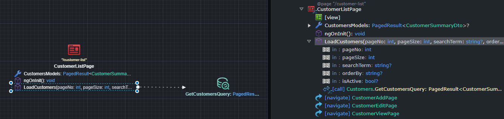

Depending on the service type:

- For `Query`s: The result is added to the `Component` as a property, and request parameters are modeled as `Operation` parameters.
- For `Command`s: A corresponding `Model Definition` is created and added to the `Component`, mapped to the command for invocation. For `Command`s, you typically want a separate model for view concerns.

> [!NOTE]
> You also need the appropriate integration module for remote communication. Currently, only `Intent.Angular.HttpClients` is supported (selected by default for new Angular applications).

---

## Implementing Your View with AI

> [!TIP]
> Install the `Intent.AI.Angular` module and connect Intent Architect to your preferred LLM API. Ensure [User Settings](https://docs.intentarchitect.com/articles/modules-common/intent-common-ai/intent-common-ai.html#user-settings) are complete, including a valid API key. Prompt results will vary by provider and model-experiment to find what works best for you.

Once your **View Model** design is ready, use the Angular AI accelerator to generate the remaining implementation details.

> [!NOTE]
> Always apply your **Software Factory** before running AI prompts, as the generated code is used as input/context for the AI.

### Generate Your View with AI

1. Run and apply the **Software Factory**.
2. Right-click the `Component` → **Implement with AI**.
3. *(Optional)* Adjust settings in the AI Prompt dialog.
4. Click **Done** - Intent Architect will generate and submit a prompt to the LLM (this may take a while).
5. Review the AI's proposed changes as a code diff.
6. Click **Apply** to accept the changes.

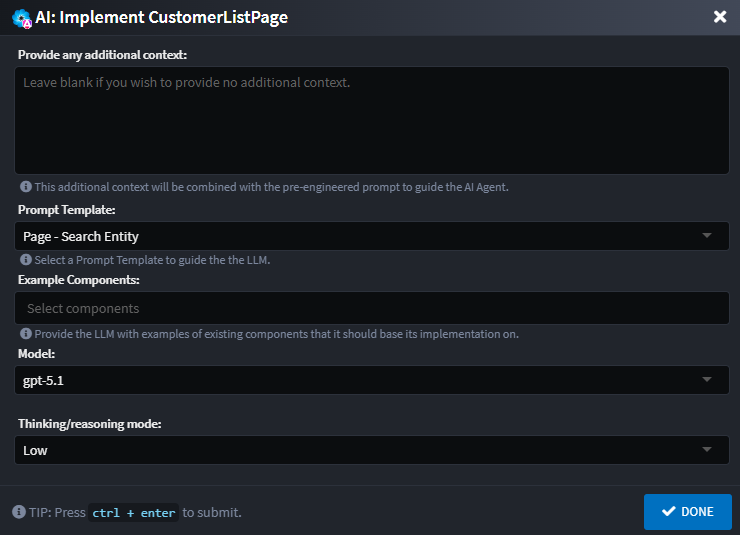

> [!NOTE]
> AI is non-deterministic. While we strive for predictability, results will vary. Test and adjust as needed.

---

### Implementing Your Layout with AI

1. Run and apply the **Software Factory**.
2. Right-click the `Layout` → **Implement with AI**.
3. *(Optional)* Adjust settings in the AI Prompt dialog.
4. Click **Done** - Intent Architect will generate and submit a prompt to the LLM.
5. Review the AI's proposed changes as a code diff.
6. Click **Apply** to accept the changes.

For a `Layout`, the AI will generate a menu structure based on navigation items. You can manually add or adjust menu items (such as ordering) as needed in the layout html file.

---

### Application Styling

By default, the application uses two stylesheets - `styles.scss` and `theme.scss` - which leverage Material themes. You can update or modify these files (and component-specific stylesheets) to suit your branding.

If you use the default implementation, you can adjust the primary and accent color themes in `Application Settings`:

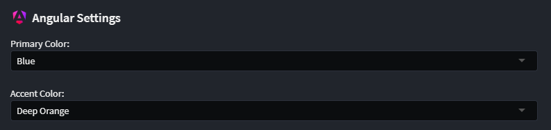

---

### Improving AI Results

You may get good results with the default AI prompt, but you can further improve outcomes with these techniques:

#### Add User Prompt Context

Usually, you don't need to provide extra context, but if the LLM repeats mistakes or needs more guidance (e.g., how to refactor code), add instructions in the AI dialog. Examples:

- "Ensure buttons/actions exist for the new navigations I added."
- "Refresh the grid if the add customer dialog closes successfully."
- "Ensure you have controls for adding and removing addresses."

#### Use a Template

Select a template to guide the AI. Templates provide:

- Additional rules and guidance
- Sample implementations

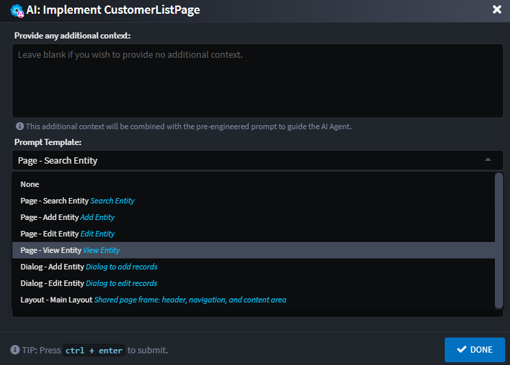

Several pre-configured Material templates exist for different Pages and Dialogs. Templates are auto-selected based on your `Component` naming convention (this can be adjusted).

| Template                | Keywords                             |
|-------------------------|--------------------------------------|
| Page - Search Entity    | search, find, list, lookup           |
| Page - Add Entity       | add, create, new, insert, register   |
| Page - Edit Entity      | edit, update, modify, change         |
| Page - View Entity      | view, details, detail, show          |
| Dialog - Add Entity     | dialog, add, create, new, insert     |
| Dialog - Edit Entity    | dialog, edit, update, modify, change |

> [!NOTE]
> [Templates can be customized, extended, or replaced](#angular-ai-prompt-augment-and-customization-through-templates). You can even adapt them for a different component library.

#### Provide an Example

If you have a similar screen, select it in **Example Components** to submit its code as guidance for the AI.

Sometimes, the LLM may generate different layouts for **Add Entity** and **Edit Entity** pages. Using an *Example Component* and extra context (e.g., "*ensure the layout of the edit page is the same as the add page*") helps align layouts.

---

## Keep Your ViewModel Managed

This approach combines deterministic and non-deterministic code generation:

- Everything you model is generated deterministically by the **Software Factory** in the **ViewModel** (e.g., `customer-add.component.ts`).
- The AI/LLM generates code in the **View** (e.g., `customer-add.component.html` and `customer-add.component.scss`) and may also update the **ViewModel**.

Considerations:

- The **ViewModel** uses *Merge* mode by default, allowing both systems to operate together.
- If the AI changes deterministic code in the **ViewModel**, the Software Factory may not merge changes automatically and could undo or duplicate code blocks.
- Ideally, refactor code and/or add explicit [**Code Management**](xref:application-development.code-management.about-code-management) instructions so Intent Architect can merge code automatically.
- If merging is not possible, use the `@IntentIgnore()` decorator.

---

## Known Issues and Limitations

We are actively working to address the following issues:

- **Multiple AI agent execution**: `Implement with AI` runs per page/component. If you make a change affecting multiple pages (e.g., adding an "Add Entity" page along with a navigation to a "Search" page), you must run `Implement with AI` on each page for full functionality.
- **Import removal**: If page A references page B, an `import` is added to page A. If page B is deleted or the reference is removed, the `import` is not automatically removed, which may cause build errors. Manually remove any unused `import` statements.
- **Traditional Services Support**: Only CQRS Services are officially supported. Traditional Services may partially work but are not fully tested. Full support is in progress.
- **Limited Weaving Capabilities** (vs. C#): TypeScript weaving is less mature than C#. Some *IntentMerge* scenarios may not work as expected; use *IntentIgnore* as needed.

---

## Angular AI Prompt Augment and Customization Through Templates

The Angular AI prompting can be further extended through **AI Prompt Templates**. Out of the box these come pre-configured for Material, but the system is simple and extensible. Embrace it, extend it, or completely re-configure it - the choice is yours.

Look in the following folder within your Intent Architect Solution:

```cmd
.\intent\AI.Prompt.Templates\{application name}\Intent.Modules.AI.Angular.Generate
```

You will find:  

- `prompt.md` (generic prompt rules, limitations and instructions)
- `prompt-config.json` (prompt configuration)
- Folders containing sample code files for the various templates  
- Template specific markdown (template specific rules, limitations or instructions

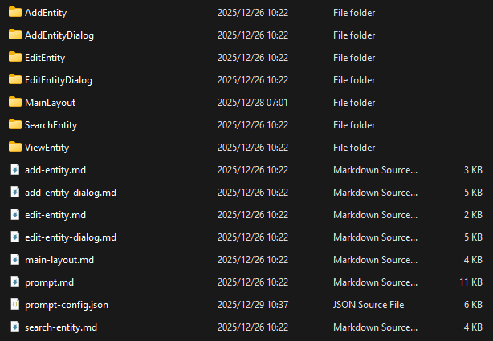

---

### Prompt Overview

The main prompt (`prompt.md`) is a readable markdown file, which can be adjusted to suite your specific rules and requirements.

This file contains the generic rules, limitations and instructions for the prompt, including:

- Component Libraries (including versions)
- Styling guides and rules (using Material)
- Rules for when and how to modify existing code
- Rules for navigation between components

#### Template Specific Prompt

Each template also has its own markdown file (e.g. `add-entity.md`) which contain any additional template specific rules to be passed to the LLM.

### JSON Schema Overview

The `prompt-config.json` file defines templates which define **reusable AI prompt blueprints** for common scenarios (e.g., Search Page, Add Dialog). They include:  

- **id** → Unique identifier  
- **name** → Human-friendly label  
- **description** → What the template does  
- **applicability** → Keywords that help Intent Architect pick the most appropriate template  
- **template-folder** → The folder containing sample files  

#### Example Template: *Search Entity Page*

```json
{
  "id": "SearchEntity",
  "name": "Page - Search Entity",
  "description": "Search Entity",
  "applicability": {
    "key-words": [
      { "word": "search", "weight": 3 },
      { "word": "list", "weight": 3 }
    ]
  },
  "template-folder": "SearchEntity"
}
```

---

### Example Template Types

The schema already defines several templates:

- **Page Templates**  
  - `SearchEntity` → Generates search/listing pages  
  - `AddEntity` → Generates entity creation pages  
  - `EditEntity` → Generates entity update pages  
  - `ViewEntity` → Generates read-only entity views  

- **Dialog Templates**  
  - `AddEntityDialog` → Generates dialogs for adding entities  
  - `EditEntityDialog` → Generates dialogs for editing entities  

Each template includes its **own rules** to ensure compliance with Material and project conventions.

---

### Extending Configuration

To extend the configuration:  

1. **Add new rules** in `prompt.md` (global) or under a specific `template` markdown.  
2. **Create a new template** in `prompt-config.json` by adding an object under `templates`.  
   - Define keywords under `applicability`.  
   - Specify a `template-folder` with an example implementation.  

#### Example A: Bulk Import Entities

```json
{
  "id": "BulkImportEntities",
  "name": "Page - Bulk Import Entities",
  "description": "Upload a CSV/Excel file, preview parsed rows, validate, and commit in bulk.",
  "applicability": {
    "key-words": [
      { "word": "import", "weight": 3 },
      { "word": "upload", "weight": 3 },
      { "word": "bulk", "weight": 3 },
      { "word": "csv", "weight": 2 },
      { "word": "excel", "weight": 2 },
      { "word": "batch", "weight": 2 }
    ]
  },
  "template-folder": "BulkImportEntities",
  "metadata": {},
  "rules": [
    
  ]
}
```

Rules in the template specific markdown file:
> Provide a file input and a server-side parse action; reuse existing parse/validate/commit methods if available.  
> Render a preview table with paging and basic filtering using mat-table or mat-grid-list.  
> Use official enum values for component parameters (no raw strings).  
> Show success/error toasts/dialogs using existing notification services if present.  

##### Example B: Upsert Template

```json
{
  "id": "AddOrUpdateEntity",
  "name": "Page - AddOrUpdate Entity",
  "description": "Create a new entity or update an existing one, using a single page flow (upsert).",
  "applicability": {
    "key-words": [
      { "word": "add", "weight": 3 },
      { "word": "create", "weight": 3 },
      { "word": "new", "weight": 2 },
      { "word": "insert", "weight": 2 },
      { "word": "register", "weight": 2 },
      { "word": "update", "weight": 3 },
      { "word": "edit", "weight": 3 },
      { "word": "modify", "weight": 2 },
      { "word": "change", "weight": 2 },
      { "word": "upsert", "weight": 3 },
      { "word": "save", "weight": 2 }
    ]
  },
  "template-folder": "AddOrUpdateEntity"
}
```

Rules in the template specific markdown file:
> Reuse existing backing methods if present (e.g., save, updateEntity, loadEntityById). Do not invent new ones if appropriate methods already exist.  
> If an Id or key is present in the model or route, treat the page as Update; otherwise treat as Add.  
> Always use official enum values for component parameters (no raw strings).  

---

✅ With this setup, you can tailor AI prompt behavior, enforce conventions, and even use a different Angular component library.
