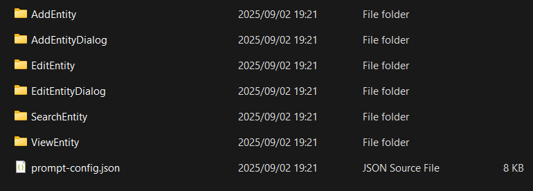

# Blazor UI Modeling with AI

This article will show you how you can use Intent Architect to rapidly build professional-looking UIs, using a combination of both deterministic (pattern reuse) and non-deterministic (LLMs driven by Intent Architect) code generation techniques.

How this works at a high level is as follows:

- Design and generate your **View Model**s. This includes aspects like which Services to interact with and where UI navigations are going.  
  

- Use our "Implement with AI" accelerator to get the LLM of your choice to build the **View** in a "prompt-less" fashion. Intent Architect handles the context engineering and manages the LLM interactions on your behalf. The results can be reviewed as a code diff of what the LLM proposes, similar to a regular **Software Factory** execution.  
  

- Review and validate the code. As always when dealing with LLMs, you will want to review and validate the code. By their nature LLMs are non-deterministic, but with a little bit of luck you should end up with a screen similar to this:  
  

> [!NOTE]  
> While the samples here use MudBlazor, there is nothing inherently MudBlazor-specific about the implementation, and you can adjust the configuration for other component libraries.

---

## Design and Generate Your View Model

To start, create a Blazor Application in Intent Architect.

> [!NOTE]  
> Intent Architect has two Architecture Templates for quickly setting up a Blazor application:  
> - **Blazor Server** (Fullstack ASP.NET core Server)  
> - **Blazor Web Application (Standalone)** (Standalone UI which composes one or more Service Applications)

### How to Model Pages

1. Add a `Page` to a diagram in the **UI Designer**.  
2. Name the `Page`, typically describing its function (e.g., `CustomerSearch` or `CustomerAdd`).  
3. *Optional*: Adjust the route in the property pane.  


To quickly add your page to the `Sider Menu`, use the **Add to Sider Menu** suggestion.  


### Adding Route parameters to your page

If your page requires **Route Parameters** (e.g., `customers/edit/{customerId}`), you can model these as follows:

1. Right-click on the `Page` → **Add Property**.  
2. Name the property (e.g., `CustomerId`) and set its type (e.g., `Guid`).  
3. Apply the `Route Parameter` stereotype to the property using **F3**.  


The page route will automatically update based on the route parameters.

---

### How to Model a Dialog

1. Add a `Page` to a diagram in the **UI Designer**.  
2. Name the `Page`, suffixed with the word **Dialog** (e.g., `CustomerAddDialog`).  


If your dialog requires parameterization, you can model that as follows:

1. Right-click on the **Dialog** → **Add Property**.  
2. Name the property (e.g., `CustomerId`) and set its type (e.g., `Guid`).  
3. Apply the `Route Parameter` stereotype using **F3**.  


---

### How to Model UI Navigations

1. Right-click on the `Component` (Page, Dialog, Component) → **Add Operation**.  
2. Name your operation (e.g., `AddNewCustomer`).  
3. Right-click on the operation → **Navigate to Page** or **Show Dialog**.  
4. Connect the navigation to the destination by left-clicking the destination.  


If your `Component` has `Route Parameters`, a mapping dialog will open for you to bind those parameters. Typically you would simply add these parameters to your navigation `Operation`.  


---

### Modeling Service Interactions

UI `Component`s interact with services to retrieve data and to affect change on the system. This is how we model this behaviour.

1. On the `Component`'s suggestions, click the `Call Backend Service` suggestion.  
2. On the **Add to Diagram** dialog select the service endpoint you want to call.  

> [!NOTE]  
> If you are not seeing the Services you want to call, [add a package reference to the `Service Package` which contains those Services in the UI Designer](#connecting-your-ui-components-to-services-in-other-applications).


Depending on the nature of the service being invoked, the default setup is slightly different:

- For `Query`s: the result is added to the `Component` as a property, and request parameters are modeled as `Operation` parameters.  
- For `Command`s: a corresponding `Model Definition` is created, based on the command, and added to the `Component`. This model is mapped to the command for invocation. Typically for `Command`s you want a separate model which may have additional view concerns.

---

### Connecting Your UI Components to Services in Other Applications

When modeling service invocations, you may want to connect to Services defined in applications beyond your UI application.

To use these services in your UI application:

1. In the `User Interface Designer`, under the `User Interface Package`, right-click `References` → **Add a Package Reference**.  
2. In the `Package Reference Manager` dialog, select the package containing the Services (e.g., `OtherApplication.Services`).  


You can now use these external services in the diagrams of the UI application.

> [!NOTE]  
> You will also need the appropriate integration module installed to make the remote communication work (e.g., `Intent.Blazor.HttpClients` for a WASM UI talking to an external REST Web API, or `Intent.Integration.HttpClients` for a server-side Blazor application talking to an external REST Web API).

---

## Implement Your View with AI

> [!TIP]  
> You will need to install the `Intent.AI.Blazor` module and connect Intent Architect to an LLM API of your choice. Ensure that the required [User Settings](https://docs.intentarchitect.com/articles/modules-common/intent-common-ai/intent-common-ai.html#user-settings) have been completed — including a valid API key for your selected AI provider. The time and accuracy of the AI prompt results will vary depending on your provider and model. Try a few and find the combination which works best for your preferred workflow.

Once you are satisfied with your **View Model** design, you can use the Blazor AI accelerator to have AI generate the remaining implementation details.

> [!NOTE]  
> Don't forget to apply your **Software Factory** before running AI prompts, as the generated code is input/context for the AI.

### Generate Your View with AI

1. Make sure you have run and applied the **Software Factory**.  
2. Right-click on the `Component` → **Implement with AI**.  
3. *(Optional)* Adjust the settings in the AI Prompt dialog.  
4. Click **Done** — IA will generate and submit a prompt to the LLM (this may take a little while).  
5. Review the AI's proposed changes as a code diff.  
6. Click **Apply** to accept the changes.  


> [!NOTE]  
> AI by its nature is non-deterministic. While we put a lot of effort into making this interaction as predictable as possible, results will vary. Test the results and make changes as desired.

---

### Common Compilation Issues (with MudBlazor)

The AI does not always get it right, even when guided explicitly. Here are a few common compilation issues you may run into.

#### Non-nullable Model Fields

Certain MudBlazor components expect nullable bindings. For example, `MudDatePicker` requires a `DateTime?`. If it gets bound to a `DateTime` on your model you will get the error:  

```
Argument 2: cannot convert from 'Microsoft.AspNetCore.Components.EventCallback<System.DateTime>' to 'Microsoft.AspNetCore.Components.EventCallback'
```

To resolve this issue, make the corresponding properties on the model nullable, ideally in Intent Architect, and run the **Software Factory**.  

If the field is required on the service contract, it still will be. We are only changing the model, and the AI should have configured the component as required based on the contract, so the value will be populated when form validation passes.  


#### The Missing `T=""`

Sometimes the AI generates code like this, which does not compile:

```csharp
@if (context.IsActive)
{
    <MudChip Color="Color.Success" Variant="Variant.Filled" Size="Size.Small">Active</MudChip>
}
else
{
    <MudChip Color="Color.Error" Variant="Variant.Filled" Size="Size.Small">Inactive</MudChip>
}
```

Error:  
```
The type of component 'MudChip' cannot be inferred based on the values provided. Consider specifying the type arguments directly using the following attributes: 'T'.
```

**Fix:** Simply add `T="string"` into the `MudChip` components.


---

### Improving the Results of AI

Hopefully you are getting good consistent results "out of the box" with the AI Prompt, but there are several things you can do to tweak/improve the results even further.

#### Additional User Prompt Context

You typically don't have to provide additional context to the LLM, but if you find it frequently making the same mistakes or you need to give it more guidance (e.g., how to refactor code it previously generated), you can provide extra instructions in the AI dialog. Examples:

- "Ensure buttons/actions exist for the new navigations I added."  
- "Refresh the grid if the add customer dialog closes successfully."  
- "Ensure you have controls for adding and removing addresses."  

#### Using a Template

You can select a template to further guide the AI. These templates contain:  

- Additional rules and guidance for the AI  
- Sample implementations  


There are several pre-configured MudBlazor templates for various types of Pages and Dialogs. These templates are also designed to automatically select the correct template based on your `Component` naming convention (this can be adjusted as required).

| Template                | Keywords                             |
|-------------------------|--------------------------------------|
| Page - Search Entity    | search, find, list, lookup           |
| Page - Add Entity       | add, create, new, insert, register   |
| Page - Edit Entity      | edit, update, modify, change         |
| Page - View Entity      | view, details, detail, show          |
| Dialog - Add Entity     | dialog, add, create, new, insert     |
| Dialog - Edit Entity    | dialog, edit, update, modify, change |

> [!NOTE]  
> [These templates can easily be customized, extended or replaced](#blazor-ai-prompt-augment-and-customization-through-templates). They could even be changed to work for a completely different component library.

#### Giving It an Example

If you already have an example of a similar screen to the one you are trying to create, you can simply select it in the **Example Components**. This will submit code associated with that `Component` to guide the AI.

#### Blazor Component Comments

Whatever comments you put on your Blazor `Component` will also be included in the prompt. This can be used for persistent, instance-based prompting context. For example:  

- "The page does the following and has X, Y, Z features."  
- "Ensure the customer grid refreshes when a dialog closes."  


---

## Try to Keep Your ViewModel Managed

In this approach you have used both deterministic and non-deterministic code generation.  

- Everything you modeled will be generated deterministically through the **Software Factory** in the **ViewModel** (e.g., `MyComponent.razor.cs`).  
- The AI/LLM will generate the code in the **View** (e.g., `MyComponent.razor`), and may augment or change some code in the **ViewModel**.  

Implications/considerations:  

- The **ViewModel** runs in *Merge* mode by default. This means both systems can operate there smoothly.  
- If the AI changes deterministic code in the **ViewModel**, the Software Factory may not be able to automatically merge the changes and may attempt to undo or duplicate code blocks.  
- Ideally, you can refactor the code and/or add explicit [**Code Management**](xref:application-development.code-management.about-code-management) instructions to the point where Intent Architect can merge code automatically.  
- If not possible, you may need to add an `IntentIgnore`.  


---

## Blazor AI Prompt Augment and Customization Through Templates

The Blazor AI prompting can be further extended through **AI Prompt Templates**. Out of the box these come pre-configured for MudBlazor, but the system is simple and extensible. Embrace it, extend it, or completely re-configure it — the choice is yours.

Look in the following folder within your Intent Architect Solution:

```cmd
.\Intent\AI.Prompt.Templates\{application name}\Intent.Blazor.AI
```

You will find:  

- `prompt-config.json` (prompt configuration)  
- Folders containing sample code files for the various templates  



---

### JSON Schema Overview

#### 1. `metadata`

The `metadata` block provides **contextual information** that is injected into the AI prompt. This ensures generated code aligns with your project’s dependencies and conventions.

```json
"metadata": {
  "component-library": {
    "name": "MudBlazor",
    "version": "8.10.0"
  }
}
```

#### 2. `rules`

The `rules` array defines **best practices, constraints, and coding standards** that the AI must follow.

```json
"rules": [
  "Don't add `@using MudBlazor` into .razor files.",
  "Favour reusing existing backing methods to fetching data.",
  "In Razor pages use foreach statements rather than for statements."
]
```

#### 3. `templates`

Templates define **reusable AI prompt blueprints** for common scenarios (e.g., Search Page, Add Dialog). They include:  

- **id** → Unique identifier  
- **name** → Human-friendly label  
- **description** → What the template does  
- **applicability** → Keywords that help Intent Architect pick the most appropriate template  
- **template-folder** → The folder containing sample files  
- **metadata** → Template-specific context  
- **rules** → Additional template-specific rules  

##### Example Template: *Search Entity Page*

```json
{
  "id": "SearchEntity",
  "name": "Page - Search Entity",
  "description": "Search Entity",
  "applicability": {
    "key-words": [
      { "word": "search", "weight": 3 },
      { "word": "list", "weight": 3 }
    ]
  },
  "template-folder": "SearchEntity",
  "rules": [
    "if you implement LoadServerData it must have 2 parameters (TableState state, CancellationToken cancellationToken)",
    "Always add placeholders to search criteria input controls"
  ]
}
```

---

### Example Template Types

The schema already defines several templates:

- **Page Templates**  
  - `SearchEntity` → Generates search/listing pages  
  - `AddEntity` → Generates entity creation pages  
  - `EditEntity` → Generates entity update pages  
  - `ViewEntity` → Generates read-only entity views  

- **Dialog Templates**  
  - `AddEntityDialog` → Generates dialogs for adding entities  
  - `EditEntityDialog` → Generates dialogs for editing entities  

Each template includes its **own rules** to ensure compliance with MudBlazor and project conventions.


---

### Extending Configuration

To extend the configuration:  

1. **Add new rules** under `rules` (global) or under a specific `template`.  
2. **Create a new template** by adding an object under `templates`.  
   - Define keywords under `applicability`.  
   - Add `rules` to enforce conventions.  
   - Specify a `template-folder` with an example implementation.  

##### Example A: Bulk Import Entities

```json
{
  "id": "BulkImportEntities",
  "name": "Page - Bulk Import Entities",
  "description": "Upload a CSV/Excel file, preview parsed rows, validate, and commit in bulk.",
  "applicability": {
    "key-words": [
      { "word": "import", "weight": 3 },
      { "word": "upload", "weight": 3 },
      { "word": "bulk", "weight": 3 },
      { "word": "csv", "weight": 2 },
      { "word": "excel", "weight": 2 },
      { "word": "batch", "weight": 2 }
    ]
  },
  "template-folder": "BulkImportEntities",
  "metadata": {},
  "rules": [
    "Provide a file input and a server-side parse action; reuse existing parse/validate/commit methods if available.",
    "Render a preview table with paging and basic filtering using MudTable or MudDataGrid.",
    "Use official enum values for component parameters (no raw strings).",
    "Surface row-level validation messages using Func<T, IEnumerable<string>> validators.",
    "Disable 'Commit' until there are no blocking validation errors.",
    "Show success/error toasts/dialogs using existing notification services if present."
  ]
}
```

##### Example B: Upsert Template

```json
{
  "id": "AddOrUpdateEntity",
  "name": "Page - AddOrUpdate Entity",
  "description": "Create a new entity or update an existing one, using a single page flow (upsert).",
  "applicability": {
    "key-words": [
      { "word": "add", "weight": 3 },
      { "word": "create", "weight": 3 },
      { "word": "new", "weight": 2 },
      { "word": "insert", "weight": 2 },
      { "word": "register", "weight": 2 },
      { "word": "update", "weight": 3 },
      { "word": "edit", "weight": 3 },
      { "word": "modify", "weight": 2 },
      { "word": "change", "weight": 2 },
      { "word": "upsert", "weight": 3 },
      { "word": "save", "weight": 2 }
    ]
  },
  "template-folder": "AddOrUpdateEntity",
  "metadata": {},
  "rules": [
    "Reuse existing backing methods if present (e.g., SaveEntityAsync, UpdateEntityAsync, LoadEntityAsync). Do not invent new ones if appropriate methods already exist.",
    "If an Id or key is present in the model or route, treat the page as Update; otherwise treat as Add.",
    "Use MudForm and consistent variants/density/margins across all inputs.",
    "For MudBlazor generics (MudSelect, MudRadioGroup, MudChipSet, MudSwitch), always declare T explicitly.",
    "When binding to inputs that accept nullable values (e.g., MudSelect, MudDatePicker), update the backing model property to be nullable.",
    "Validation delegates must match Func<T, IEnumerable<string>>.",
    "Always use official enum values for component parameters (no raw strings)."
  ]
}
```

---

✅ With this setup, you can tailor AI prompt behavior, enforce conventions, and event using a different blazor component library
