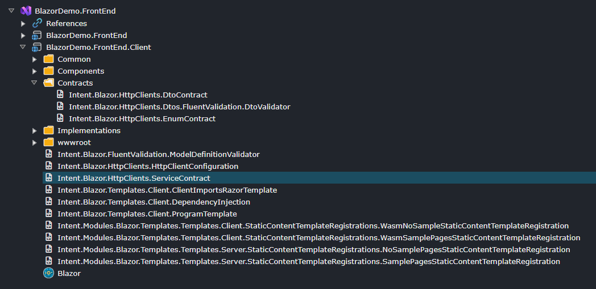
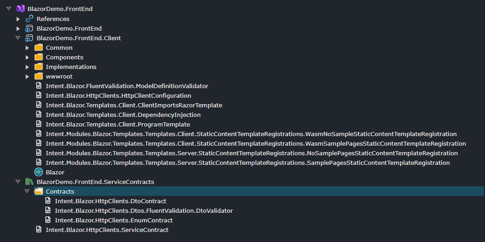

# Visual Studio Designer

## What is the Visual Studio Designer

The **Visual Studio Designer** is used to model your Visual Studio Solution and specify how Intent Architect integrates generated source code files into that solution. In this designer, you are modeling the following:

- The name of your Visual Studio Solution.
- The various C# projects that make up your solution.
- C# project configurations.
- The locations where the various code files will reside in the solution.
- The "Roles" each C# project plays in the solution.

Below is an example of a Visual Studio Designer configured for a typical Clean Architecture Visual Studio Solution. In this designer, we can see the following:

- The Visual Studio Solution will be named **VisualStudioDesigner.Example**.
- The solution will have four C# projects:
  - **VisualStudioDesigner.Example.Api** – Responsible for application hosting and service distribution.
  - **VisualStudioDesigner.Example.Application** – Responsible for application-specific business rules and use cases.
  - **VisualStudioDesigner.Example.Domain** – Responsible for business rules and domain logic.
  - **VisualStudioDesigner.Example.Infrastructure** – Responsible for infrastructure, persistence, and integration.

We can also see `Template Output`s, such as `Intent.Entities.Entity`, which indicate where the generated code files will be placed. In this case, domain `Entity` code files will be generated into the **VisualStudioDesigner.Example.Domain** C# project, inside the `Entities` folder. When you install new modules, they will automatically add their `Template Output`s to this designer. Modules use `Role`s to determine where to place their `Template Output`s.

> [!TIP]
> `Application Template`s typically fully configure the **Visual Studio Designer** for you. However, you can reconfigure or adjust this designer if you want to customize the structure of your application's code generation.

## What are Roles and how do they work?

`Role`s in projects are arbitrary tags used to guide `Module`s on where to install the code they generate. Modules contain templates that generate code files, and these files target `Role`s to determine their placement.

For example, if you have a domain-oriented module, it will generate code that should be installed into the C# project responsible for domain concepts. This project is identified by having a "Domain" `Role`.

When a module is installed, it looks for `Role`s to determine where its generated code files should go in the **Visual Studio Designer**. These `Role`s serve as guidance for the module to determine where to insert its `Template Output`s, the actual artifacts that define "where code files go".

> [!NOTE]
> `Role`s assist modules in determining where they should place their `Template Output`s within the designer. That is their sole function. Ultimately, the `Template Output` determines where the code is placed, and these can be adjusted post-installation if needed.

## Adding a New Project

1. Right-click on the `Visual Studio Solution` element or a `Folder` under it and select `C# Project (.NET)`.
2. Enter the name of your C# project.
3. *(Optional)* Configure any project options in the Property Pane, such as `Target Framework`.
4. *(Optional)* Customize your project by configuring `Role`s, `Folder`s, `Template Output`s, etc.

## Changing Where Code Files Are Generated

If you want to change where Intent Architect generates code, you can do so by making changes in this designer. Here are some examples of how this can be achieved.

### Moving a File to a Different Location

Given the following setup:

Modeled domain entities are generated into the `Entities` folder. These entities may be things like `Customer` or `Order`, depending on what `Entity`s you have modeled in the **Domain Designer**.

If you drag the **Intent.Entities.Entity** `Template Output` to the root folder of the C# project, the entities will now be generated directly into the project's root folder.

Alternatively, you could create a new folder, say `My Folder`, and move `Intent.Entities.Entity` into that folder. Now, the entities will be generated into a folder named `My Folder`.

### Restructuring Projects

You can reorganize your Visual Studio solution structure by consolidating projects, splitting them apart, or creating entirely new projects. This section demonstrates common restructuring scenarios.

#### Consolidating Projects

In this example, let's assume you do not want four projects and prefer to consolidate the `Application` and `Domain` projects.

To consolidate the `Domain` project into the `Application` project:

1. Move all `Template Output`s from the `Domain` project into the `Application` project, placing them where you want the code to go.
2. Delete the `Domain` project.

  
_Visual Studio solution with Domain project consolidated into Application project._

Now, your Visual Studio solution will have three projects instead of four.

#### Adding Projects

In this example, we have a Standalone Blazor application, and we don't want HTTP Client information in our Client application but would prefer to split it out into its own project.

The existing structure of the solution. In this example, we want to move the `Intent.Blazor.HttpClients.ServiceContract` template to a separate project.

  
_Original Blazor project structure with the ServiceContract template in the main Client project._

To split out templates into a separate project:

1. Create a new project, as per the steps described in the [Add a New Project](#adding-a-new-project) section.
2. Move the `Intent.Blazor.HttpClients.ServiceContract` template from the existing project to the new project, placing it where you want the code to go.

> [!WARNING]
> Templates that `Intent.Blazor.HttpClients.ServiceContract` depends on also need to be moved to avoid circular dependencies. The Software Factory will throw errors if projects have circular references.

3. Move dependent templates to the new project. In this example, the entire `Contracts` folder also needs to be moved to the new project to prevent the Client project from depending on the New project while the New project depends on the Client project.

  
_Refactored structure with HttpClients in a separate project._
