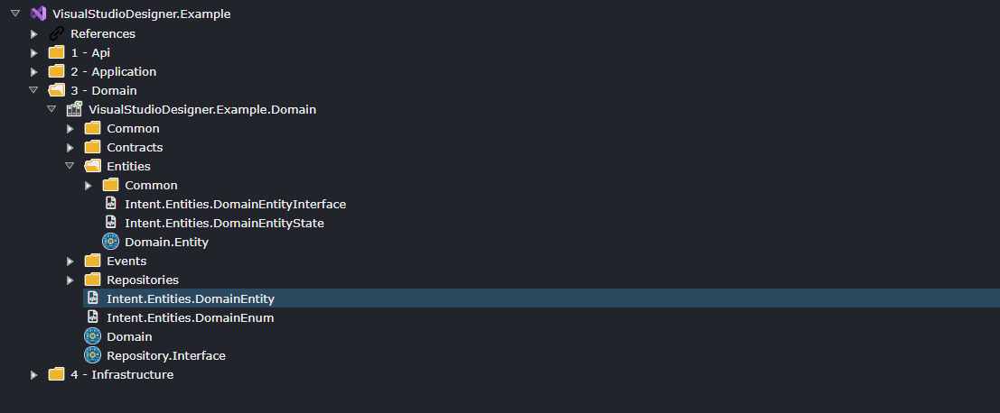

# Visual Studio Designer

## What is the Visual Studio Designer

The **Visual Studio Designer** is for modeling out your Visual Studio Solution and specifying how Intent Architect "integrates" generated source code files into that solution. In this designer you are modelling the following:

- The name of your Visual Studio Solution.
- The various C# Projects making up your Solution.
- C# Project configuration.
- Configure where the various code files will reside in the solution.
- What "Roles" each of the C# Project play in the solution.

Below is an example of a Visual Studio Designer configured for a typical Clean Architecture Visual Studio Solution.
In this designer we can see the following:

- The Visual Studio Solution will be named "VisualStudioDesigner.Example".
- The solution will have 4 C# projects, namely:
  - **VisualStudioDesigner.Example.Api**, responsible for application hosting and service distribution.
  - **VisualStudioDesigner.Example.Application**, responsible for application-specific business rules and use cases.
  - **VisualStudioDesigner.Example.Domain**, responsible for business rules and domain logic.
  - **VisualStudioDesigner.Example.Infrastructure**, responsible for infrastructure, persistence and integration.

We can also see `Template Output`s for example `Intent.Entities.Entity`, these are showing you where the generated code files will be placed. In this case we are shown that the domain `Entity`s code files will be generated into the **VisualStudioDesigner.Example.Domain** C# project, in the `Entities` folder. When you install new Modules they will automatically add their `Template Output`s to this designer. Modules use `Role`s to determine where to place their `Template Output`s.

> [!TIP]
> `Application Template`s typically fully configure the **Visual Studio Designer** for you, but can re-configure or adjust this designer if you want to customize the structure of your applications code generation.

## What are Roles and how do they work ?

`Role`s in projects are arbitrary tags which can be used to provide guidance for `Module`s as to where they should install the code they generate. Modules contain templates which generate code files, these code files target `Role`s to determine where their output should go.

For example,  if you have a "Domain" orientated module, it will generate code which should be installed into the c# Project which is responsible for "Domain" concepts, this project would be identified by the fact that is has a "Domain" `Role`.

When a module is installed it will look for `Role`s to determine where in the **Visual Studio Designer** it's generated code file should go. These `Role`s serve as guidance for the Module to determine where to inserts it's `Template Output`s which are the actual artifacts of "This is where, this code will go."

> [!NOTE]
> `Roles`s assist Modules with determining where they should put their `Template Output`s into the designer, that is all they do. Ultimately the `Template Output` determines where the code goes and these can me adjusted post installation if required.

## Adding a new Project

1. On the `Visual Studio Solution` element or a `Folder` under it, right-click and select `C# Project (.NET)`
2. Capture the name of you C# Project.
3. *(Optional)* Configure any project options you would like in the Property Pane for example `Target Framework`
4. *(Optional)* Customize your project by configuring `Role`s, `Folder`s, `Template Output`s etc.

## Changing where code files are generated to

If you want to change where Intent Architect is generating code, this can be achieved by making changes to this designer.
Here are some example of how this can be achieved.

### Moving where a file get generated

Given the following setup:

Modeled domain entities are being generated into the `Entities` folder. These entities may be things like `Customer` or `Order` depending on what `Entity`s you have modeled in the **Domain Designer**.

If you dragged the **Intent.Entities.Entity** `Template Output` to the C# Projects root folder, this entities would now be generated directly into the C# projects folder.

Alternatively, you could create a new `Folder` say `My Folder` and move `Intent.Entities.Entity` into that folder. Now the entities will be generated into a folder named `My Folder`.

### Changing the Project structure

In this example lets assume you did not want to have 4 projects, and you wanted to consolidate the `Application` and `Domain` projects.

lets consolidate the `Domain` project into the `Application` project.

1. Simply move all the `Template Output`s from the `Domain` project into the `Application` project, where ever you would like that code to go.
2. Delete the `Domain` Project.

Now you Visual Studio solution will have 3 project rather than the original 4.
