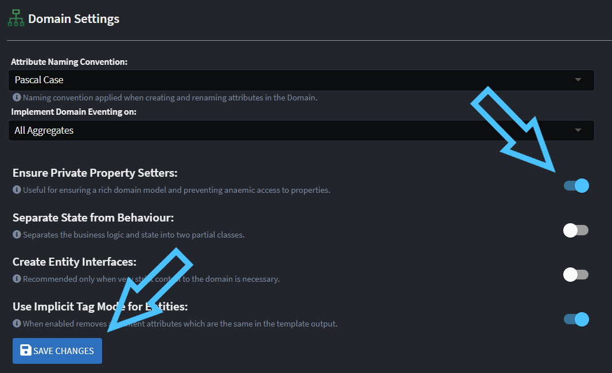

# Practicing DDD (Domain Driven Design) with Intent Architect

Intent Architect and our standard modules have extensive support for modelling DDD (Domain Driven Design) systems for both [anemic](https://www.martinfowler.com/bliki/AnemicDomainModel.html) and rich domain approaches.

A great introduction and explanation of these concepts is covered in our [A Deep Dive into Domain Modeling Webinar](https://intentarchitect.com/#/insights-deep-dive-domain-modeling).

## Rich Domain Support in Intent Architect

Our designers have full support for Rich Domain modelling, in particular:

- You can model _Operations_ (behaviors) on _Domain Classes_.
- In the Services designer _Commands_, _Queries_ and _Service Operations_ can be mapped directly to _Class Operations_.

## Rich Domain Modelling Example

In this example we will enable "Private Setters" for our domain entities in our Application, model a _Class_ with a _Constructor_ and  _Operation_ in the Domain Designer and then in the Services Designer model CRUD Commands and Queries for interacting with our domain entity.

This example assumes you are using an already created Application or you've created a new Application with the "Clean Architecture .NET" application template:


### Enabling "private setters"

In order to make it impossible to anemically update domain entities, you can enable the private setters option which makes all domain entities have `private` setters as opposed to the default of them being `public`.

Go to the Settings of the Application:


Under the _Domain Settings_ section, enable _Ensure Private Property Setters_ and press the _Save Changes_ button.



### Create a domain entity

In the Domain designer, create a `Customer` entity and add a `Name` attribute onto it:


Right-click the `Customer` and select the _Add Constructor_ option:


Right-click the _Constructor_ and select the _Map Constructor..._ option:


Select the `Name` Attribute and then press the _DONE_ button:


With the constructor created and mapped, you can run the Software Factory and observe the following happening in the `Customer.cs` file:


A `public` constructor has been created and because we mapped the `Name`, it has automatically created a parameter which sets the property.

Also note that a `protected` constructor has been created so that Entity Framework is still able to re-hydrate entities it reads from your database.

Similarly to creating the constructor, we will use the _Add Operation_ context menu option:


We'll name it `Update` and then use the _Map Operation..._ context menu option:


Again, just select the `Name` attribute and press _DONE_:


When running the Software Factory, observe that it adds a method to the `Customer`:


### Create CQRS CRUD Operations

In the Services designer, right-click the _Services Package_ and select the _Create CQRS Operations_ option:


Observe that the `CreateCustomerCommand` is mapping to the constructor while the `UpdateCustomerCommand` is mapped to the `Update` operation:


To see the details of a mapping, we can right-click it and choose the appropriate menu option, for example for an _[update]_ we can select the _Map Entity Update_ option:


Observe how the Command is mapped to the `Update` _Operation_ while the `Name` field is mapped to its parameter:


And when the Software Factory is run you will see that the generated implementation is passing the field's value to the method:


### Conclusion

We have now created Rich Domain behaviors on our Domain entity and mapped our services to interact with them.

## Advanced Example: Modeling Aggregates and Composite Entities

In certain scenarios, you may need to model an aggregate root (for example, an `Order`) that manages a collection of associated entities (for example, `OrderLine`). This section illustrates how to structure such a domain relationship in Intent Architect using private setters, map these structures through the Services designer, and expose operations to manage the aggregate.

### Designing the Aggregate and Composite Entities

1. **Create the Domain Classes**  
   In the Domain Designer, model a class named `Order` and another named `OrderLine`. Establish a one-to-many relationship so that `Order` contains a collection of `OrderLine` entities.  
   

2. **Use Private Setters and a Dedicated Constructor**  
   To keep the domain model cohesive and prevent anemic updates, introduce a constructor that accepts a list or enumeration of `OrderLineDO` data objects. Within that constructor, create a collection to map these objects into actual `OrderLine` entities:

```csharp
public class Order
{
    private List<OrderLine> _orderLines = [];

    public Order(int refNo, IEnumerable<OrderLineDO> orderLines)
    {
        RefNo = refNo;
        _orderLines = orderLines.Select(s => new OrderLine(s.Description, s.Amount)).ToList();
    }
}
```


1. **Instantiate the Aggregate via a Command**  
   In the Services Designer, configure a `CreateOrderCommand` that links to this constructor. Fields for critical properties, like `RefNo` and the list of `OrderLineDO`, can then be mapped automatically.  
   

### Managing Existing Aggregates

After the `Order` entity is created, you can add or modify `OrderLine` entities:

1. **Define a Domain Operation**  
   For instance, create an `AddOrderLine` operation on the `Order` entity. This method can accept parameters (e.g., `amount`, `description`, `quantity`) and build a new `OrderLine` (this assumes your `OrderLine` has a constructor accepting: `amount`, `description`, `quantity`).

```csharp
public void AddOrderLine(decimal amount, string description, int quantity)
{
    _orderLines.Add(new OrderLine(amount, description, quantity));
}
```


2. **Expose the Operation with a Command**  
   Create an `AddOrderLineOrderCommand` (or similar) in the Services Designer. Map its parameters to the `AddOrderLine` operation.  
   

3. **Command Handler**  
   Intent Architect will generate the handler logic, retrieving `Order` from the repository and invoking `AddOrderLine`:

```csharp
public async Task Handle(AddOrderLineOrderCommand request, CancellationToken cancellationToken)
{
    var order = await _orderRepository.FindByIdAsync(request.Id, cancellationToken);
    if (order is null)
    {
        throw new NotFoundException($"Could not find Order with Id '{request.Id}'");
    }
    order.AddOrderLine(request.Description, request.Amount);
}
```

---

This advanced example extends the concepts introduced earlier by demonstrating how to create aggregates with composite entities and expose domain operations through commands in Intent Architect—helping maintain a cohesive, rich domain model.
