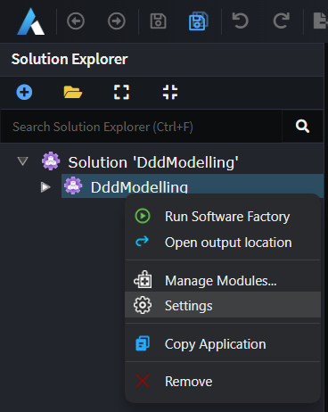
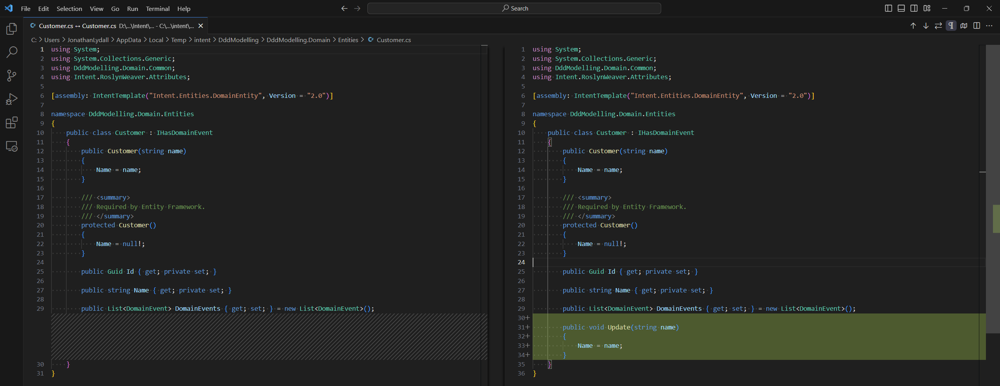
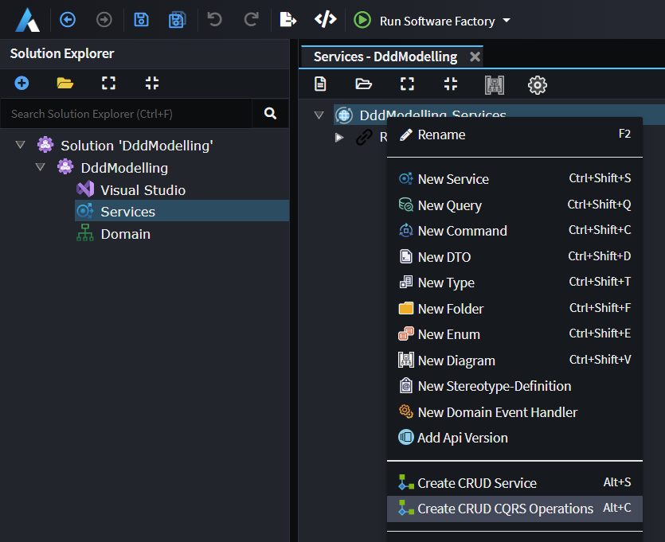

# Practicing DDD (Domain Driven Design) with Intent Architect

Intent Architect and our standard modules have extensive support for modelling DDD (Domain Driven Design) systems for both [anemic](https://www.martinfowler.com/bliki/AnemicDomainModel.html) and rich domain approaches.

A great introduction and explanation of these concepts is covered in our [A Deep Dive into Domain Modeling Webinar](https://intentarchitect.com/#/insights-deep-dive-domain-modeling).

## Rich Domain Support in Intent Architect

Our designers have full support for Rich Domain modelling, in particular:

- You can model _Operations_ (behaviors) on _Domain Classes_.
- In the Services designer _Commands_, _Queries_ and _Service Operations_ can be mapped directly to _Class Operations_.

## Rich Domain Modelling Example

In this example we will enable "Private Setters" for our domain entities in our Application, model a _Class_ with a _Constructor_ and  _Operation_ in the Domain Designer and then in the Services Designer model CRUD Commands and Queries for interacting with our domain entity.

This example assumes you are using an already created Application or you've created a new Application with the "Clean Architecture .NET" application template:

### Enabling "private setters"

In order to make it impossible to anemically update domain entities, you can enable the private setters option which makes all domain entities have `private` setters as opposed to the default of them being `public`.

Go to the Settings of the Application:

Under the _Domain Settings_ section, enable _Ensure Private Property Setters_ and press the _Save Changes_ button.

### Create a domain entity

In the Domain designer, create a `Customer` entity and add a `Name` attribute onto it:

Right-click the `Customer` and select the _Add Constructor_ option:

Right-click the _Constructor_ and select the _Map Constructor..._ option:

Select the `Name` Attribute and then press the _DONE_ button:

With the constructor created and mapped, you can run the Software Factory and observe the following happening in the `Customer.cs` file:

A `public` constructor has been created and because we mapped the `Name`, it has automatically created a parameter which sets the property.

Also note that a `protected` constructor has been created so that Entity Framework is still able to re-hydrate entities it reads from your database.

Similarly to creating the constructor, we will use the _Add Operation_ context menu option:

We'll name it `Update` and then use the _Map Operation..._ context menu option:

Again, just select the `Name` attribute and press _DONE_:

When running the Software Factory, observe that it adds a method to the `Customer`:

### Create CQRS CRUD Operations

In the Services designer, right-click the _Services Package_ and select the _Create CQRS Operations_ option:

Observe that the `CreateCustomerCommand` is mapping to the constructor while the `UpdateCustomerCommand` is mapped to the `Update` operation:

To see the details of a mapping, we can right-click it and choose the appropriate menu option, for example for an _[update]_ we can select the _Map Entity Update_ option:

Observe how the Command is mapped to the `Update` _Operation_ while the `Name` field is mapped to its parameter:

And when the Software Factory is run you will see that the generated implementation is passing the field's value to the method:

### Conclusion

We have now created Rich Domain behaviors on our Domain entity and mapped our services to interact with them.
