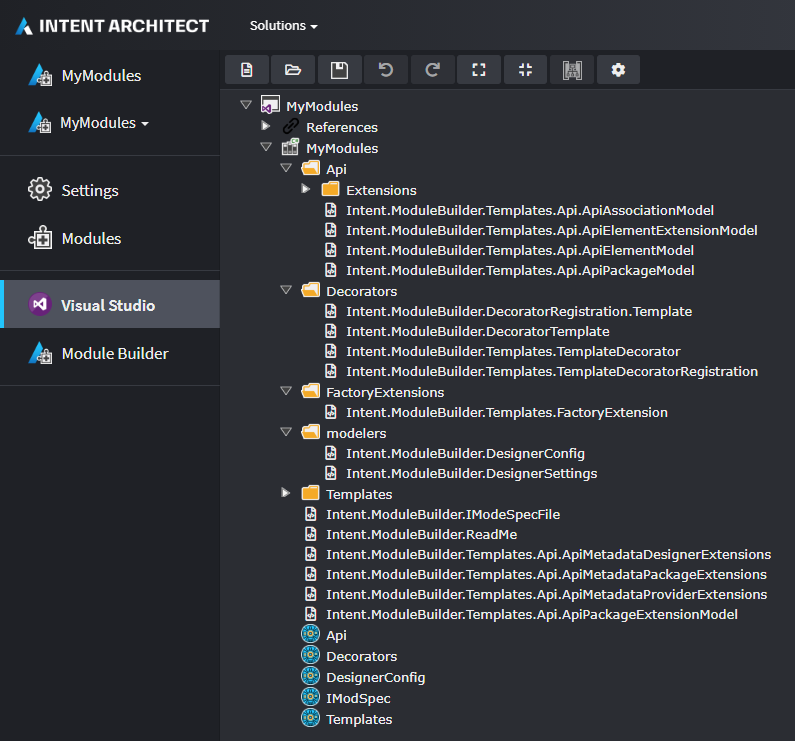

# About the Visual Studio Designer

The `Intent.VisualStudio.Projects` [Module](xref:modules.about-modules) provides a [Designer](xref:designers.about-designers) for modelling a Visual Studio solutions and projects as well as [Templates](xref:templates.about-templates) to generate them.

## Designer

The Visual Studio Designer can be used to control the output location of the different Templates in your Application.

_Screenshot of the Visual Studio Designer for an example Application._
