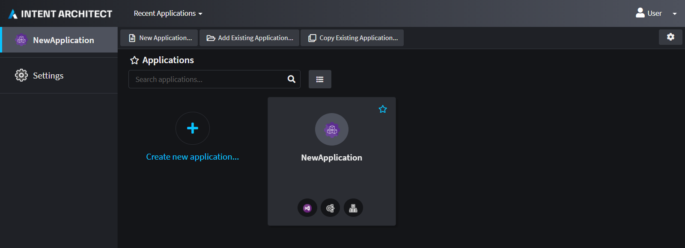
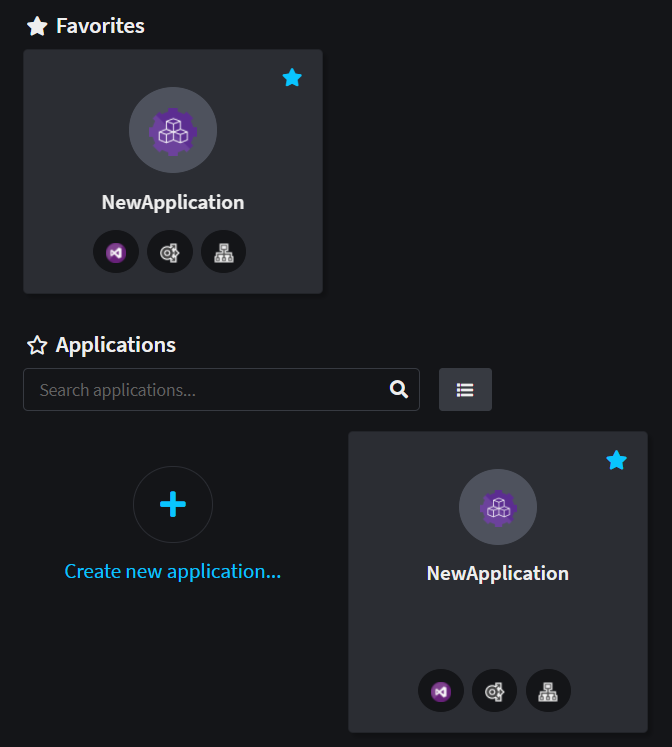

# About Solutions

Solutions in Intent Architect serve as a collection of one or more [Applications](xref:applications.about-applications).

They are represented by an `.isln` (Intent Solution) file on the disk-drive. With Intent Architect you can only open Solution files and not Application files; so if you want to open an Intent Architect Application, you have to do that through the context of a Solution.

## Solution Dashboard View

The Solution Dashboard can be viewed in one of the following ways:

### Tiles

_Applications are arranged in a grid of Tiles._

### List

_Applications are arranged as a List of items._

### Favorites

_You can can click on the **Star** icon (located top-right of each Application) to categorize them in your "favorites" list._

## Managing Applications

At the top of the Solution Dashboard you will find these commands that can be performed:

### New Application

Create a new Application such as in the .

### Add Existing Application

Browse for an existing Application located outside your current Intent Architect solution and add it to this Solution.

> [!NOTE]
> It will not import the content into this Solution but will merely make a reference to that location.

### Copy Existing Application

Like its `Add Existing Application` counterpart, this command will not only add the Application to this Solution but also attempt to import all its content as well. This is especially useful for working on Template Applications such as Intent Architect Modules.
