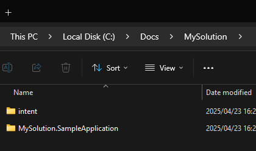

# SDLC Best Practices for Intent Architect Users

## Version Control

### Commit your Intent Architect design with the source code

When using Intent Architect, you are modeling your system design and applying that design to your codebase. This design evolves naturally over time alongside your codebase. In the same way we commit and version our code, we should also commit and version our design to ensure they remain aligned. For example, if you switch to a different branch or roll back to a previous version of the codebase, you want to be able to work with the corresponding version of the design.

The Intent Architect designs are stored in the **intent** folder.  
It is best practice to commit this **intent** folder into version control alongside the codebase.

The image below shows a default solution structure with the various components:

- **Intent Architect Solution Folder** — in this case, `C:\Docs\MySolution`
- **Design Folder** — the `intent` folder inside the solution directory
- **Application Codebase Folder** — the `MySolution.SampleApplication` folder, containing the application codebase

### Merge Conflicts on Intent Architect Metadata Files

Everything you design within Intent Architect is persisted as `xml` files inside the **intent** folder. As with any files stored in a repository, it's possible for the same file to be edited differently across branches or by multiple users. In that case, you'll encounter a **merge conflict** that must be resolved.

This is similar to resolving conflicts in a **.csproj** file. It can feel intimidating to merge a file you're unfamiliar with, but once you understand its structure, it's usually straightforward.

We strive to keep our metadata files human-readable and appropriately sized to minimize conflicts.

To reduce the frequency and complexity of merge conflicts, apply standard development practices:

- **Pull frequently** – Regularly fetch and merge changes from the main branch to stay in sync.
- **Keep branches short-lived** – Work in small, focused branches and merge them quickly.
- **Communicate with your team** – Coordinate when multiple people are working on related areas.
- **Avoid large commits** – Make atomic commits that are easier to review and merge.
- **Rebase instead of merging (when appropriate)** – Keeps history clean and makes conflicts easier to manage.
- **Use tools for visual diffing** – Tools like Beyond Compare, Meld, or IDE-integrated tools help clarify changes.

For more details, read [Understanding and Resolving Merge Conflicts involving Intent Architect Metadata Files](xref:application-development.applications-and-solutions.understanding-and-resolving-merge-conflicts)

### Working with Pull Requests

To Do

## CI/CD Tooling

### Intent Architect design and codebase should be synchronized when committing to version control

Since you commit your Intent Architect design to version control alongside your codebase, it's best practice to ensure that your design work has been applied to the codebase **before committing**. Ultimately, you want the commited design and codebase to always be in sync.

Failing to do so is analogous to committing code that doesn't compile — something CI/CD processes aim to prevent.

You can use the `Software Factory CLI tool` with the `ensure-no-outstanding-changes` option as part of your CI/CD pipeline to enforce this behavior.

[Software Factory CLI tool documentation](xref:tools.software-factory-cli)

### Automate Governance of Architectural Deviations (Optional)

If you're using the [Deviation Tracking feature](xref:application-development.software-factory.about-software-factory-execution#the-deviations-screen) and its approval functionality, you can integrate governance checks into your CI/CD pipeline.

Run the `Software Factory CLI tool` with the `ensure-no-outstanding-changes` and `--check-deviations` options. This will cause the build to break if there are any unapproved deviations.

[Software Factory CLI tool documentation](xref:tools.software-factory-cli)

There are multiple ways to configure this. A recommended setup is:

- Allow deviations in a `development` branch.
- Enforce approval checks in a `release` branch.

This approach allows developers to work freely in development while ensuring that deviations are reviewed before promotion.

## Upgrading and Installing Modules

Upgrading and installing modules can result in changes to your codebase. It is best practice to perform these operations on a **clean checkout** of your codebase. This helps isolate the impact of the upgrade and verify your codebase's readiness.

This is similar to manually upgrading NuGet packages — you'd typically do this from a clean state to ensure smooth upgrades.

Your codebase is a mix of Intent Architect–managed code and custom code. While the tool upgrades managed code automatically, some custom code may need manual adjustments.
This allows you to easily roll back the modules / changes, if for some reason you wanted to.

[Module Management documentation](xref:application-development.applications-and-solutions.about-modules)

## Have your team run the same version of Intent Architect

We recommend that all team members use the same version of Intent Architect. Most of our users are part of teams working on shared solutions, so it's ideal for all developers to use the same **major and minor** version (e.g., 4.4.x) to ensure a consistent and predictable experience.

Teams should coordinate when upgrading product versions to avoid compatibility issues.

## Custom Module deployment

If you build your own Intent Architect modules, you will need to consider how you deploy these modules, so that your teams can discover and use your modules.
Module discovery is done through a Repository configuration which can be setup globally per Intent Architect solution. This can be particularly useful if you have custom modules which you want share / distribute either with-in your own development team or with external parties.

These repositories can be either:

- Url to a module server, by default solution's are configured to point to the Intent Architect official module server and you can also host your own.
- UNC Path, e.g. a local file folder or a mapped drive.

For more information on configuring Module Repositories, read further [here](xref:application-development.applications-and-solutions.how-to-manage-repositories).

### Module Server

If you have custom modules which you wish to distribute and don't want to go the UNC Path route, you can host your own Module Server to distribute your modules, this is very analogous to setting up a custom NuGet hosting solution for distributing your own NuGet packages.

For more information on deploying a Module Server, read further [here](xref:tools.module-server).

## Configure your development Environment

When working with Intent Architect there are some best practices we recommend for configuring your development environment, these are detailed [here](xref:application-development.development-environment-setup.development-environment-setup).
