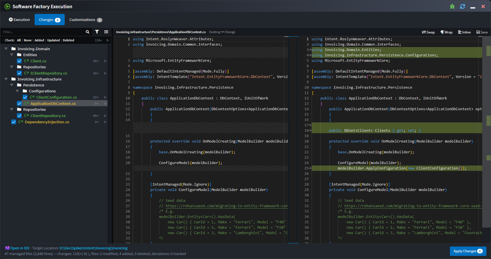
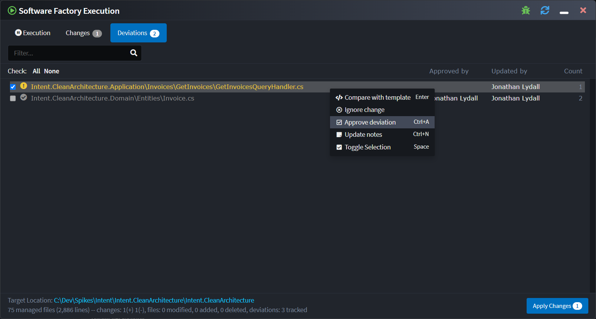
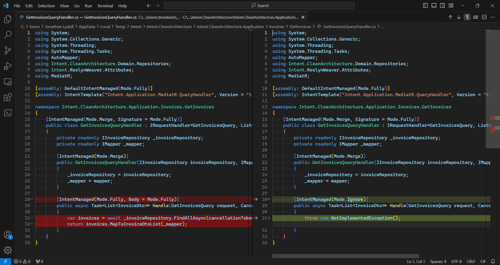

# About Software Factory Execution

The Software Factory Execution is the process that executes the installed [Modules](xref:application-development.applications-and-solutions.about-modules) with the metadata from the [Designers](xref:application-development.modelling.about-designers) within an [Application](xref:application-development.applications-and-solutions.about-applications). The result is changes to the codebase which are **staged** before being accepted or rejected.

Intent Architect will not make changes to your codebase without your consent. The changes will be listed and can be clicked on which launches a Diff tool for you to view the changes between the files - like a _pull request_ from your robot developer friend.

_An example diff of changes made to a C# interface that's managed by Intent Architect._

The Software Factory Execution is initiated from within an Application by clicking on the _Run Software Factory_ button in the top tool bar. The execution is typically kicked off after completing some design changes, or installing / updating Modules.

_Run the Software Factory from the top tool bar_

You can also run the Software Factory from the applications context menu.

_Run the Software Factory from the application context menu_

The Software Factory can also be minimized to the task bar. In this state the Software Factory will subscribe to changes for the application and automatically run in the background, notifying the user when it has pending changes.

_Minimized Software Factory running in the background._

## The Deviations screen

It can be useful to know which files may not be following the architecture which your installed modules normally generates.

Towards this, the Software Factory is able to track deviations of code management instructions, i.e. where instructions such as `IntentIgnore` are added to files which aren't present in default template output:

Selecting the "Compare with Template" context menu option or simply double-clicking a deviation will open a diff comparing the unmerged template output (left) with the current file (right):

It is worth noting that editing and saving the file in the right pane will trigger re-running the code merging for that particular file allowing fixing of deviations without having to open the file through some other means.

Deviations can be approved by right-clicking it and selecting "Approve deviation" which will also record who approved the deviation and when. To see when a deviation was approved, you can hover over the name in the "Approved by" column and read the tooltip which shows.

If the particular deviation(s) for the file changes, the approval is revoked, approvals can also be manually revoked using the context menu.

The final option available on the context menu is the ability to update "Notes" on a deviation, allowing you to enter any free form text which you feel may be relevant to a particular deviation.

> [!TIP]
> The [Software Factory CLI tool](xref:tools.software-factory-cli)'s `ensure-no-outstanding-changes` command has a `--check-deviations` option that can be used on CI environments to automatically detect unapproved deviations pushed into source control.
