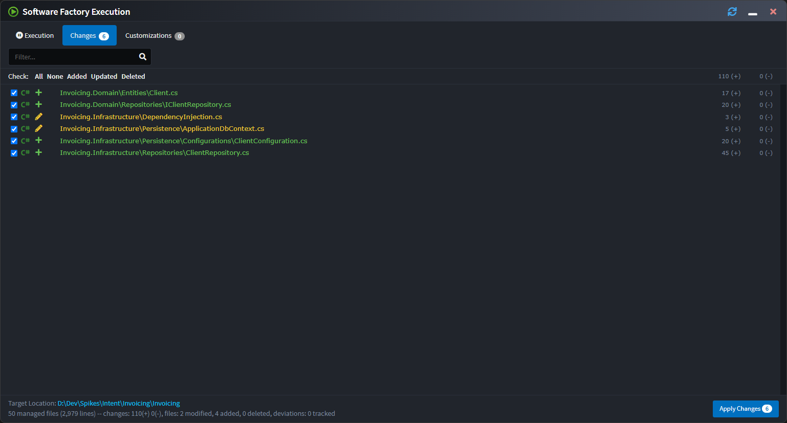

# About Software Factory Execution

The Software Factory Execution is the process that executes the installed [Modules](xref:application-development.applications-and-solutions.about-modules) with the metadata from the [Designers](xref:application-development.modelling.about-designers) within an [Application](xref:application-development.applications-and-solutions.about-applications). The result is changes to the codebase which are **staged** before being accepted or rejected.

A core principal of Intent Architect is that it will not make changes to your codebase without your explicit consent which is why a diff is shown for the selected file - like a _pull request_ - giving your the opportunity to review or update the changes.

The Software Factory Execution is initiated from within an Application by clicking on the _Run Software Factory_ button in the top tool bar. The execution is typically kicked off after completing some design changes, or installing / updating Modules.

_Run the Software Factory from the top tool bar._

You can also run the Software Factory from the application's context menu:

_Run the Software Factory from the application context menu_

The Software Factory can also be minimized to the task bar. In this state the Software Factory will subscribe to changes for the application and automatically run in the background, notifying the user when it has pending changes.

_Minimized Software Factory running in the background._

## See also

- [Synchronizing code changes to design](xref:application-development.software-factory.synchronize-code-to-design)
- [Inspecting codebase customizations](xref:application-development.software-factory.customizations-screen)
