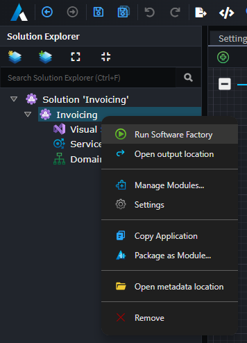
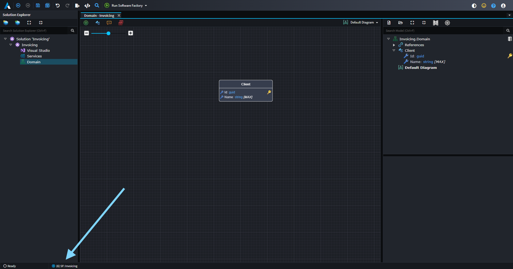

# About Software Factory Execution

The Software Factory Execution is the process that executes the installed [Modules](xref:application-development.applications-and-solutions.about-modules) with the metadata from the [Designers](xref:application-development.modelling.about-designers) within an [Application](xref:application-development.applications-and-solutions.about-applications). The result is changes to the codebase which are **staged** before being accepted or rejected.

Intent Architect will not make changes to your codebase without your consent. The changes will be listed and can be clicked on which launches a Diff tool for you to view the changes between the files - like a _pull request_ from your robot developer friend.

_An example diff of changes made to a C# interface that's managed by Intent Architect._

The Software Factory Execution is initiated from within an Application by clicking on the _Run Software Factory_ button in the top tool bar. The execution is typically kicked off after completing some design changes, or installing / updating Modules. 

_ Run the Software Factory from the top tool bar _

You can also run the Software Factory from the applications context menu.

_ Run the Software Factory from the application context menu _

The Software Factory can also be minimized to the task bar. In this state the Software Factory will subscribe to changes for the application and automatically run in the background, notifying the user when it has pending changes.

_ Minimized Software Factory running in the background. _
