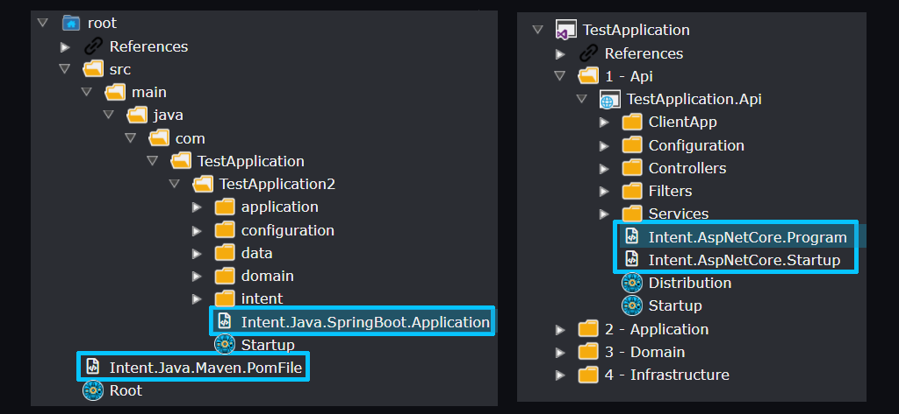
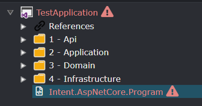

# About Template Output Targeting

## Overview

`Output Targeting` refers to how Intent Architect determines where a Template's output should be placed on the file system during the software execution through configuration within designers and the template itself.

Some designers (such as the `Folders` and `Visual Studio` designers) support "Output Configuration" which lets Intent Architect know during module installation that `Template Output`s should be placed in it. The Software Factory Execution uses these `Template Outputs` to determine the output paths for template instances.

_Example features both a Folder (left) and Visual Studio (right) designer layout with Template Output items highlighted_

## Template Outputs

`Template Output`s in the designers are used by the Software Factory to know where on the file system that template output should be written, in particular under which sub-folder. As modules are installed, for each template within them, a `Template Output` is automatically created with its name being the value of the `TemplateId` property of the template as specified during module building.

## Unassigned Template Output

Some designers (such as the Visual Studio designer) will show unassigned Template Outputs in red:

Running the Software Factory while these template are unassigned will result in errors during the execution about there being unassigned templates.

Module authors can control where their "Template Output"s should be placed by default during module installation so that things work automatically, this is covered in this [article](xref:module-building.templates-general.configuring-a-templates-default-output-location).

## See also

- 
