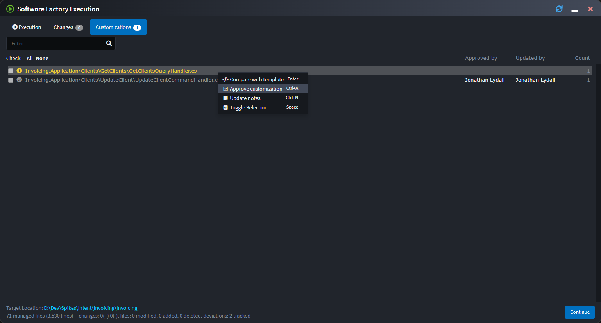

# The Software Factory Customizations screen

It can be useful to know which files may not be following the architecture which your installed modules normally generates.

Towards this, the Software Factory is able to track customizations of code management instructions, i.e. where instructions such as `IntentIgnore` are added to files which aren't present in default template output:

Clicking on a file in the list shows a diff by default comparing the unmerged template output (left) with the current file (right).

Editing and saving the file in the right pane will trigger re-running the code merging for that particular file allowing fixing of customizations without having to open the file through in a different editor (such as your IDE).

Customizations can be approved by right-clicking it and selecting "Approve customization" which will also record who approved the customization and when. To see when a customization was approved, you can hover over the name in the "Approved by" column and read the tooltip which shows.

If the particular customization(s) for the file changes, the approval is revoked, approvals can also be manually revoked using the context menu.

The final option available on the context menu is the ability to update "Notes" on a customization, allowing you to enter any free form text which you feel may be relevant to a particular customization.

> [!TIP]
> The 's `ensure-no-outstanding-changes` command has a `--check-for-unapproved-customizations` option that can be used on CI environments to automatically detect unapproved customizations pushed into source control.
