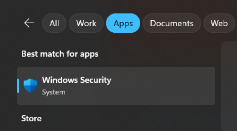
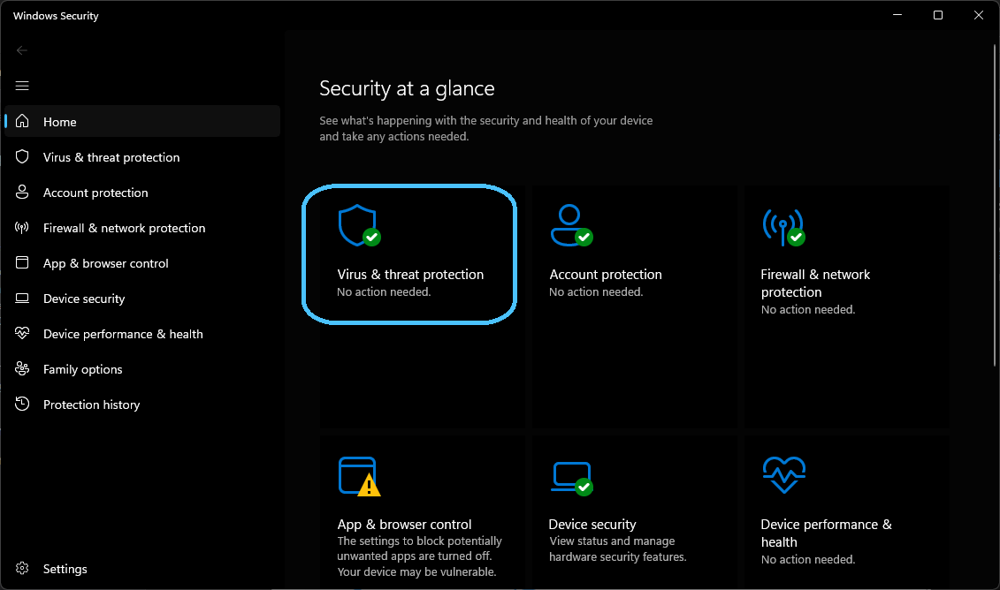
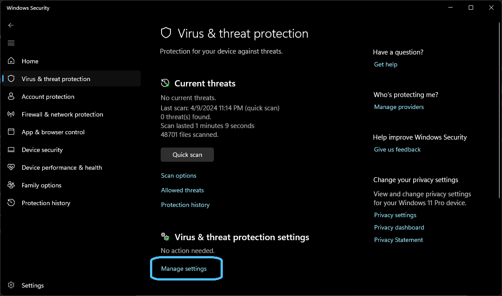
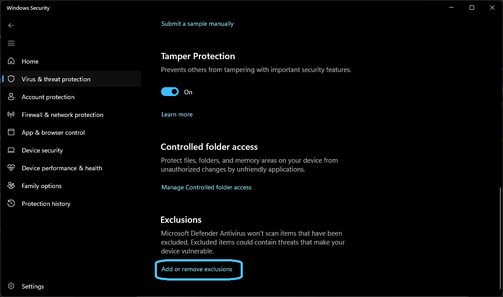

# Improving the speed of the Software Factory

So as to avoid negatively affecting developer productivity, we take the performance of the Software Factory very seriously. Over time we have applied many optimizations to the Software Factory and continue to do as we find areas where it's possible.

To ensure you're getting the best and shortest possible execution times, please ensure you're running the latest version of Intent Architect as well as the latest versions of the modules.

## Advice for optimizing Software Factory Execution speed

Windows 11 users are able to use Microsoft's [Dev Drive](https://learn.microsoft.com/en-us/windows/dev-drive/) feature which is intended to improve the performance of many developer related tasks by using a different file system type and adjusting the way that Windows Defender works.

## Common causes of slowness

### "Initializing Software Factory Execution" step is slow

A common area of slowness in the Software Execution is the very first step, "Initializing Software Factory Execution". While this step should take less than a second, on some machines we have observed it taking multiple seconds and in extreme cases, tens of seconds.

The identified cause of this slowness is the interference of computer anti-virus software in the loading process of Module DLLs from the disk drive.

Consider adding some or all of the following exclusions to your anti-virus software to prevent this slowness:

- The folder in which Intent Architect is installed (e.g. `C:\Program Files\Intent Architect v4`).
- The folder containing your Intent Architect Solution and Applications, essentially the folder into which the "source code" for your project is checked out.
- The Intent Architect software factory executable: `Intent.SoftwareFactory.Host.exe`

> [!WARNING]
> Adding exclusions to your anti-virus protection may expose you to additional risks. If your computer is administered by an IT department, their approval and assistance may be required to add exclusions.

#### Adding Exclusions to Windows Defender

- Open Windows Security by clicking on the Start menu and selecting the shield icon to open Windows Security. Alternatively, you can search for "Windows Security" in the search bar.

  

- In the Windows Security window, click on "Virus & threat protection" on the left sidebar.
  
- Scroll down to the "Virus & threat protection settings" section and click on "Manage settings."
  
- In the settings window, scroll down to the "Exclusions" section. Here, you will find options to add exclusions for files, folders, file types, and process exclusions.
  
- Add Exclusions:
  - For Folders: Click on "Add or remove exclusions" under the "Folders" section. In the window that opens, click on "Add an exclusion," then browse to the folder you want to exclude (e.g. `C:\Program Files\Intent Architect v4` or `C:\Dev`) and select it. Click "Select Folder" and then "OK."
  - For Processes: Click on "Add an exclusion" under the "Processes" section. Type the name of the process you want to exclude (e.g. `Intent.SoftwareFactory.Host.exe`) and click "Add."
- After adding the exclusions, you will be prompted to confirm. Click "OK" to save your changes.