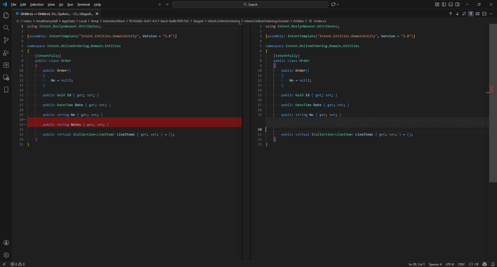

# Reverse synchronization

Intent Architect has a "reverse synchronization" capability for taking changes manually made to files and applying them back to models in Intent Architect designers.

Synchronization supports structural aspects of source code files, some (non-exhaustive) examples:

- Added/removed/updated properties on domain entities can add/remove/update attributes in the Domain Designer.
- Added/removed/updated methods on domain entities can add/remove/update operations, including parameters, in the Domain Designer.
- Added/removed/updated properties on DTOs can add/remove/update attributes in the Services Designer.

> [!NOTE]
>
> Only templates which have implemented the required reverse synchronization logic will offer this capability. We are progressively applying this logic to additional templates, in the meantime please reach out to our support team if there are particular templates you are looking to have this supported on sooner rather than later.

## Using the feature

For example a `Notes` property has been added to an entity in your IDE and when running the Software Factory it wants to remove it:

Intent Architect will show a "synchronize changes" icon next to such files:

> [!NOTE]
>
> Only templates which have implemented the required reverse synchronization logic will show this icon. We are progressively applying this logic to additional templates, in the meantime please reach out to our support team if there are particular templates you are looking to have this supported on sooner rather than later.

On clicking the icon the Software Factory minimizes, the relevant designer will be opened, focussed and the changes applied. In the following screenshot notice the dirty indicator on the `Notes` attribute:

You can then save and the Software Factory will no longer want to remove those changes from the file.
