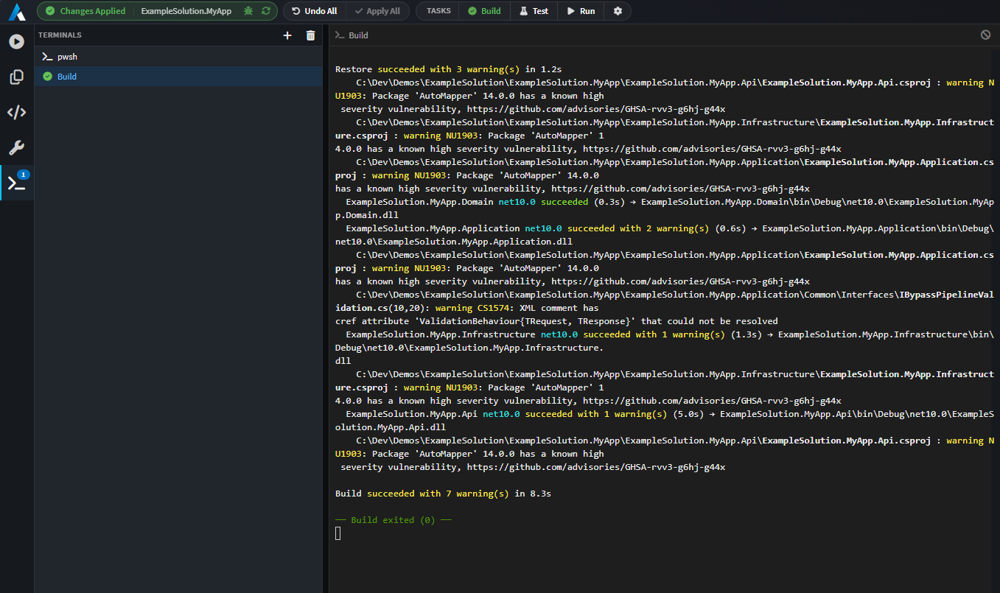
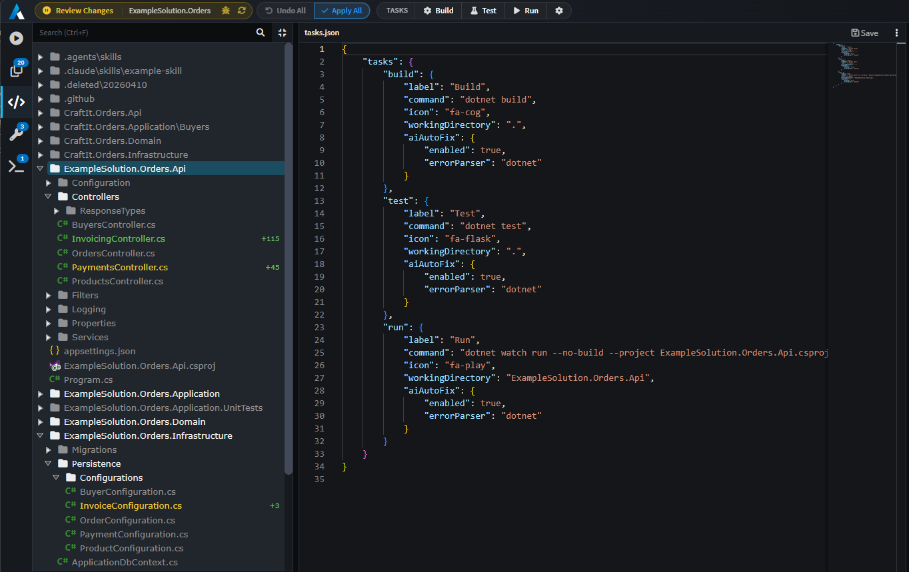

# Terminal & Tasks

The Software Factory panel includes a built-in terminal and a configurable task runner. Tasks are shell commands you define once in `tasks.json` and then trigger from the toolbar - or that AI agents can run via the `run_task` tool.

---

## The Terminal panel

The terminal lives inside the Software Factory view as a side-panel of sessions. Each session is its own tab; the currently selected one is rendered, the rest stay in memory and keep receiving output in the background.

There are two kinds of session:

| Kind        | What it is                                                                                          |
| ----------- | --------------------------------------------------------------------------------------------------- |
| **Shell**   | An interactive shell session. Free-form - type commands and use it like any terminal.                |
| **Task**    | A specific task from `tasks.json`. Re-running the same task reuses its tab so you don't accumulate clutter. |



### Default shells

| Platform        | Shell used                                                          |
| --------------- | ------------------------------------------------------------------- |
| Windows         | `pwsh.exe` (PowerShell 7) if installed, otherwise `powershell.exe`, otherwise `cmd.exe` |
| macOS / Linux   | The shell from `$SHELL`, otherwise `/bin/bash`, otherwise `/bin/sh` |

Tasks are wrapped by `cmd /d /s /c <command>` on Windows and `bash -c <command>` on macOS/Linux, so any shell syntax valid for those is fair game.


### Buffer behaviour

- Each session keeps a rolling buffer of up to **5 MB** of output. When that's exceeded, older output is dropped and a `[... older output truncated ...]` marker is shown.
- Switching tabs detaches and re-attaches the renderer but does not lose buffered output.
- **Clear** wipes the visible buffer (it does **not** stop the underlying process).
- **Remove** kills the process (with `SIGTERM`) and removes the tab.

---

## Tasks (`tasks.json`)

Tasks are commands you configure per-application. Each task becomes a button on the Software Factory toolbar.

> [!NOTE]
> Access the `tasks.json` directly inside of Intent Architect by clicking on the cog icon in the Software Factory toolbar.



### File location

`tasks.json` lives in the **application's config folder** (next to the project metadata, alongside `.intent` and similar). The toolbar's **Edit Tasks** action will create it from a sample if it doesn't exist yet, then open it in the editor.

> The file is hot-reloaded - edits made while the Software Factory view is open update the toolbar buttons immediately. No restart needed.

### Format

```jsonc
{
    // Each key under "tasks" is the task name (also used by the AI run_task tool).
    "tasks": {
        "build": {
            "label": "Build",
            "icon": "fa-cogs",
            "command": "dotnet build",
            "workingDirectory": ".",
            "aiAutoFix": {
                "enabled": false,
                "errorParser": "dotnet"
            }
        }
    }
}
```

`//` line comments, `/* … */` block comments, and trailing commas are tolerated.

### Task fields

| Field              | Required | Notes                                                                                   |
| ------------------ | -------- | --------------------------------------------------------------------------------------- |
| `label`            | Yes      | Text shown on the toolbar button.                                                        |
| `icon`             | Yes      | Font Awesome class (e.g. `fa-cogs`, `fa-play`, `fa-flask`).                              |
| `command`          | Yes      | The shell command to run. Wrapped by the platform shell (cmd on Windows, bash on Unix).  |
| `workingDirectory` | No       | Relative to the application's **output folder**. Defaults to `.` (the output folder root). |
| `aiAutoFix`        | No       | See **AI Auto-Fix** below.                                                              |

The task's **key** in the `tasks` object is its name - referenced by the AI `run_task` tool and used internally for state tracking.

---

## AI Auto-Fix

When a task fails, **AI Auto-Fix** can hand the failure to a coding agent that attempts to fix it automatically.

```jsonc
"aiAutoFix": {
    "enabled": true,
    "errorParser": "dotnet"
}
```

| Field         | Notes                                                                                                               |
| ------------- | ------------------------------------------------------------------------------------------------------------------- |
| `enabled`     | Master switch for this task. If `false`, failures are just shown in the terminal and nothing further happens.        |
| `errorParser` | How to extract structured errors from the task output. Built-in: `generic` (default - line/message heuristics) and `dotnet` (recognises `error CSxxxx:` and similar). Unknown values fall back to `generic`. |

After each attempt the task is re-run. If it still fails, the parsed errors are fed back to the agent for another iteration, up to a maximum of **3 attempts**.


---

## Tips

- **One task per concern.** A `build`, a `test`, a `lint`, a `migrate` - small, single-purpose tasks compose better than one all-in-one script.
- **Pick the right error parser.** `dotnet` knows about `error CSxxxx:` and similar; `generic` falls back to line-and-message heuristics. Match the parser to the task's output.
- **Use `workingDirectory` for monorepos.** If your build needs to run inside a subdirectory of the application output, set `workingDirectory` instead of `cd`-ing inside `command`.
- **Put long-running watchers in shells, not tasks.** A task is meant to start, do a thing, and exit. Use a free-form shell for anything that lives forever (file watchers, dev servers, etc.).
