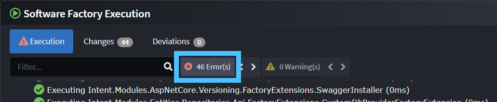
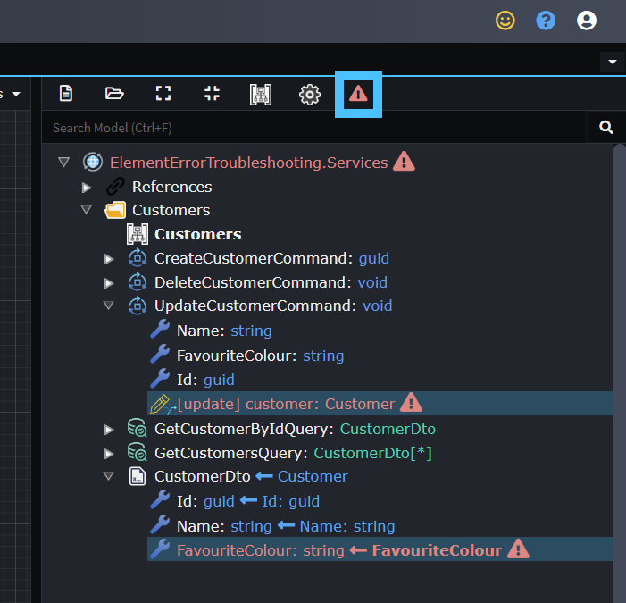

# Troubleshooting element errors

A common error which can occur during Software Factory execution is the _Element Error_, for example:

 

> [!TIP]
> You can quickly drill into the logs to the first error by clicking the "\<number\> Error(s)" button above the log.
>
> 

Element errors can occur for a wide variety of reasons, but very often if we look at the element in Intent Architect which had the error, it is obvious how to resolve the error.

On these errors you can click the bolded text segment (in this case the "**Element Error: \[create\] customer: Customer \[Create EntityAction Target End\]**" text).

Once clicked, Intent Architect will automatically switch to the designer with the element with the error and highlight it, for this example it jumps to the following and if we hover over the red triangle with the exclamation mark it has some additional information:

In this case we can click the triangle which will open the mapping screen:

We can see from the error in this case that the mapping target could not found which in this example was due to a `FavouriteColour` attribute on the `Customer` class having been deleted. A solution here is to delete the field:

We can press _DONE_ on the dialogue.

After doing so we can see by the red triangle above the designer tree view that there is at least one more error still, we can click the red triangle to highlight all elements with errors:

The first error on the `[update]` mapping under the `UpdateCustomerCommand` can be fixed in the same way as the `[create]` mapping above.

For the `FavouriteColour` field under `CustomerDto` the field can simply be deleted.

In this example after doing the above actions the red triangle is now gone and we can see there are no more errors:

We can now save the designer, run the Software Factory and we should see it can run with no errors now:

## What to do if there are no errors visible in the designer

Sometimes when you navigate to the element causing the error it may not show an error in the designer, in such cases we will want to look at additional details on the error. You can expand the error line in the Software Factory to see additional errors:

Sometimes this additional information is enough to find a resolution yourself, other times you may want need to contact [Intent Architect support](https://github.com/IntentArchitect/Support) or the module's author with the error details to receive additional help.

Errors can be copied to your clipboard by right-clicking and selecting the "Copy" option or using the Ctrl+C shortcut key:

